## Summary
Control is a Linux chain created by jkr and hosted on VulnLab. It's also the first hard-difficulty chain on the platform that I've tried.
After completing it, I think it's in my top 5. The steps flow together quite nicely.

Tools used:
- nmap
- curl

---
## Recon
This chain provides two target hosts.
- 10.10.247.21
- 10.10.247.22

Starting with an `nmap` scan to identify all open ports(`-p-`), and using `--min-rate=1000` to keep the discovery process from stagnating:
```
sudo nmap -p- --min-rate=1000 -v 10.10.247.21 -oN nmap.21-ports
```
There isn't any performance or evasive reason why I separate it into two scans, I just think it looks more organized.

Now that we know everything that's open, it's time to do a more detailed scan on the open ports:
```
ports=$(cat nmap.21-ports | awk -F/ '/open/ {b=b","$1} END {print substr(b,2)}'); sudo nmap -p $ports -v -A -min-rate=1000 -oN nmap.21 10.10.247.21
```
Naturally since there are two hosts this needs to be repeated for the other.

Nmap result for intra.control.vl(10.10.247.21)
```
# Nmap 7.95 scan initiated Mon Nov  4 20:03:40 2024 as: nmap -p 22,443 -v -A -min-rate=1000 -oN nmap.21-full 10.10.247.21
Nmap scan report for 10.10.247.21
Host is up (0.17s latency).

PORT    STATE SERVICE  VERSION
22/tcp  open  ssh      OpenSSH 8.9p1 Ubuntu 3ubuntu0.1 (Ubuntu Linux; protocol 2.0)
| ssh-hostkey: 
|   256 be:fa:cf:c3:c8:b1:50:11:f2:b0:73:b8:c5:ad:3d:0b (ECDSA)
|_  256 ef:4e:d4:7e:cc:dc:d6:90:91:d8:ed:1d:7b:88:07:b4 (ED25519)
443/tcp open  ssl/http nginx 1.25.0
|_http-trane-info: Problem with XML parsing of /evox/about
|_http-generator: DokuWiki
| ssl-cert: Subject: commonName=wiki.intra.control.vl/
```

Nmap result for os.control.vl(10.10.247.22)
```
# Nmap 7.95 scan initiated Mon Nov  4 20:03:58 2024 as: nmap -p 22,80,443,8443,8444 -v -A -min-rate=1000 -oN nmap.22-full 10.10.247.22
Nmap scan report for 10.10.247.22
Host is up (0.17s latency).

PORT     STATE SERVICE  VERSION
22/tcp   open  ssh      OpenSSH 8.9p1 Ubuntu 3ubuntu0.1 (Ubuntu Linux; protocol 2.0)
| ssh-hostkey: 
|   256 05:0f:88:bf:a3:a3:b9:f1:d7:82:fc:b1:92:19:90:ab (ECDSA)
|_  256 0b:53:d6:5d:21:4a:64:1d:69:aa:bd:01:77:87:90:cc (ED25519)
80/tcp   open  http     nginx
| http-methods: 
|_  Supported Methods: GET HEAD POST OPTIONS
|_http-title: Did not follow redirect to https://10.10.247.22/
443/tcp  open  ssl/http nginx
|_ssl-date: TLS randomness does not represent time
| http-methods: 
|_  Supported Methods: GET HEAD POST OPTIONS
| ssl-cert: Subject: commonName=os.control.vl/
8443/tcp open  ssl/http nginx
|_ssl-date: TLS randomness does not represent time
| http-methods: 
|_  Supported Methods: GET
| ssl-cert: Subject: commonName=os.control.vl/
```

Notable information from nmap for intra.control.vl(10.10.247.21):
- From the scan we can see that a webserver with DokuWiki is listening on port 443.
- We also get some hostnames: wiki.intra.control.vl intra.control.vl

Notable information from nmap for os.control.vl(10.10.247.22):
- From the scan we can see that ports 80 and 443 are open, and there's also a login page present at port 8443.
- We also get the hostname os.control.vl.

Add the gathered hostnames to /etc/hosts:

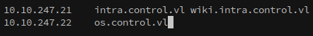

### Recon of intra.control.vl
When navigating to `wiki.intra.control.vl` we confirm that it hosts a DokuWiki instance. 

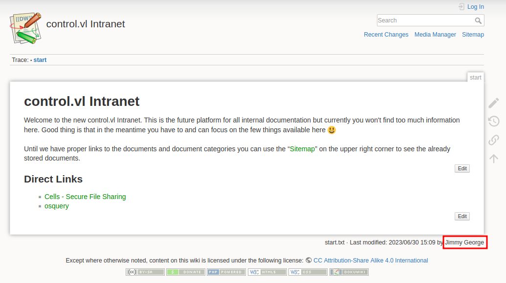
Notably, each page displays the username of the last editor, making it possible to enumerate users passively. An initial search for DokuWiki exploits yielded several results, though most were outdated, and none appeared immediately applicable.
### Recon of os.control.vl
Accessing `os.control.vl` on port 80 initiates a redirect to HTTPS (port 443). Although the main page lacks content, further exploration reveals another accessible service on port 8443.

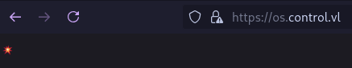

Although the main page lacks content, the nmap scan showed another accessible service on port 8443.

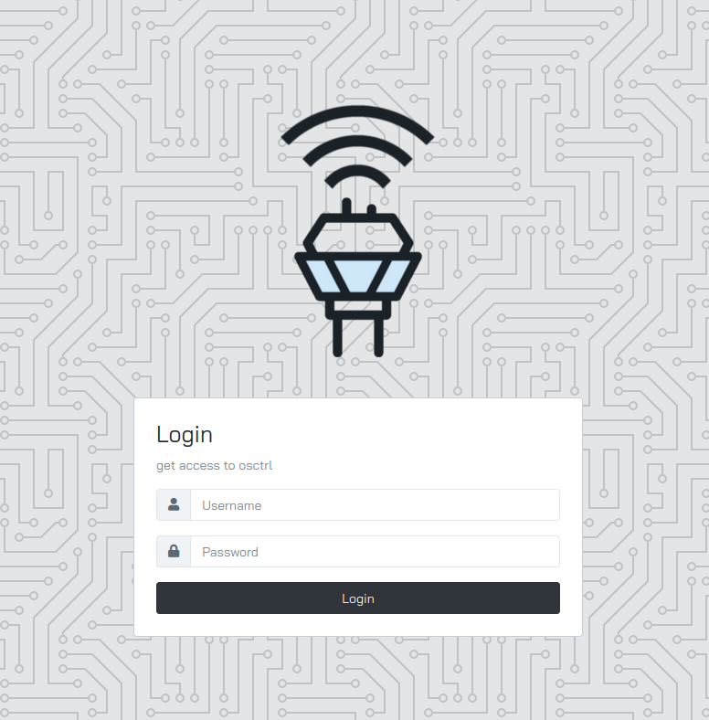

The login page on port 8443 belongs to osctrl. An initial search for vulnerabilities in osctrl doesn't yield anything juicy, and no useful exploits were noted on the project’s GitHub Issues or Security pages: https://github.com/jmpsec/osctrl/issues

---
## Enumerating Wiki
The wiki at wiki.intra.control.vl feels like it's the only way forward, so we'll begin by enumerating it.
First I want to follow the direct links on the home page, starting with Cells:

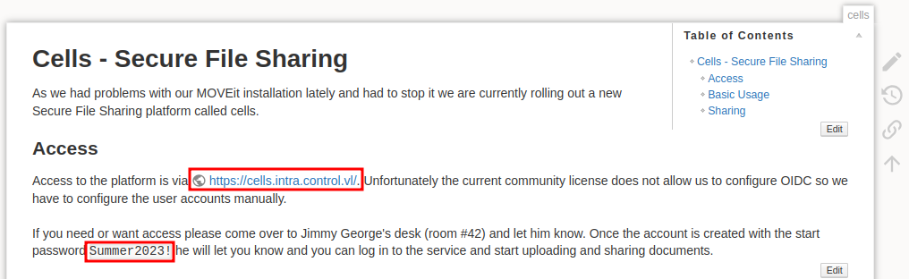

Immediately there are two things worth noting:
- There's another subdomain at cells.intra.control.vl
- The default password for accounts on cells is `Summer2023!`

There's a lot of screenshots on this page, and we can gather a lot of useful information from them.

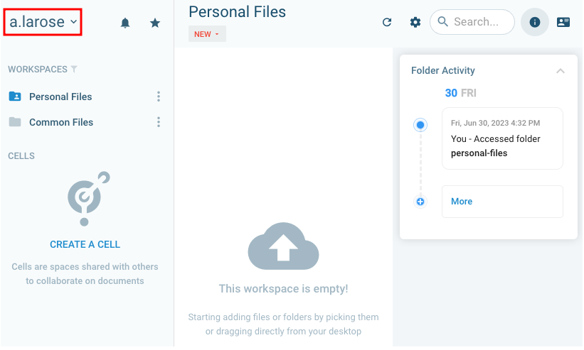

From this image we now know that the format for usernames used on cells is first-inital.lastname.

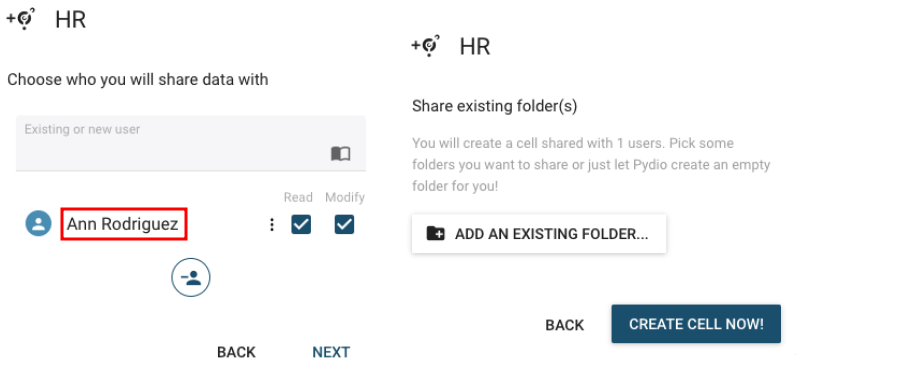

From here we see a user named Ann Rodriguez, who we can add to our username list.

And at the bottom we also get another user's name:

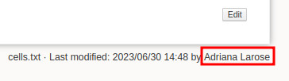

This likely corresponds to the `a.larose` account that we saw above in the cells screenshot.

---
### Brief look at cells.intra.control.vl

On visiting the site we're greeted by a login screen:

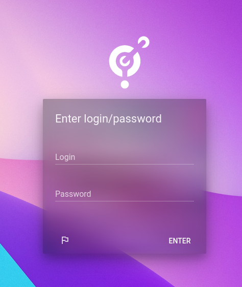

From the title of the tab, or by examining the source code, we can see that it's a login for Pydio Cells:

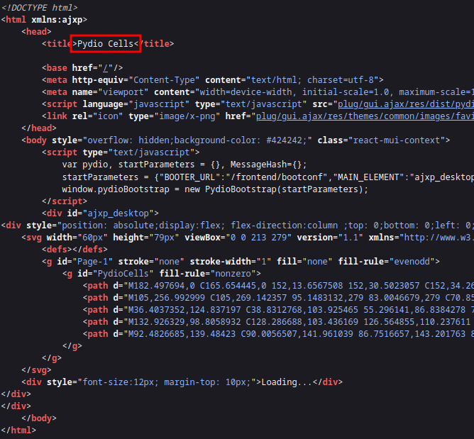
A quick search on google reveals a few couple exploits have been found recently:
- https://www.exploit-db.com/exploits/51498 - Server-side request forgery
- https://www.exploit-db.com/exploits/51496 - Unauthorized role assignment
Neither of them are useful without already having an account, but it is potentially useful information to know for later if we do get access to one.

---
### Finishing enumeration of the Wiki

Back on the wiki, another thing that we can check for each page is the revision history:

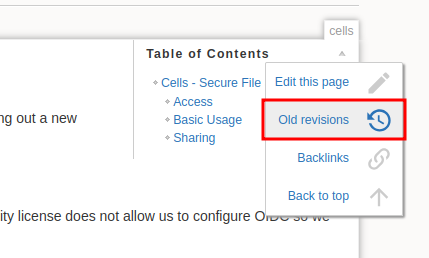
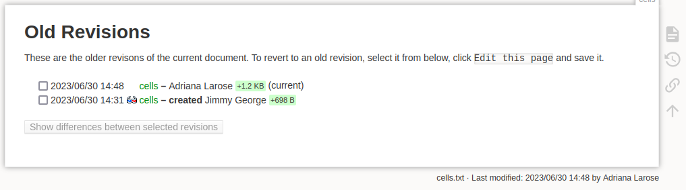
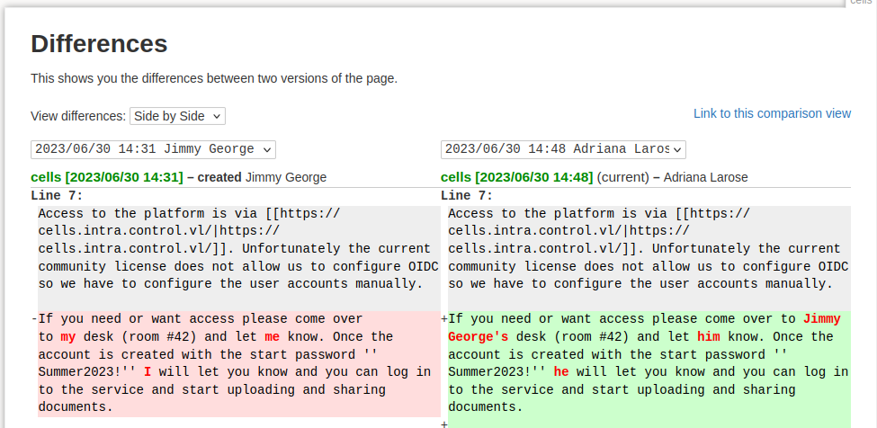

We don't gain any new information in this example, but it's worth it to be thorough when enumerating.

The other link on the home page was to an entry about osquery:

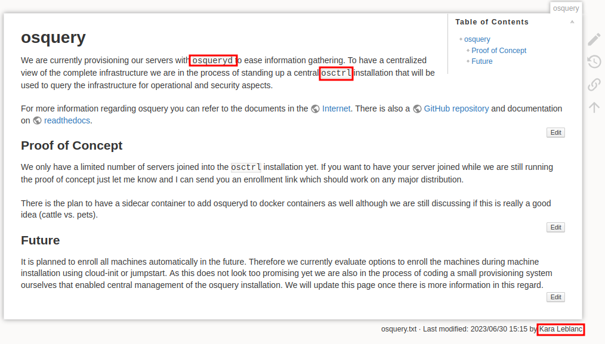

From this post we know that the machines are running ostrl and osquery. Also, we can add the user Kara Leblanc to our list!

Checking the revision history for this entry gives us two more users:

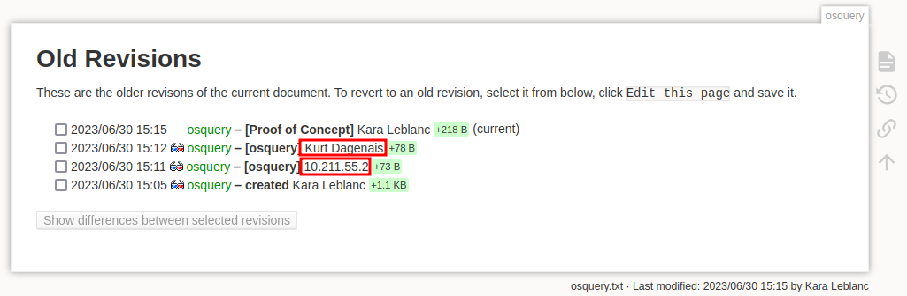

Kurt Dagenais and 10.211.55.2, which is probably an internal machine.
Checking the revisions themselves doesn't give any additional information.

I didn't check the revision history of the start page yet:

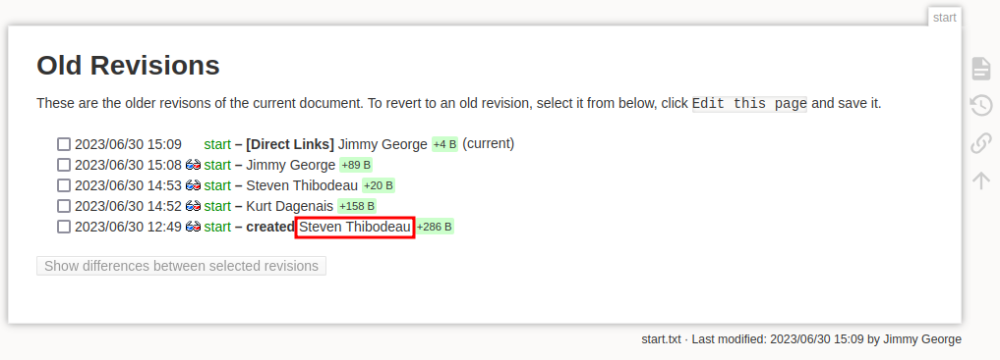

It gives another user, Steven Thibodeau.

You can also gather usernames from the Recent Changes tab, but we've already added all the users present here into our list:

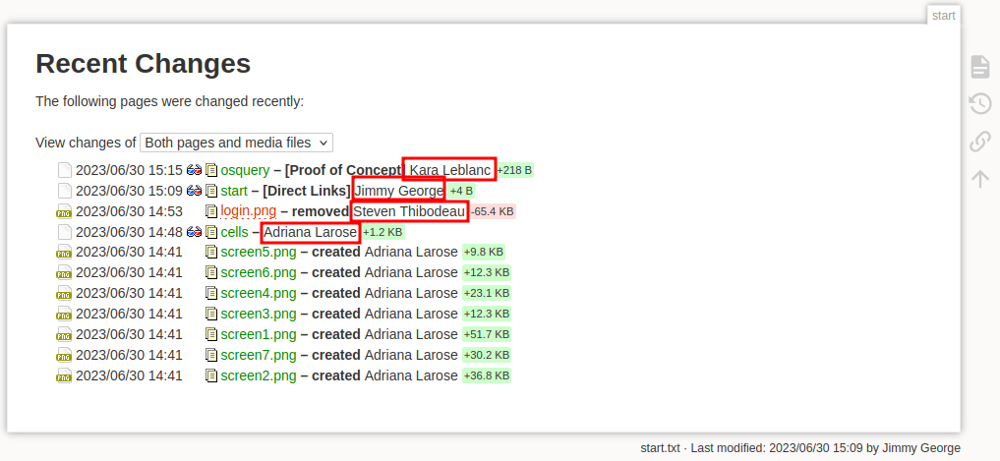

It might also be possible to gather users from the media manager:

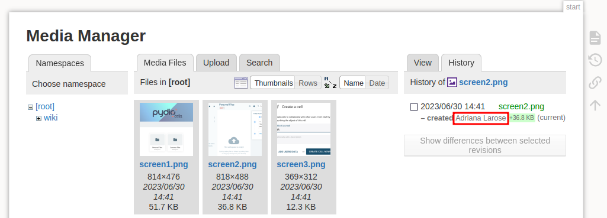

The only name present here is Adriana Larose, who we already have in the list. But it is worth noting that information can be gathered here in case we ever have to deal with DokuWiki again.

At this point we have a few users, and there doesn't seem to be any more to gather from the wiki.
User List:
```
Jimmy George
Steven Thibodeau
Kara Leblanc
Adriana Larose
Ann Rodriguez
Kurt Dagenais
```

Remembering from the screenshots in Cells the format for accounts is first-initial.lastname, so we can build a list to do password sprays.
Username List:
```
j.george
s.thibodeau
k.leblanc
a.larose
a.rodriguez
k.dagenais
```

Additionally, we found that when creating accounts for Cells Jimmy George uses `Summer2023!` as the default password. With that as a lead it's time to move on to cells.intra.control.vl.

---
## Enumerating Pydio Cells
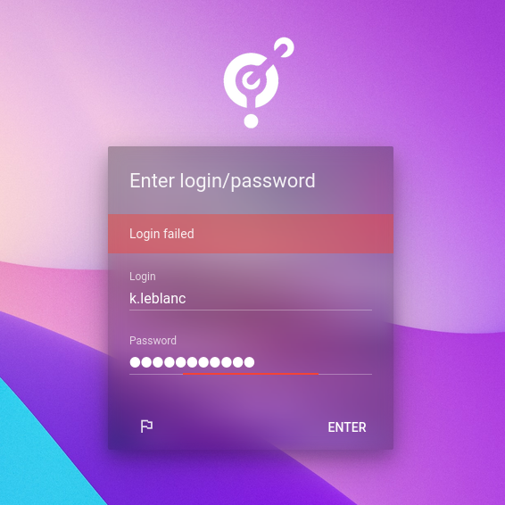

One nice thing for us is that the page doesn't clear the password on failed login attempts, so we just need to copypaste the username. You could automate this, but with only six potential usernames and a single default password it makes senses to just copypaste.

After a few attempts we gain access as k.dagenais:

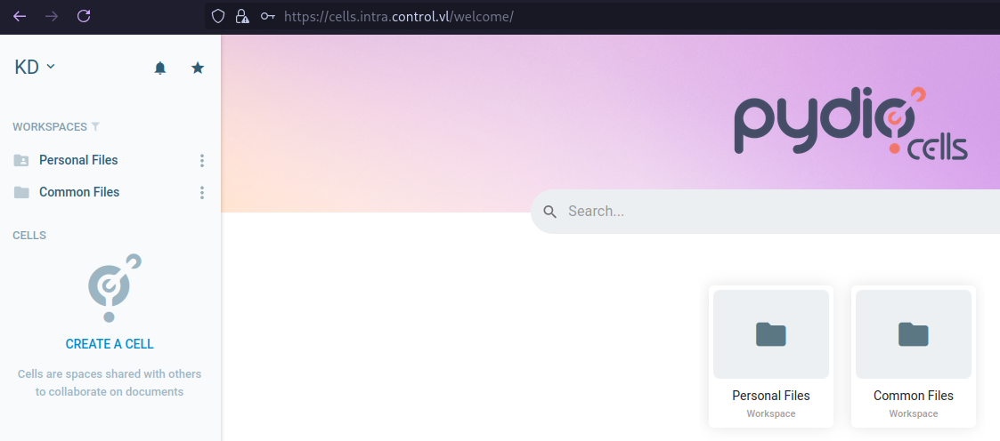

Unfortunately Kurt only has access to his Personal Files and the Common Files folders, which are both empty.

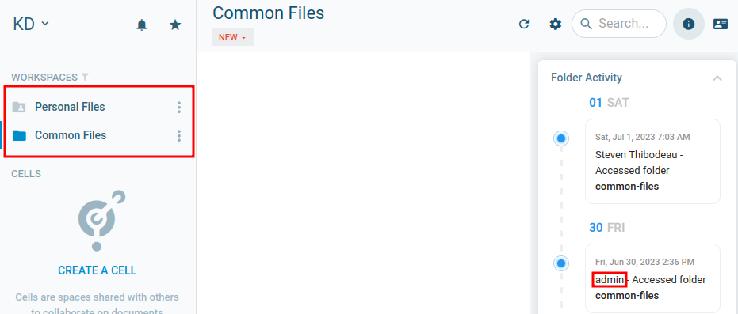

We can see from the folder activity tab that there's an admin account present, but it doesn't seem to be accessing the folder regularly. In fact, no one is.

Checking the address book gives us two more users to spray:

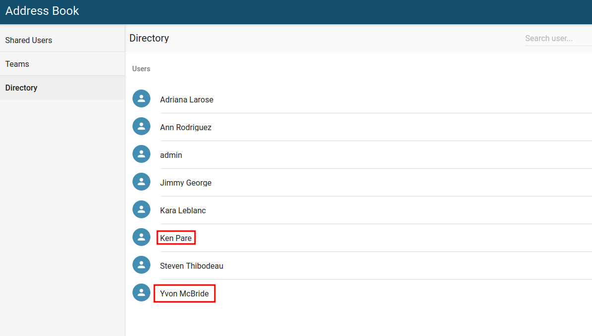
```
k.pare
y.mcbride
```

The default password also works for Yvon! Unfortunately this doesn't get any additional information for us though, since they also only have access to Personal Files and Common Files, which are both empty.

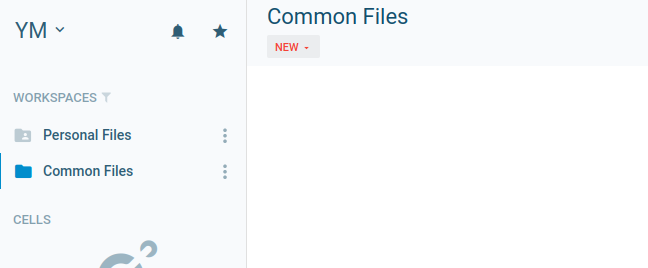

---
###  Pydio Cells privilege escalation
Earlier we noted two recent exploits for Pydio Cells:
- https://www.exploit-db.com/exploits/51498 - Server-side request forgery
- https://www.exploit-db.com/exploits/51496 - Unauthorized role assignment
Since we now have access to two accounts we can utilize the role assignment exploit in order to get a privileged account.

You should read the actual post on exploit-db, but the summary is that users can create accounts that allow external access to documents. By default these users only have two roles, but we can create a request that gives them ALL roles, which gives access to everything stored in the Pydio instance.

There is one addition to all the curl commands that we need to add, the `-k` flag which allows access to https sites that are self signed.

The first step is to get an Authorization Token for one of the accounts. I'll be using Yvon's in this section, but either will work.
If you're using burp suite you can copy the JWT token from Authorization: Bearer from one of your requests.

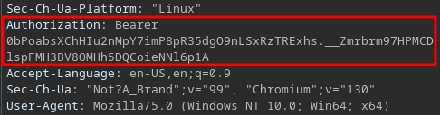

It's also stored in the local storage area of the inspect dev tools, which can be opened by shift-clicking the page and selecting `Inspect`. Once there, copy the Access Token.

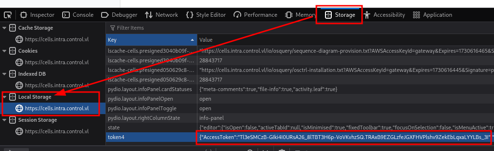

First I'll export the Token so it can be easily accessed later:
```
export TOKEN="hKBSY0scbcE66c4BeBtVG9SMGN4-B8fYY6Z3t7cyf5g.vlboHvPUZj9a-BMy52f91w-yHqhmvftcSnlB6qEwTcg"
```

Then send a request to get information about all users:
```
curl -k --silent \
--header "Authorization: Bearer $TOKEN" \
--header 'Content-Type: application/json' \
--data '{}' \
https://cells.intra.control.vl/a/user | tee all_users.json
```
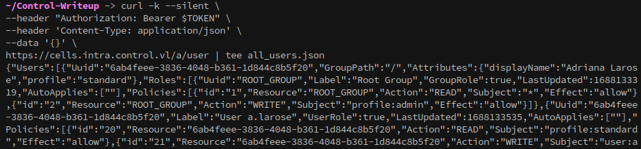

This command looks at the result of the previous and gathers all roles, then generates account information for the next request:
```
jq '.Users[].Roles' all_users.json \
| jq -s 'flatten | .[].Uuid | {Uuid: .}' \
| jq -s 'unique' \
| jq '{"Login": "polar", "Password": "hunter2", "Attributes":
{"profile": "shared"}, "Roles": .}' \
| tee create_user.json
```
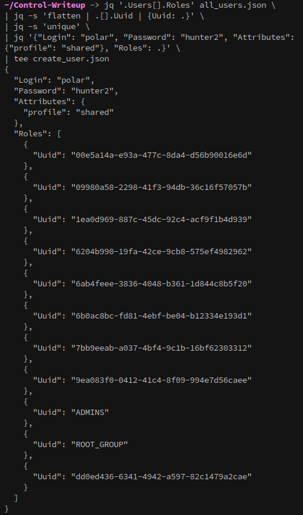

Create the account:
```
curl -k --request PUT \
--silent \
--header "Authorization: Bearer $TOKEN" \
--header 'Content-Type: application/json' \
--data @create_user.json \
https://cells.intra.control.vl/a/user/trigger
```
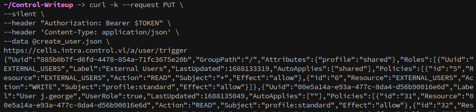

If the exploit was successful we should be able to login with our new user.

And we're in. With our privileges escalated, we now have permissions to view the *HR* and *osquery* cells:

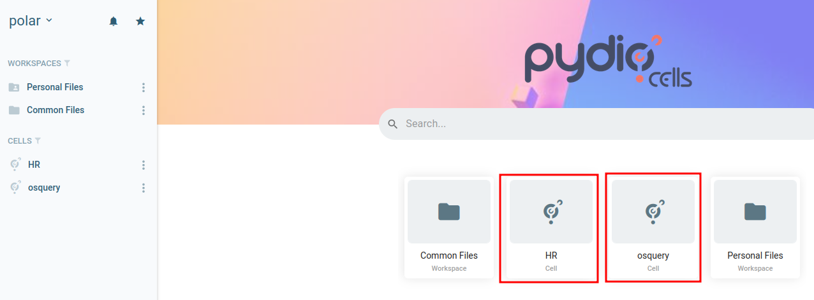

HR is empty:

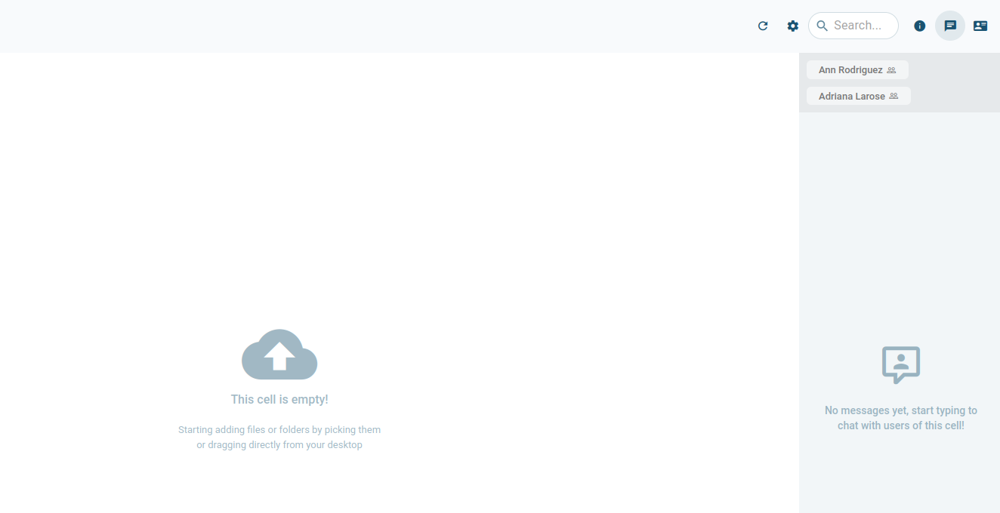

However in the osquery cell we have two files, and when checking the chatroom we see a username and password for a user on os.control.vl:

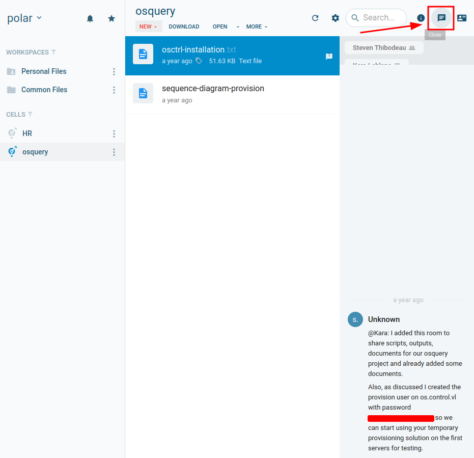

The credentials don't work on the web interface:

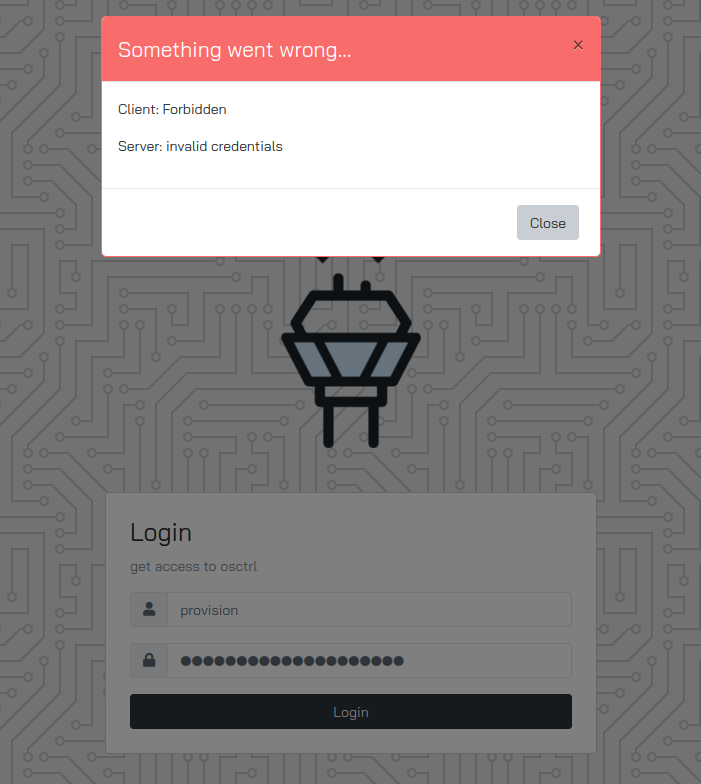

But they do work over ssh:

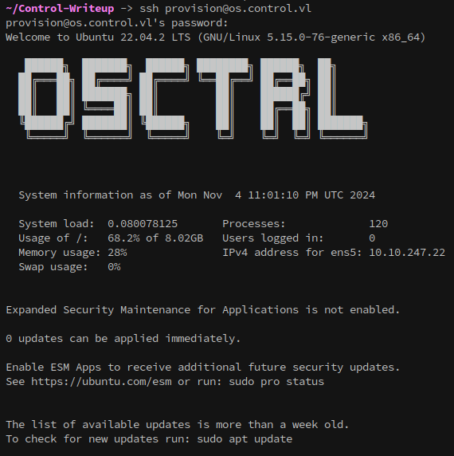

---
## Foothold on OS
With a foothold established on os.control.vl it's time to enumerate.
Checking the user's home gives us our first flag!

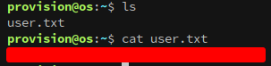

The first thing in my workflow is to see if the account I have access to has sudo permissions:

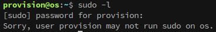

The provision user has ssh keys in their home:

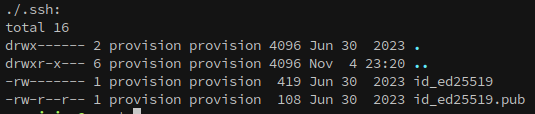
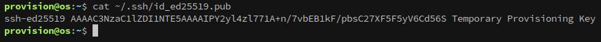

From this we learn that the keys on this machine are id_ed25519 and not another form like id_rsa.

Checking linpeas, or `ps aux`, shows the folder that osctrl is active from:

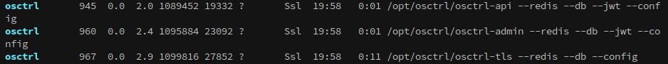

We can also see that osquery is running as root:

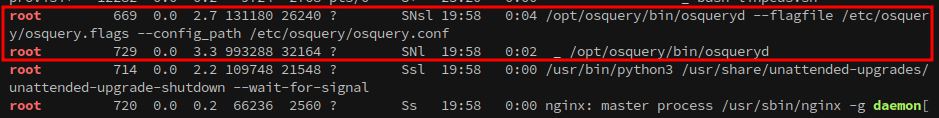

Also worth noting down the other users on the machine:

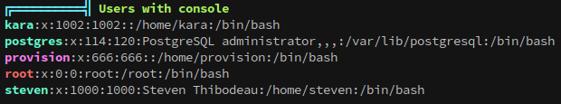

Linpeas doesn't offer any other hints for progression, but it's worth investigating the osctrl and osquery installs.

Checking the osctrl config files gets the database password:

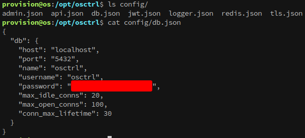

From here the goal is to enumerate the database, which we can do with `osctrl-cli`.
https://osctrl.net/usage/osctrl-cli/user/
```
./osctrl-cli --db-user osctrl --db-pass {snip} -d user list
```

The only user on the server is admin:

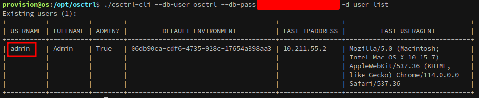

Since we have full access to the database we can create our own user with admin privileges into the same environment:
```
./osctrl-cli --db-user osctrl --db-pass {snip} -d user add --username polar --password
"Password123!" --admin --environment "06db90ca-cdf6-4735-928c-17654a398aa3" --fullname Polar
```
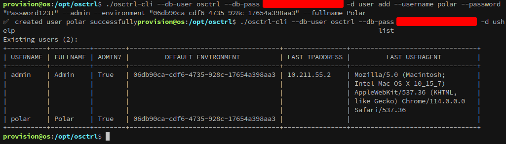

With the newly created account we can access the os.control.vl website:

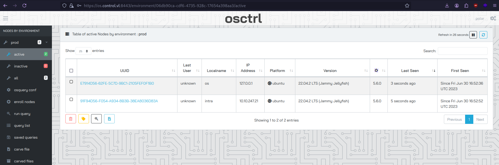

Earlier we saw that osquery was running as root, and we can execute queries from osctrl. Our privilege escalation vector is clear.

After doing some research and reading the osquery documentation we can read files with carve.
- https://www.reddit.com/r/osquery/comments/1czifgf/reading_data_from_file/
- https://osquery.readthedocs.io/en/stable/deployment/file-carving/

Using carve I can extract files from the system:

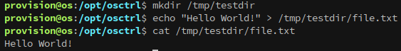
```
SELECT * FROM carves WHERE path LIKE '/tmp/testdir/%%' AND carve=1;
```
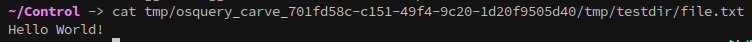

Instead of the Run Query menu, you can also use the Carve File menu, set the file that you want, then select the hostname and carve away:

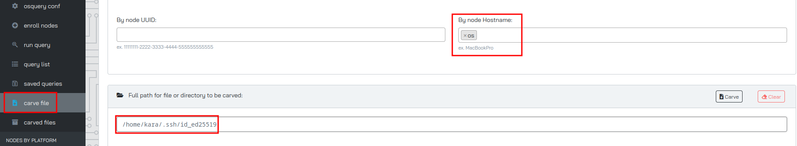

Once the file has been carved, you can download it using the download button.

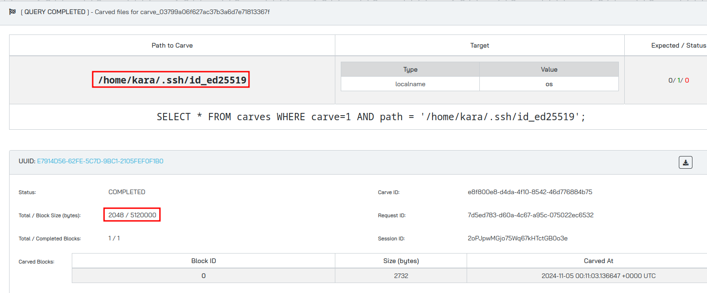

Extract the flle with:
```
tar xvf {file}
```

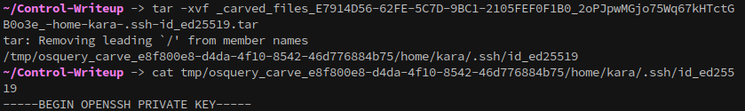

With Kara's ssh key, we can login to the system as them:

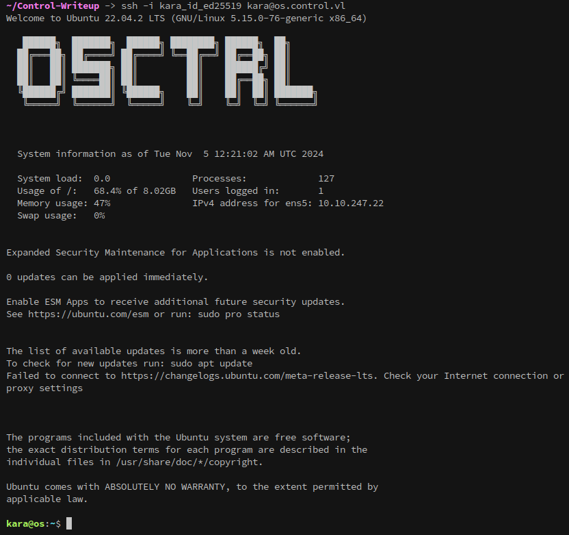

Checking our sudo permissions reveals that kara can execute any command with it, which gives an easy route to root:

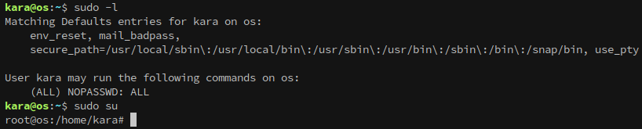

Now we can head to the root folder and get our second flag!

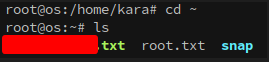

The next challenge is moving to intra.control.vl.

---
## Lateral Movement to Intra
Since we can execute queries on intra.control.vl using osctrl, the next step is to enumerate that system.
Looking at the authorized_keys for intra shows that the Temporary Provisioning Key that we found when first getting a foothold can authenticate to intra.control.vl as the root user:

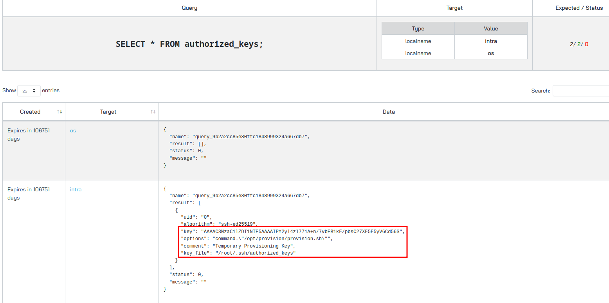

Attempting to login to the machine as root with the key closes the connection immediately though.

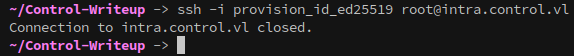

We can carve provision.sh using osquery:

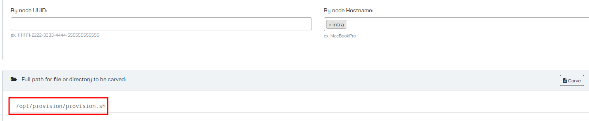

Looking at the content of provision.sh, it's preventing commands outside of a whitelist from being executed.

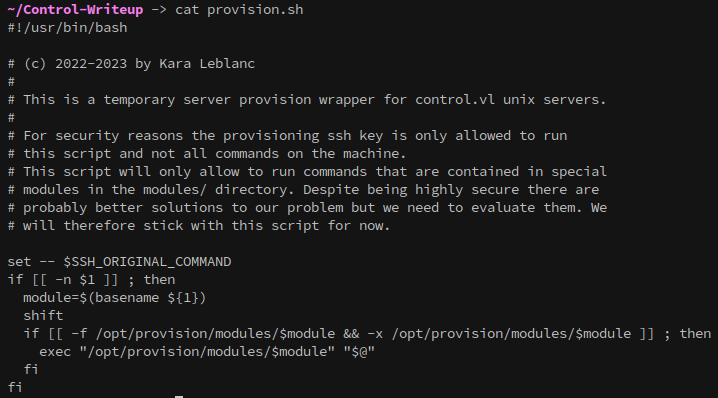

We can actually carve entire directories, but only when submitting as a query instead of using the Carve Files menu:
```
SELECT * FROM carves WHERE path LIKE '/opt/provision/modules/%%' AND carve=1;
```

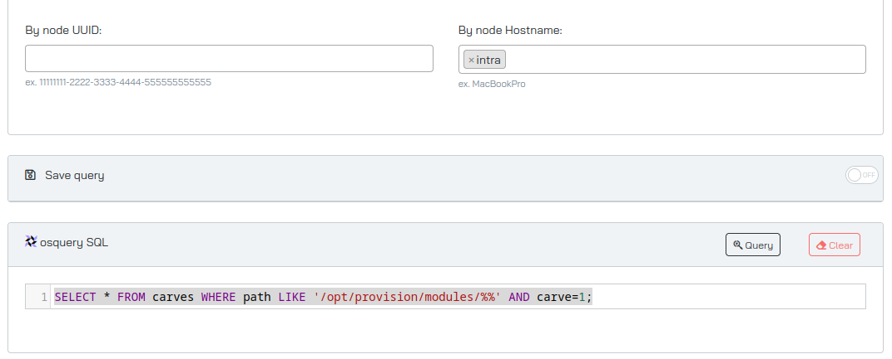

There are three files in the modules folder, which together define the command whitelist.

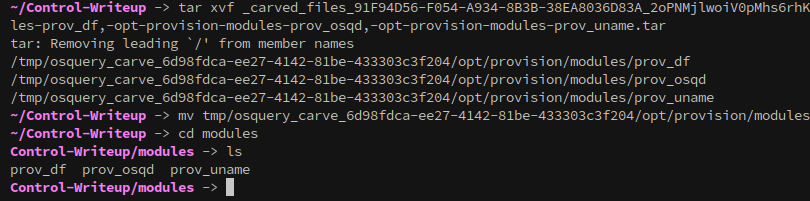

Now that these commands are identified, they can be executed over SSH.

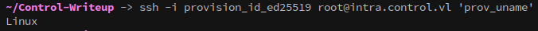

- prov_uname gives the operating system
- prov_df checks disk space
- prov_osqd is a bash script

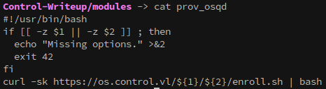

This script is curling another from os.control.vl and executing it with bash. If we place a reverse shell in the location that the script looks for then we can get root access to the machine.

Since we're root on os.control.vl we can control everything about it, including what's hosted on it.

In /var/www/html I created the src/img directories, and placed the following reverse shell inside:

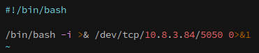

When we attempt to access the file we get an 'Invalid' message:

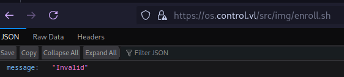

With the way the server is setup it automatically forwards traffic on port 443, as seen in the below tls.conf from /etc/nginx:

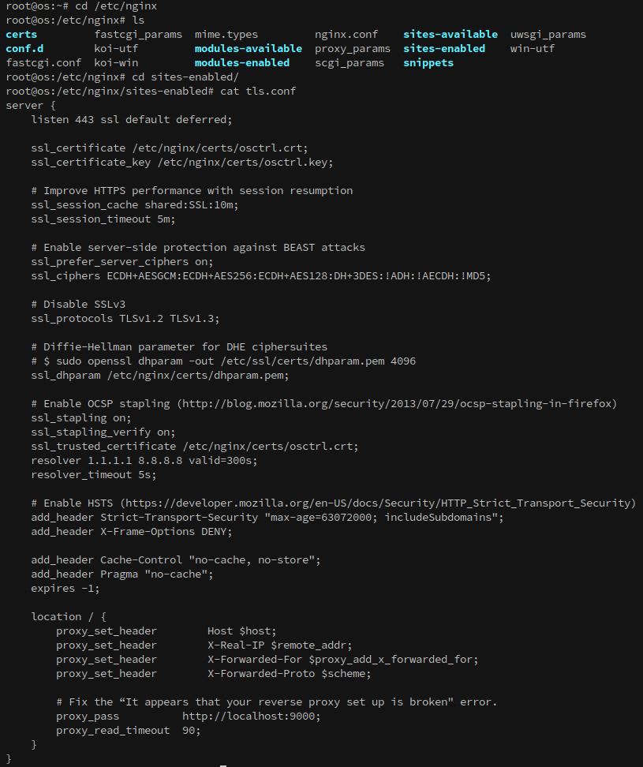

We can edit the file to specify the location to /var/www/html, where our reverse shell is located:

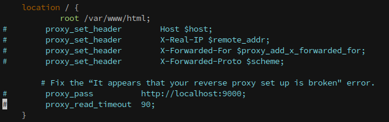

Next, we need to reload the nginx configuration, which we can do with:
```
nginx -s reload
```

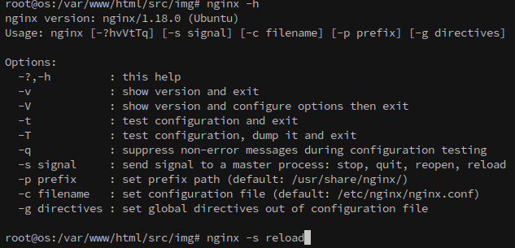

Now when we try to reach the file it resolves to our reverse shell:

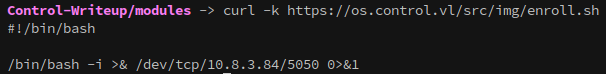

If it's successful for us, this setup should work similarly for intra.control.vl as well.

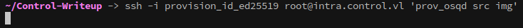

And with that, the chain is complete:

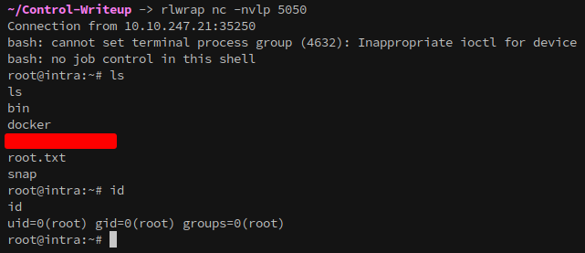
