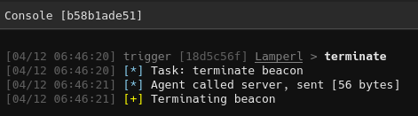
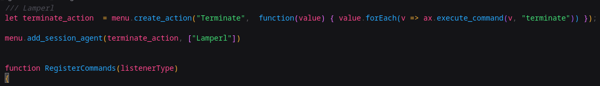
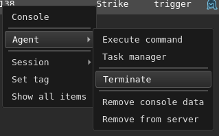
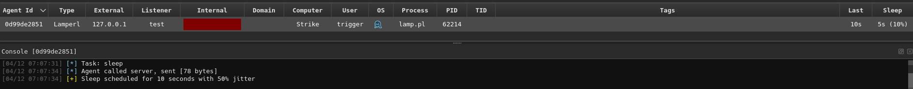
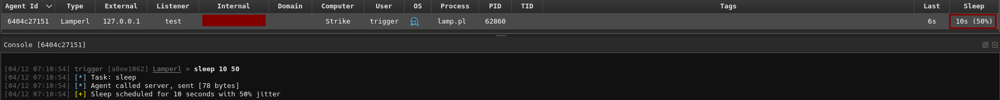

Hello again, in this post I'm going to show the process of implementing two functions that I would consider to be essential but were not included in the last post: **Terminate**, and **Sleep**. The Perl side of this is very simple, as a result the focus of this post will be on the Adaptix agent config in the `ax_config.axs` and `pl_agent.go` files.

In the previous post we built a basic agent with three commands: `pwd`, `cd`, and `run`. While functional, it was missing fundamental C2 agent capabilities. Every practical agent needs the ability to cleanly exit (`terminate`) and adjust its beacon interval (`sleep`). Being able to terminate agents avoids leaving orphaned processes, and dynamic sleep adjustment lets operators balance stealth against responsiveness based on the engagement phase.


The main function already loops until `should_terminate` is true, so the only thing the terminate function will do is set that variable.

```perl
while (!$should_terminate) 
```

Similarly, we already have a function that uses jitter to compute sleep time included in the loop, so our sleep function will just set the `sleep_time` and `jitter_percent` variables.

```perl
sub calculate_sleep {
    return $sleep_time unless $jitter_percent > 0;
    return $sleep_time + int(rand($sleep_time * $jitter_percent / 100));
}
```

The main purpose of this post is to provide instructions for implementing commands, since I feel the last didn't cover it very well as the code was written before the article was.

For every function added to an Adaptix agent there are three things that must be updated.
1. `ax_config.axs`
2. `CreateTask` function in `pl_agent.go`
3. `ProcessTasksResult` function in `pl_agent.go`

## Implementing Terminate

Lets get into it, the Perl implementation is straightforward. We create a command that sets the `should_terminate` flag:

```perl
sub cmd_terminate {
    my ($task) = @_;
    $should_terminate = 1;
    return {
        command => 'terminate',
        status  => 'terminating',
    };
}
```

This function:
- Accepts the task object (unused here but required for consistency)
- Sets `$should_terminate = 1` to signal the main loop to exit
- Returns a status object confirming termination has been initiated

With the function created, we now need to update the dispatch table to include it.
```perl
my %COMMANDS = (
    pwd      => \&cmd_pwd,
    cd       => \&cmd_cd,
    run      => \&cmd_run,
    terminate=> \&cmd_terminate,
);
```

And we're done with the Perl portion of the code for this feature.

### Adaptix Configuration

Now we need to register this command with Adaptix so it appears in the UI and can be properly dispatched. This involves three files:
1. `ax_config.axs` - UI command definition
2. `pl_agent.go` - CreateTask (operator -> agent)
3. `pl_agent.go` - ProcessTasksResult (agent -> operator)

#### ax_config.axs

First lets add the new command to the `ax_config.axs` file:
```go
let cmd_terminate = ax.create_command("terminate", "Terminate beacon", "terminate", "Task: terminate beacon");
```

This creates a command definition with:
- Command name: `terminate`
- Description: "Terminate beacon"
- Usage example: `terminate`
- Message: "Task: terminate beacon"

Then we add it to the agent's command group, located at the bottom of the file.
```go
if(listenerType == "LamperlHTTP") {
    let commands_external = ax.create_commands_group("Lamperl", [cmd_pwd, cmd_cd, cmd_terminate, cmd_run]);

    return { commands_linux: commands_external }
}
```

#### pl_agent.go - CreateTask - Terminate

Next we move to `pl_agent.go`. As terminate doesn't take any parameters, updating `CreateTask` is straightforward:
```go
case "terminate":
    // No additional parameters needed
```

Add this case to the switch statement in the `CreateTask` function. Since terminate requires no parameters, we simply match the command and let the default task creation handle the rest.

#### pl_agent.go - ProcessTasksResult - Terminate

We also don't really need any output, so in `ProcessTasksResult` we'll just show a simple message:
```go
case "terminate":
    consoleOutput = "Terminating beacon"
```

This case extracts the termination confirmation from the agent's response and displays it in the operator console.

### Building and Testing

Now we just need to build the plugin and deploy it:

```bash
make
```

Restart the Adaptix server, generate a new agent, and test the terminate command.



### Adding Context Menu Integration

Right now every time we want to terminate the agent we have to type out the command and send it, which can get tedious when handling a bunch of agents. Let's add a right-click context menu option for quick termination.

AxScript provides menu functions that let us add custom actions to the agent context menu. The documentation is available here:
- [https://adaptix-framework.gitbook.io/adaptix-framework/development/axscript/axmenu-type](https://adaptix-framework.gitbook.io/adaptix-framework/development/axscript/axmenu-type)

Add the following to the top of the `ax_config.axs` file:

```go
let terminate_action  = menu.create_action("Terminate",  function(value) { value.forEach(v => ax.execute_command(v, "terminate")) });

menu.add_session_agent(terminate_action, ["Lamperl"])
```


Breaking this down:
- `menu.create_action("Terminate", ...)` creates a menu item labeled "Terminate"
- The function receives selected agents as `value` and iterates through them
- `ax.execute_command(v, "terminate")` executes the terminate command on each selected agent
- `menu.add_session_agent(...)` adds this action to the agent context menu
- `["Lamperl"]` restricts this action to only Lamperl agents

This links the `Terminate` function to the agent context menu, allowing you to right-click and terminate agents with one click:



Rebuild the plugin and test:

```bash
make
```

## Implementing Sleep
### Perl Quirks and Design Choices

An interesting thing about Perl's sleep: it's in seconds. So if it's set to 5 seconds with a 10% jitter, like is set by default, it will literally always be 5 seconds because Perl truncates towards 0. For low sleep values, this effectively disables jitter.

Also, the current implementation will always jitter higher than the base sleep time and never lower. That's how I want it (ensures minimum sleep time), but if you prefer bidirectional jitter you can swap the `calculate_sleep` function with the following:
```perl
sub calculate_sleep {
    return $sleep_time unless $jitter_percent > 0;
    return $sleep_time + int(($sleep_time * $jitter_percent / 100) * (rand(2) - 1));
}
```

This alternative uses `rand(2) - 1` to generate a number between -1 and +1, creating bidirectional jitter.

### Perl Agent Side

Here's how the sleep function is implemented:
```perl
sub cmd_sleep {
    my ($task) = @_;
    $sleep_time = $task->{duration} || 5;
    $jitter_percent = $task->{jitter} || 0;
    return {
        command  => 'sleep',
        duration => $sleep_time,
        jitter   => $jitter_percent,
        status   => 'completed',
    };
}
```

This function:
- Extracts `duration` from the task object (defaults to 5 seconds if not provided)
- Extracts `jitter` percentage (defaults to 0 if not provided)
- Updates the global `$sleep_time` and `$jitter_percent` variables
- Returns a status object confirming the new sleep configuration

The beauty of this approach is that these are global variables checked at the end of the main beacon loop, so the change takes effect immediately.

Once again, we update the dispatch table:
```perl
my %COMMANDS = (
    pwd      => \&cmd_pwd,
    cd       => \&cmd_cd,
    run      => \&cmd_run,
    sleep    => \&cmd_sleep,
    terminate=> \&cmd_terminate,
);
```

### Adaptix Sleep Configuration

Now we need to wire this up to Adaptix. Unlike terminate, sleep requires parameters (duration and optional jitter), so the implementation is slightly more complex.

#### ax_config.axs

First we need to add the sleep command definition to `ax_config.axs`. We need to define it with parameter inputs for duration and jitter. Both of those are ints, jitter isn't required to be set:

```go
let cmd_sleep = ax.create_command("sleep", "Sleep for a duration with optional jitter", "sleep 10 20", "Task: sleep");
cmd_sleep.addArgInt("duration", true, "Duration to sleep in seconds");
cmd_sleep.addArgInt("jitter", false, "Jitter percentage (0-100)");
```

Once again we add it to the agent's command group.
```go
if(listenerType == "LamperlHTTP") {
    let commands_external = ax.create_commands_group("Lamperl", [cmd_pwd, cmd_cd, cmd_sleep, cmd_terminate, cmd_run]);

    return { commands_linux: commands_external }
}
```

#### pl_agent.go - CreateTask - Sleep

In `CreateTask`, we need to extract and validate the parameters:
```go
case "sleep":
    duration, ok := args["duration"].(float64)
    if !ok {
        err = errors.New("parameter 'duration' must be set")
        return taskData, messageData, err
    }
    commandData["duration"] = int(duration)
    if jitter, ok := args["jitter"].(float64); ok {
        commandData["jitter"] = int(jitter)
    }
```

This:
- Extracts `duration` from args and validates it exists (required parameter)
- Optionally extracts `jitter` if provided
- Packages both into the commandData map for serialization

#### pl_agent.go - ProcessTasksResult - Sleep

In `ProcessTasksResult`, we parse the agent's response and display it:
```go
case "sleep":
    duration := getInt(outputData, "duration")
    jitter := getInt(outputData, "jitter")

    consoleOutput = fmt.Sprintf("Sleep scheduled for %d seconds with %d%% jitter", duration, jitter)
```

This extracts the duration and jitter from the agent's response and formats a confirmation message.

Rebuild and test:

```bash
make
```



Which works. The command executes and the beacon sleeps for the spcified time. However, if you test it like this you'll quickly notice that it does not update the `Sleep` column in the Adaptix client UI. The agent's internal sleep has changed, but Adaptix's metadata is stale.

### Updating Agent Metadata

In order to have the change reflected in the client we must also update the `agentData` object and persist it back to the teamserver:

```go
case "sleep":
    duration := getInt(outputData, "duration")
    jitter := getInt(outputData, "jitter")

    // Update agent data with new sleep configuration
    agentData.Sleep = uint(duration)
    agentData.Jitter = uint(jitter)
    _ = ts.TsAgentUpdateData(agentData)

    consoleOutput = fmt.Sprintf("Sleep scheduled for %d seconds with %d%% jitter", duration, jitter)
```

The key additions:
- `agentData.Sleep = uint(duration)` - Update the agent's sleep metadata
- `agentData.Jitter = uint(jitter)` - Update the agent's jitter value
- `ts.TsAgentUpdateData(agentData)` - Persist changes to `agentData`

This ensures the UI reflects the agent's current configuration.

Final build and deploy:

```bash
make
```



Generate a new payload and test. Once the sleep command is executed, the sleep displayed in the client will update in real-time.


### Key Takeaways

For every new Adaptix agent command, remember the pattern of threes:
1. **ax_config.axs** - UI definition, parameter forms, add to command group
2. **CreateTask** - Operator input -> agent task serialization
3. **ProcessTasksResult** - Agent output -> console display + metadata sync

This pattern scales to any command complexity. Even advanced features like file upload/download, socks proxies, or process injection follow this same structure, they just have more complex parameter handling and result processing.

In the next post, we'll actually tackle more advanced functionality: upload/download support and asynchronous job handling.


- [AxScript Documentation](https://adaptix-framework.gitbook.io/adaptix-framework/development/axscript)


